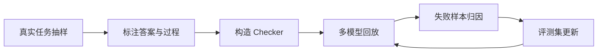

# 业务评测集与过程监督准则

## 来源

- [[01_LLM与大模型/0107_模型评测/文章/done-OpenAI：Let’s Verify Step by Step 解读|Let's Verify Step by Step]]
- [[01_LLM与大模型/0107_模型评测/文章/done-如何评测新模型 -- 看看新模型是否适合自己的业务？|如何评测新模型]]

## 核心问题

模型评测不能只看最终答案或公开榜单。对多步推理、工具调用、数据分析和业务任务，评测集应记录过程、失败步骤、版本、provider、成本和可复跑校验器。

## 判断准则

| 主题 | 可复用准则 |
|---|---|
| ORM vs PRM | 结果监督只判断最终答案；过程监督能定位错误步骤，更适合多步推理和复杂任务。 |
| 业务评测集 | 样本来自真实任务或日志，必须有输入、期望输出、成功标准、失败分类和版本记录。 |
| 新模型选型 | 每次模型升级都要记录模型名、provider、参数、上下文、成本、延迟和失败样本。 |
| Checker | 能程序化判断的部分优先程序化；开放任务再用人工或 LLM-as-Judge 抽检。 |
| 榜单降权 | 公开 benchmark 只做初筛，不能替代业务回放。 |

## 认知校准点

| 常见错误认知 | 正确理解 |
|---|---|
| 答案对就代表推理对 | 多步任务可能过程错误但结果碰巧正确，PRM 才能暴露错误步骤。 |
| GPT-4/强模型可直接当评测真值 | 评测模型也会偏，需要人工抽样、交叉验证和一致性检查。 |
| 业务评测集一次建完 | 评测集要随着失败样本、模型版本和业务任务持续更新。 |
| 只看分数就能升级模型 | 升级还要看成本、延迟、稳定性、格式输出、工具调用和回滚方案。 |

## 评测闭环

## 待验证缺口

- PRM800K 的人工标注成本和迁移到业务任务的可行性需要补读原论文与数据集。
- 本地模型评测模板还需落到具体字段和脚本，覆盖结构化输出、工具调用、长上下文和数据分析任务。
