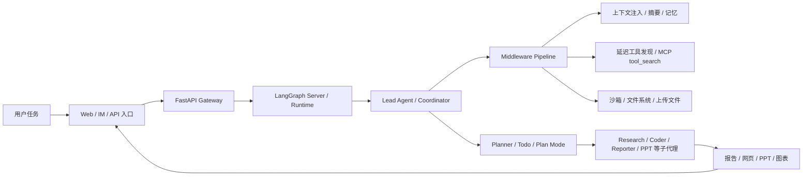

# DeerFlow

## 知识点入口

- 本模块先看宏观流程，再看文章：[知识地图](020101_核心知识点/知识地图.md)。
- 新文章必须先归入流程节点，再判断是补充、冲突、不同层次还是降权。
- `文章/` 只保留原文锚点，长期知识必须沉淀到 `020101_核心知识点/`。

## 技术定位

| 项 | 内容 |
|---|---|
| 技术名 | DeerFlow |
| 一级类目 | Agent 与 AI 工程 |
| 二级类目 | Agent 框架 |
| 技术本体 | 面向深度研究、长链路产物生成和多智能体协作的 Agent 编排框架 |
| 全局架构位置 | 位于模型、工具、沙箱、文件系统和前端工作台之间，承担任务拆解、状态推进、子代理调度和产物交付 |
| 主要使用者 | Agent 应用工程师、研究型 Agent 开发者、内部 AI 工程平台开发者 |
| 主要产出 | 研究报告、网页、PPT、图表、代码执行结果、任务线程状态 |

## 官方锚点

- 官网：后续补证
- GitHub：本地文章指向 `https://github.com/bytedance/deer-flow`，需后续补证仓库状态
- 官方文档：后续补证
- 架构文档：后续补证

## 架构图

## 核心模块

| 模块 | 职责 | 重点问题 |
|---|---|---|
| 前端工作台 | 承载任务输入、线程展示、产物预览 | 是否只是演示界面，还是能支撑长期任务状态 |
| Gateway API | 连接前端、LangGraph Server 和应用层配置 | API、鉴权、任务状态和流式返回是否清晰 |
| LangGraph Runtime | 执行 Agent 图和循环 | 状态如何推进、失败如何恢复、循环如何终止 |
| deerflow-harness | 封装可复用 Agent 框架层 | harness 与 app 边界是否由测试保护 |
| Middleware Pipeline | 注入上传文件、记忆、沙箱、摘要、Todo、子代理限制等横切能力 | 顺序、调试成本、可插拔性和失效隔离 |
| Planner / Todo | 拆解任务、维护计划、判断下一步 | 计划修订轮次、上下文膨胀和人工确认点 |
| Subagents | 独立上下文中执行研究、代码、报告、PPT 等专业子任务 | 并发上限、输入输出契约、失败降级 |
| 工具与沙箱 | 搜索、浏览器、代码执行、文件系统、MCP 工具 | 最小权限、延迟注册、超时、重试和审计 |

## 上下游

| 方向 | 对象 | 关系 |
|---|---|---|
| 上游 | 复杂研究任务、产物生成任务、业务分析问题 | 需要拆成多步、多角色或多工具链路 |
| 下游 | 报告、网页、PPT、数据图表、代码结果 | 作为可交付产物，需要可验证和可回滚 |
| 依赖 | LangGraph、模型 Provider、搜索工具、沙箱、文件系统、前端运行环境 | 决定任务可控性、成本、稳定性和安全边界 |

## 横向对标

| 对标技术 | 对标点 | 优势 | 劣势 | 使用判断 |
|---|---|---|---|---|
| LangGraph | 状态图和执行循环 | DeerFlow 在其上补工作台、harness、中间件和子代理实践 | 仍继承图状态和工具链复杂度 | 需要直接控制状态图选 LangGraph，需要完整研究型应用参考看 DeerFlow |
| OpenClaw | 长任务、会话、生命周期和多通道助手 | DeerFlow 更偏产物生成和多子代理工作台 | 文章认为多通道、队列和平台治理仍需补证 | 要“产出一份东西”偏 DeerFlow，要“长期管理一件事”偏 OpenClaw |
| DeepAgents | 技能、子代理和渐进式披露 | DeerFlow 更像完整应用栈和运行时样板 | DeepAgents 作为能力分包更轻 | 需要研究/报告/PPT一体化时看 DeerFlow，需要技能分包时看 DeepAgents |
| CrewAI / AutoGen | 角色化多 Agent 协作 | DeerFlow 更强调工程边界、沙箱和产物链路 | 社区通用生态需后续补证 | 原型可看 CrewAI/AutoGen，生产样板优先看状态、沙箱和恢复能力 |
| OpenAI Agents SDK | Agent API、工具和执行控制 | DeerFlow 给出多角色研究产品形态 | 官方能力边界未补证 | 用 SDK 组底层能力，用 DeerFlow 看应用级编排 |

## 已沉淀核心知识点

| 主题 | 文件 | 问题指纹 | 解决什么问题 | 认知增量 |
|---|---|---|---|---|
| 多智能体编排与计划修订 | [DeerFlow多智能体编排与计划修订](020101_核心知识点/DeerFlow多智能体编排与计划修订.md) | DeerFlow + Coordinator/Planner/Researcher/Reporter + 计划修订/HITL/搜索精炼 + 研究型产物生成 + 多轮搜索才值得使用 | 如何判断 DeerFlow 类架构是否值得引入 | DeerFlow 的核心不是“很多 Agent”，而是计划、搜索、人工确认和成本边界 |
| 中间件与 Harness 边界 | [DeerFlow源码中的中间件与Harness边界](020101_核心知识点/DeerFlow源码中的中间件与Harness边界.md) | DeerFlow + Middleware/Harness/App 边界 + 横切能力隔离/延迟工具发现/CI 守护边界 + 生产演进 + 防止 Demo 主流程腐化 | 如何把 Agent 框架从示例代码推进到可演进应用 | 横切能力要进中间件，harness/app 边界要用测试守住 |

## 后续追查

- 关键词：DeerFlow、deerflow-harness、LangGraph Server、AgentMiddleware、Plan Mode、SubagentLimitMiddleware、tool_search、Human-in-the-Loop。
- 待读资料：官方仓库、README、架构文档、部署文档、版本差异；本轮只用本地文章，未联网补证。
- 待补实验：跑一个最小研究任务，记录计划轮次、搜索轮次、Token 成本、失败重试、产物验收和中断恢复。
