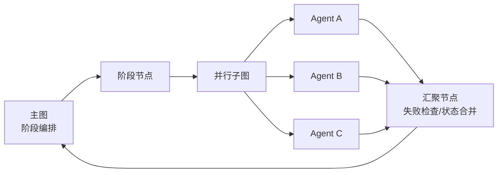

# LangGraph 子图与并行状态合并

## 原文锚点

- 本地文件：[LangGraph 子图功能详解：进阶技巧与实战经验（下篇）](<../文章/LangGraph 子图功能详解：进阶技巧与实战经验（下篇）.md>)
- 原文链接：`https://mp.weixin.qq.com/s?__biz=MzYzODA4ODUxOQ==&mid=2247483760&idx=1&sn=eb4a9be73866e6b00ac8ad1e24adbb1c`
- 关键段落：嵌套子图、条件子图、并行任务失败、并行度限制、调试子图、状态合并冲突。
- 关键图：原文提到项目结构和子图场景，但 Markdown 未保留可用技术图。

## 图片处理

| 图片 | 类型 | 是否保留 | 理由 | 处理方式 |
|---|---|---|---|---|
| 子图/项目示意 | 架构图 | 原图缺失 | 正文描述子图嵌套、条件子图和阶段内并行，但本地 Markdown 无图 | 用 Mermaid 重建 |

## 一句话结论

这篇文章值得精读但不直接判实践：它把 LangGraph 子图从“模块化语法”校准为“阶段内并行、状态合并、失败隔离和调试边界”的工程机制。

## 用户相关性判断

| 项 | 内容 |
|---|---|
| 用户当前认知层级 | Agent 工作流 / LangGraph：L2-L3 |
| 认知成熟度 | draft |
| 阅读投入建议 | 精读 |
| 阅读投入理由 | 能补 LangGraph 流程控制笔记缺少的子图边界、并行度和失败处理，但代码片段不是完整可运行工程 |
| 对用户的新信息 | 子图价值不在“还能嵌套”，而在把阶段内并行、汇聚检查和状态合并做成可复用单元 |
| 问题指纹 | LangGraph + Subgraph/并行阶段 + 嵌套/条件子图/汇聚节点 + 多 Agent 阶段内并行 + 状态合并和失败隔离 |
| 排重判断 | 新建，补足已有“流程控制模式”中只提到子图但未展开的边界 |
| 置信度 | 中 |

## 认知校准点

| 校准点 | 文章观点/信息 | 与用户认知或价值观的关系 | 处理建议 |
|---|---|---|---|
| 子图不是越多越好 | 原文建议单任务直接执行，多个任务才创建子图 | 纠偏“复杂框架功能都要用”的倾向 | 后续设计先判断任务数、依赖和并行收益 |
| 嵌套子图有调试上限 | 原文建议最多 2-3 层嵌套 | 补充可维护性边界 | 子图用于封装阶段，不用于无限拆层 |
| 并行失败必须在汇聚节点处理 | 子节点捕获异常还不够，汇聚节点要检查失败列表 | 强化失败场景 | 汇聚节点必须产出 `failed_agents`、`partial_failure` 或降级状态 |
| 并行度需要限制 | 原文给出 `MAX_PARALLEL_AGENTS` 和分批执行思路 | 符合工程可控性 | 将并行度作为配置，不写死为“越多越好” |
| 状态合并是主要坑 | 多个并行节点更新同一字段会覆盖 | 与已有 Reducer 认知一致并补边界 | 后续所有并行子图先定义合并函数 |

## 冲突点

| 冲突类型 | 具体表现 | 影响 | 处理 |
|---|---|---|---|
| 图片缺失 | 正文描述子图场景但本地 Markdown 无可用技术图 | 影响快速理解执行链路 | Mermaid 重建 |
| 证据不足 | 文章基于 AgoraAI 项目经验，但没有完整可复现实验和性能指标 | 不能直接沉淀为性能结论 | 只吸收机制和边界，不采信收益数字 |
| 实践门槛不足 | 代码片段较多，但缺完整依赖、测试和运行输出 | 不能判为实践 | 降为精读 |

## 待吸收点

| 分级 | 内容 | 为什么值得吸收 | 后续动作 |
|---|---|---|---|
| 理解 | 主图负责阶段编排，子图负责阶段内并行 | 有助于拆分复杂 Agent 流程 | 设计多阶段流程时先画阶段依赖 |
| 记住 | 子图汇聚节点要检查失败、缺失和部分成功 | 这是生产可控性的关键 | 建立汇聚节点检查清单 |
| 记住 | 并行度必须受资源和 API 限流约束 | 避免并行带来更高延迟 | 为每类子 Agent 设置并发上限 |
| 理解 | 条件子图可按任务数量和 Agent 类型选择执行策略 | 比固定并行更可控 | 后续结合多 Agent 协作实验验证 |
| 了解 | 子图可嵌套，但不宜超过 2-3 层 | 防止调试复杂度失控 | 复杂流程优先拆技术边界，而不是嵌套层数 |

## 已知可跳过

| 内容 | 跳过理由 |
|---|---|
| “俄罗斯套娃式优雅”等类比 | 帮助阅读但不形成工程准则 |
| 大量示例代码细节 | 没有完整工程上下文，保留机制即可 |
| 项目宣传和评论引导 | 不进入知识点 |

## 实践门槛

| 门槛 | 判断 | 证据 |
|---|---|---|
| 可运行 | 部分 | 有伪代码和函数片段，但缺完整项目依赖 |
| 可验证 | 否 | 没有输入、输出和测试断言 |
| 可排障 | 部分 | 提到日志、可视化、单独测试子图 |
| 可迁移 | 是 | 可迁移到文章批量处理和多 Agent 阶段并行 |
| 结论 | 降为精读 | 先沉淀设计准则，后续再补最小可运行例子 |

## 归类判断

| 项 | 内容 |
|---|---|
| 技术本体 | LangGraph |
| 文章主问题 | 如何用子图组织复杂并行流程、错误处理和状态合并 |
| 使用场景 | 多 Agent 阶段内并行、复杂任务分层、子流程复用 |
| 关键词干扰 | AgoraAI 项目只是案例；多 Agent 是使用场景，不改变 LangGraph 技术本体 |
| 最终归类 | Agent 与 AI 工程 / Agent 框架 / LangGraph |
| 归类理由 | 主问题是 LangGraph 子图机制和状态控制 |

## 技术定位

| 项 | 内容 |
|---|---|
| 技术类型 | Agent 框架机制 |
| 所属领域 | Agent 与 AI 工程 |
| 二级类目 | Agent 框架 |
| 全局架构位置 | LangGraph 控制流中的模块化子流程层 |
| 涉及模块 | StateGraph、Subgraph、并行节点、汇聚节点、状态合并、日志调试 |
| 解决问题 | 让复杂 Agent 工作流按阶段封装、并行执行和局部失败隔离 |
| 原文局限 | 没有完整可运行项目、没有官方版本边界和测试输出 |
| 我的结论 | 以后关注，作为 LangGraph 子图设计准则 |

## 纵向理解

| 维度 | 判断 |
|---|---|
| 全局架构 | 主图负责阶段顺序，子图负责阶段内部任务，汇聚节点把结果写回共享状态 |
| 本文位置 | LangGraph 子图进阶，不是 LangGraph 全貌 |
| 核心机制 | 子图作为节点组合进主图，并通过状态对象和合并逻辑承接并行结果 |
| 使用链路 | 判断是否需要子图 -> 定义子图状态 -> 添加并行节点 -> 汇聚检查 -> 限制并行度 -> 单测子图 |
| 前置条件 | 子任务无强依赖、状态 schema 清晰、合并规则明确、资源可承受 |
| 边界 | 单任务不需要子图；强顺序依赖不适合并行；深嵌套会显著增加调试成本 |

## 横向对标

| 对标技术 | 实现方式 | 优势 | 劣势 | 适合场景 |
|---|---|---|---|---|
| 普通节点 | 主图中直接串联节点 | 简单直观 | 主图容易膨胀 | 小流程、强顺序依赖 |
| LangGraph 子图 | 子流程编译后作为节点 | 模块化、可复用、阶段内并行 | 状态映射和调试复杂 | 多阶段 Agent 工作流 |
| Send API | 运行时动态生成并行任务 | 适合 Map-Reduce | 汇聚和调试复杂 | 动态任务数量 |
| 手写 asyncio | 代码内直接并发 | 灵活 | 脱离图状态和观测 | 局部 I/O 并发 |

## 后续追查

- 关键词：LangGraph Subgraph、state merge、reducer、parallel subgraph、nested subgraph。
- 相关技术：LangGraph 流程控制、多 Agent 协作、长任务 Agent 运行时。
- 需要补读的文章：LangGraph 官方子图、checkpoint、人机中断和部署资料，本轮不联网，后续补证。
