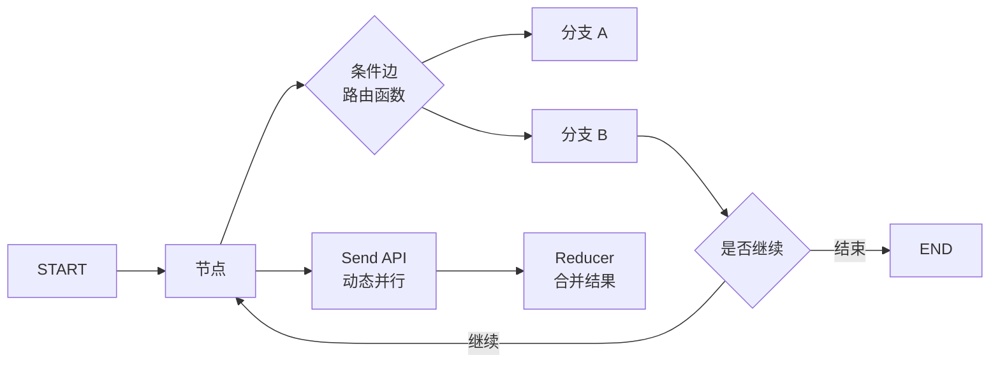

# LangGraph 流程控制模式

## 原文锚点

- 本地文件：[LangGraph（四）快速入门｜流程控制：四种流程模式一览](<../文章/done-LangGraph（四）快速入门｜流程控制：四种流程模式一览.md>)
- 原文链接：`https://mp.weixin.qq.com/s?__biz=MzkzMTYzMTEzMg==&mid=2247485244&idx=1&sn=9b92febc61a3ae8f6da5bcbcf355df6b`
- 关键段落：条件边、循环、并行、Send API、子图、Reducer、递归限制。
- 关键图：无原图，主要是代码和表格。

## 图片处理

| 图片 | 类型 | 是否保留 | 理由 | 处理方式 |
|---|---|---|---|---|
| 无 | 无 | 不适用 | 文章主要用代码说明流程控制 | Mermaid 重建控制流图 |

## 一句话结论

这篇文章值得精读：LangGraph 的核心不是“套 Agent 模板”，而是把 Agent 流程显式建模为状态图，用条件边、循环、并行、Send 和子图控制复杂工作流。

## 用户相关性判断

| 项 | 内容 |
|---|---|
| 用户当前认知层级 | Agent 工作流 / LangGraph：L2 |
| 认知成熟度 | draft |
| 阅读投入建议 | 精读 |
| 阅读投入理由 | 能补 LangGraph 控制流骨架，但只是入门级 API，不覆盖持久化和生产观测 |
| 对用户的新信息 | 条件边、Reducer、Send API、递归限制是从“能跑”到“可控”的关键 |
| 问题指纹 | LangGraph + 控制流 + 条件边/循环/并行/Send/子图 + Agent 工作流可控性 + 防止框架教程碎片化 |
| 排重判断 | 新建 |
| 置信度 | 高 |

## 认知校准点

| 校准点 | 文章观点/信息 | 与用户认知或价值观的关系 | 处理建议 |
|---|---|---|---|
| LangGraph 是显式状态机 | 文章用图、节点、边、状态描述流程 | 补充 Agent 框架本体 | 作为 LangGraph index 首篇 |
| 循环不能只靠递归限制 | 原文强调要有退出条件 | 符合工程安全偏好 | 记住循环必须有业务终止条件 |
| 并行必须定义 Reducer | 并行节点更新同一字段要合并 | 重要失败边界 | 后续所有并行 Agent 设计都检查 Reducer |
| Send API 是动态并行 | 运行时按任务列表创建分支 | 对文章整理流水线有迁移价值 | 可用于批量文章处理 |
| 入门文章不等于生产方案 | 没有持久化、错误恢复、观测 | 需要降权 | 后续补 checkpoint 和 tracing |

## 冲突点

| 冲突类型 | 具体表现 | 影响 | 处理 |
|---|---|---|---|
| 原文局限 | 只讲控制流 API，未讲生产状态、权限、重试 | 容易误以为会画图就能生产落地 | 标记后续追查 |
| 实践门槛不足 | 代码片段可运行但缺完整工程和测试 | 不直接判实践 | 降为精读 |

## 待吸收点

| 分级 | 内容 | 为什么值得吸收 | 后续动作 |
|---|---|---|---|
| 理解 | 条件边通过路由函数决定下一节点 | Agent 决策流的核心 | 用于文章处理流程路由 |
| 记住 | 循环必须有显式退出条件，不依赖 recursion limit | 防止长任务失控 | 后续设计写终止条件 |
| 理解 | 多出边或路由返回列表可触发并行 | 适合独立任务并发处理 | 需要配 Reducer |
| 记住 | Reducer 决定并行结果怎么合并 | 并行状态冲突高发 | 设计状态字段时先定合并规则 |
| 理解 | Send API 适合 Map-Reduce 型动态任务 | 对批量文章处理有迁移价值 | 后续可建处理流水线 |
| 了解 | 子图用于模块化封装复杂流程 | 避免单图过大 | 后续补子图文章 |

## 已知可跳过

| 内容 | 跳过理由 |
|---|---|
| 智能客服路由样例 | 只是 API 示例 |
| 导航系统类比 | 帮助理解但不沉淀 |
| 公众号知识库推广 | 不进入知识点 |

## 实践门槛

| 门槛 | 判断 | 证据 |
|---|---|---|
| 可运行 | 部分 | 有 API 代码片段 |
| 可验证 | 否 | 没有测试、状态输出和异常场景 |
| 可排障 | 部分 | 提到 recursion limit 和 Reducer |
| 可迁移 | 是 | 可迁移到 Agent 流程设计 |
| 结论 | 降为精读 | 后续补完整最小项目 |

## 归类判断

| 项 | 内容 |
|---|---|
| 技术本体 | LangGraph |
| 文章主问题 | Agent 图工作流的流程控制模式 |
| 使用场景 | Agent 应用、动态路由、循环改进、并行任务、子图模块化 |
| 关键词干扰 | LLM、客服、知识库只是示例 |
| 最终归类 | Agent 与 AI 工程 / Agent 框架 |
| 归类理由 | 主问题是 Agent 框架控制流 |

## 技术定位

| 项 | 内容 |
|---|---|
| 技术类型 | Agent 框架 |
| 所属领域 | Agent 与 AI 工程 |
| 二级类目 | Agent 框架 |
| 全局架构位置 | LLM 和工具之上的工作流控制层 |
| 涉及模块 | StateGraph、条件边、路由函数、Reducer、Send、Subgraph |
| 解决问题 | 让 Agent 多步流程可显式设计、执行和控制 |
| 原文局限 | 不覆盖生产状态持久化、错误恢复、评估 |
| 我的结论 | 以后关注，作为 LangGraph 控制流入口 |

## 纵向理解

| 维度 | 判断 |
|---|---|
| 全局架构 | State -> Node -> Edge -> Route -> Parallel/Loop/Subgraph -> END |
| 本文位置 | 控制流 API 和设计模式 |
| 核心机制 | 用路由函数和状态决定图执行路径 |
| 使用链路 | 定义状态 -> 定义节点 -> 定义边和路由 -> 定义 reducer -> compile/invoke |
| 前置条件 | 状态 schema、退出条件、并行合并规则 |
| 边界 | 不解决模型质量、工具安全和结果评估 |

## 横向对标

| 对标技术 | 实现方式 | 优势 | 劣势 | 适合场景 |
|---|---|---|---|---|
| 普通边 | 固定节点顺序 | 简单可读 | 不能动态决策 | 顺序流程 |
| 条件边 | 路由函数返回下一节点 | 分支可控 | 路由映射要完整 | 分类、审核、错误处理 |
| 循环 | 条件边回到上游 | 支持迭代优化 | 容易死循环 | 生成-检查-改进 |
| 并行边 | 多节点同超级步执行 | 提升吞吐 | 状态合并复杂 | 独立分析任务 |
| Send API | 动态创建分支 | 适合 Map-Reduce | 调试复杂 | 批量处理、动态任务数 |
| 子图 | 图作为节点 | 模块化 | 状态映射复杂 | 大型工作流 |

## 后续追查

- 关键词：LangGraph conditional edges、Reducer、Send API、Subgraph、Checkpoint。
- 相关技术：LangChain、CrewAI、Dify、n8n、OpenAI Agents SDK。
- 需要补读的文章：LangGraph 子图功能、跨会话记忆持久化、生产环境观测性。
