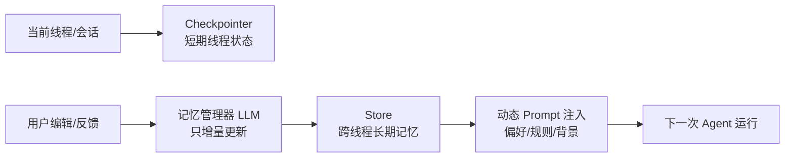

# LangGraph 记忆与反馈循环

## 原文锚点

- 本地文件 1：[LangGraph 记忆系统实战：反馈循环 + 动态 Prompt 让 AI 持续学习](<../../../0211_Memory Management/文章/done-LangGraph 记忆系统实战：反馈循环 + 动态 Prompt 让 AI 持续学习.md>)
- 本地文件 2：[Python+LangChain/LangGraph框架开发Ai智能体系列(九) | 实现完整跨会话记忆持久化的Agent](<../../../0211_Memory Management/文章/done-Python+LangChain_LangGraph框架开发Ai智能体系列(九) _ 实现完整跨会话记忆持久化的Agent.md>)
- 原文链接 1：`https://mp.weixin.qq.com/s?__biz=Mzk0OTI1OTQ2MQ==&mid=2247595240&idx=2&sn=4734d59422751cd627f95e7ea1646f81`
- 原文链接 2：`https://mp.weixin.qq.com/s?__biz=Mzk0MzQyNDA0Mg==&mid=2247484251&idx=1&sn=9b099569cea5dd1591efe3147f72c684`
- 关键段落：线程级记忆、跨线程记忆、Store、checkpointer、`update_memory`、人机反馈、记忆管理器提示词、下次运行动态注入。
- 关键图：正文提到架构位置图，但本地 Markdown 无图。

## 图片处理

| 图片 | 类型 | 是否保留 | 理由 | 处理方式 |
|---|---|---|---|---|
| 记忆架构图 | 架构图 | 原图缺失 | 正文引用“位置如下所示”，但本地 Markdown 无图 | Mermaid 重建 |

## 一句话结论

这组文章值得合并精读：LangGraph 记忆的关键不是“保存聊天记录”，而是把短期线程状态和跨线程偏好分开，并用人机反馈触发受控的长期记忆更新。

## 用户相关性判断

| 项 | 内容 |
|---|---|
| 用户当前认知层级 | Agent 工作流 / 记忆机制：L2 |
| 认知成熟度 | draft |
| 阅读投入建议 | 精读 |
| 阅读投入理由 | 能补 LangGraph 状态管理和长期记忆边界，但教程较长且示例偏邮件助手，不能直接当生产方案 |
| 对用户的新信息 | 长期记忆应由反馈触发、专用记忆管理器增量更新，并在下一轮以规则形式注入，而不是原样堆聊天历史 |
| 问题指纹 | LangGraph + Checkpointer/Store + 反馈触发/记忆管理器/动态 Prompt + 跨会话偏好学习 + 区分短期状态和长期规则 |
| 排重判断 | 新建，合并两篇记忆文章；短目录式文章只作为补充锚点 |
| 置信度 | 中 |

## 认知校准点

| 校准点 | 文章观点/信息 | 与用户认知或价值观的关系 | 处理建议 |
|---|---|---|---|
| 短期记忆和长期记忆不能混 | 线程级记忆由 checkpointer 管，跨线程记忆由 Store 管 | 补齐状态管理边界 | 后续所有记忆文章先判断是线程状态还是长期知识 |
| 接受不等于学习信号 | 用户直接 accept 时不更新记忆，edit/feedback/ignore 才触发 | 符合“避免污染长期知识”的偏好 | 记住长期记忆必须有明确反馈证据 |
| 记忆更新要有专用管理器 | 文章使用 `MEMORY_UPDATE_INSTRUCTIONS` 约束只增量更新 | 补充可控性机制 | 不让业务 Agent 自由改写整份记忆 |
| 长期记忆应注入为规则 | 下次运行从 Store 取偏好，填入 Prompt | 纠偏“长期记忆=原始聊天记录” | 存规则、偏好、事实，不存噪声对话 |
| InMemory 只适合开发 | 原文区分 InMemory、langgraph dev、本地 pickle、PostgreSQL/pgvector | 补足环境边界 | 生产必须后续补官方和真实存储配置 |

## 冲突点

| 冲突类型 | 具体表现 | 影响 | 处理 |
|---|---|---|---|
| 原目录冲突 | 主文章在 `01_LLM与大模型`，但主问题是 LangGraph Agent 记忆机制 | 可能误归到模型能力或提示词 | 重路由到 Agent 框架 / LangGraph |
| 图片缺失 | 正文提到架构位置图但 Markdown 无图 | 缺少直观链路 | Mermaid 重建 |
| 实践门槛不足 | 长文有大量代码，但依赖环境和运行输出不完整；另一篇仅目录式摘要 | 不能直接判实践 | 合并为精读，后续补最小实验 |
| 证据不足 | 生产存储和 pgvector 细节未补官方证据 | 不能作为版本事实 | 标记后续补证 |

## 待吸收点

| 分级 | 内容 | 为什么值得吸收 | 后续动作 |
|---|---|---|---|
| 理解 | Checkpointer 管线程内状态，Store 管跨线程长期记忆 | 是 LangGraph 状态管理核心边界 | 更新 LangGraph index 的核心模块 |
| 记住 | 只有用户编辑、自然语言反馈或忽略才是强学习信号 | 避免长期记忆被默认成功污染 | 后续设计记忆写入门槛 |
| 记住 | 记忆管理器必须只做增量更新，不覆盖整份 Profile | 防止反馈一次破坏长期规则 | 写入记忆更新准则 |
| 理解 | 长期记忆以命名空间和键组织 | 支持用户、偏好、背景、任务规则分层 | 实验时设计 namespace |
| 实践 | 做一个最小邮件/文章整理 Agent，验证 feedback -> Store -> Prompt 注入 | 可迁移到用户知识整理流程 | 后续补本地最小实验 |

## 已知可跳过

| 内容 | 跳过理由 |
|---|---|
| 邮件助手业务细节 | 示例载体，不是用户主要场景 |
| Pydantic 基础解释 | 用户大概率已知结构化输出价值 |
| Jaccard/SQLite 入门段落 | 过于基础，不能代表生产记忆系统 |
| 公众号推荐内容 | 不进入知识点 |

## 实践门槛

| 门槛 | 判断 | 证据 |
|---|---|---|
| 可运行 | 部分 | 长文给出节点和函数片段，缺完整依赖和仓库结构 |
| 可验证 | 部分 | 有 accept/edit 测试输出描述，但不是本地复现证据 |
| 可排障 | 部分 | 提到过滤 tool_calls、防止覆盖记忆 |
| 可迁移 | 是 | 可迁移到文章整理 Agent 的反馈记忆 |
| 结论 | 降为精读 | 需要后续本地最小实验再判实践 |

## 归类判断

| 项 | 内容 |
|---|---|
| 技术本体 | LangGraph |
| 文章主问题 | Agent 如何管理短期状态、长期记忆和用户反馈学习 |
| 使用场景 | 邮件助手、个性化偏好、跨会话记忆、HITL 反馈 |
| 关键词干扰 | RAG、Prompt、LLM 只是相关机制；主问题不是模型能力 |
| 最终归类 | Agent 与 AI 工程 / Agent 框架 / LangGraph |
| 归类理由 | 文章围绕 LangGraph Store、checkpointer、interrupt 和图节点组织记忆 |

## 技术定位

| 项 | 内容 |
|---|---|
| 技术类型 | Agent 框架状态管理机制 |
| 所属领域 | Agent 与 AI 工程 |
| 二级类目 | Agent 框架 |
| 全局架构位置 | LangGraph 运行时的状态持久化和长期记忆层 |
| 涉及模块 | Checkpointer、Store、namespace、interrupt、memory updater、动态 Prompt |
| 解决问题 | 让 Agent 在不堆积聊天历史的情况下跨会话保持偏好和规则 |
| 原文局限 | 示例偏长、生产存储未补官方证据、缺本地复现实验 |
| 我的结论 | 以后关注，作为 LangGraph 状态管理入口 |

## 纵向理解

| 维度 | 判断 |
|---|---|
| 全局架构 | 输入线程 -> Checkpointer 保存当前会话状态 -> 用户反馈触发记忆管理器 -> Store 保存长期偏好 -> 下次运行注入 Prompt |
| 本文位置 | 记忆和反馈循环，不覆盖 LangGraph 部署、权限、安全 |
| 核心机制 | 通过 Store 的 namespace/key 保存长期偏好，用专用 LLM 增量更新，再动态填入系统提示词 |
| 使用链路 | 定义默认规则 -> 编译图时传入 checkpointer/store -> 中断收集反馈 -> update_memory -> 下一轮 get_memory |
| 前置条件 | 明确反馈类型、长期记忆 schema、更新准则和回滚策略 |
| 边界 | 不适合把所有对话原文写入长期记忆；无反馈不应学习；生产存储需要补证 |

## 横向对标

| 对标技术 | 实现方式 | 优势 | 劣势 | 适合场景 |
|---|---|---|---|---|
| Session 历史 | 原样保留消息 | 简单 | 上下文膨胀、噪声多 | 当前会话连续对话 |
| LangGraph Checkpointer | 保存线程状态 | 支持暂停和恢复 | 不是长期偏好库 | 单线程工作流状态 |
| LangGraph Store | 命名空间长期记忆 | 可跨线程复用规则 | 需要 schema 和更新门槛 | 用户偏好、长期事实、经验规则 |
| 向量库记忆 | 语义检索历史片段 | 召回灵活 | 容易召回噪声 | 文档/事实型长期知识 |
| 文件规则/Skill | 人写规则文件 | 可审计、稳定 | 更新较慢 | 高价值稳定准则 |

## 后续追查

- 关键词：LangGraph Store、Checkpointer、InMemoryStore、MemorySaver、interrupt、long-term memory、namespace。
- 相关技术：长任务 Agent 运行时、DeepAgents Skills、RAG 与知识库。
- 需要补读的文章：LangGraph 官方 memory、persistence、interrupt 文档；本轮不联网，后续补证。
