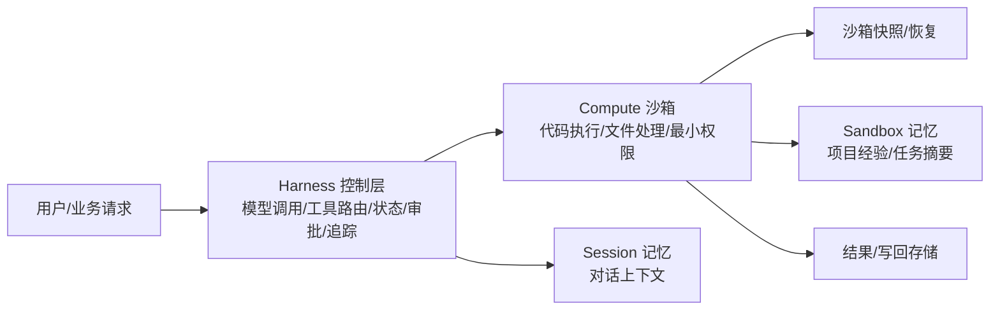

# OpenAI Agents SDK
## 知识点入口

- 本模块先看宏观流程，再看文章：[知识地图](020103_核心知识点/知识地图.md)。
- 新文章必须先归入流程节点，再判断是补充、冲突、不同层次还是降权。
- `文章/` 只保留原文锚点，长期知识必须沉淀到 `020103_核心知识点/`。

## 技术定位

| 项 | 内容 |
|---|---|
| 技术名 | OpenAI Agents SDK |
| 一级类目 | Agent 与 AI 工程 |
| 二级类目 | Agent 框架 |
| 技术本体 | 把模型调用、工具路由、运行状态、沙箱执行、记忆和追踪组织成可控 Agent 运行时 |
| 全局架构位置 | 位于模型 API 和业务应用之间，承担 Agent 控制面与执行面编排 |
| 主要使用者 | AI 应用工程师、Agent 平台工程师、安全工程师 |
| 主要产出 | Agent 运行配置、沙箱任务、记忆文件、快照恢复点、追踪记录 |

## 官方锚点

- 官网：后续补证
- GitHub：后续补证
- 官方文档：后续补证
- 架构文档：后续补证

## 架构图

## 核心模块

| 模块 | 职责 | 重点问题 |
|---|---|---|
| Harness | 控制模型调用、工具路由、审批、追踪和运行状态 | 凭证隔离、可观测、恢复策略 |
| Compute Sandbox | 执行模型生成的代码或文件操作 | 最小权限、环境一致性、销毁恢复 |
| Manifest | 声明工作空间、挂载和读写策略 | 本地到生产的一致运行语义 |
| Session 记忆 | 保存当前对话上下文 | 上下文膨胀、会话边界 |
| Sandbox 记忆 | 保存可复用项目经验和任务摘要 | 不把长期经验塞进聊天历史 |
| 快照恢复 | 容器丢失后重建运行环境 | 长任务断点续传、恢复点粒度 |

## 上下游

| 方向 | 对象 | 关系 |
|---|---|---|
| 上游 | 用户请求、业务系统、模型 API | 输入任务目标、工具调用意图和模型能力 |
| 下游 | 沙箱、云存储、代码仓库、业务结果 | 执行任务并写回产物 |
| 依赖 | 容器/托管沙箱、存储挂载、追踪系统 | 决定安全、可靠性和可审计性 |

## 横向对标

| 对标技术 | 对标点 | 优势 | 劣势 | 使用判断 |
|---|---|---|---|---|
| LangGraph | 显式状态图和流程控制 | OpenAI Agents SDK 更强调沙箱、记忆和恢复基础设施 | 图控制细粒度需后续补证 | 需要安全执行和托管运行时优先关注 SDK |
| LangChain / DeepAgents | 工具和子代理编排 | SDK 更像完整运行时控制面 | 生态边界本轮未补证 | 已在 LangChain 生态时可对照能力取舍 |
| 自研 Harness | 控制面、执行面、记忆、追踪 | SDK 可减少自研基础设施 | 平台绑定和版本演进风险 | 除非有强合规/私有化约束，避免重复造通用底座 |
| 直接主机执行 | 执行代码和工具 | 沙箱隔离显著降低攻击面 | 增加配置和恢复复杂度 | 高权限工具或不可信输入不应直接主机执行 |

## 已沉淀核心知识点

| 主题 | 文件 | 问题指纹 | 解决什么问题 | 认知增量 |
|---|---|---|---|---|
| 沙箱执行与记忆控制 | [OpenAI Agents SDK沙箱执行与记忆控制](<020103_核心知识点/OpenAI Agents SDK沙箱执行与记忆控制.md>) | OpenAI Agents SDK + Harness/Compute + 双层记忆/快照恢复 + 安全隔离和长任务连续性 + 将 Agent 框架从 API 调用校准为运行时基础设施 | 如何同时处理安全隔离、状态连续和长期任务恢复 | Agent 框架竞争点正在转向控制面、执行面、记忆和恢复，而不是单纯模型调用 |

## 后续追查

- 关键词：OpenAI Agents SDK、Harness、Compute、Sandbox、Manifest、Snapshot、Sandbox memory。
- 待读资料：官网、GitHub、官方沙箱/记忆/快照文档，本轮不联网，全部后续补证。
- 待补实验：本地最小沙箱任务，验证凭证是否进入沙箱、沙箱销毁后是否能从快照恢复。
