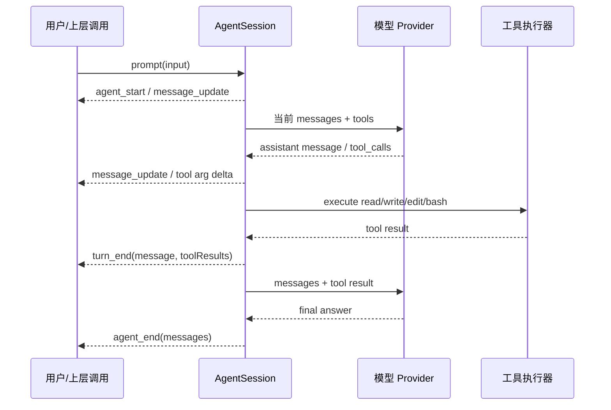

# Pi 运行时事件流与会话边界

## 原文锚点

- 本地文件：[Pi 系列 01｜用最小例子看 agent runtime 的事件流](<../文章/done-Pi 系列 01｜用最小例子看 agent runtime 的事件流.md>)；[Agent Loop的收敛：为什么OpenClaw、DeerFlow2.0和LangChain都放弃了显式ReAct](<../../../0212_COT&TOT&REACT/文章/done-Agent Loop的收敛：为什么OpenClaw、DeerFlow2.0和LangChain都放弃了显式ReAct.md>)
- 原文链接：本地 Markdown 保留公众号链接；Pi 源码路径、OpenClaw 文档和 LangChain 源码需后续补证。
- 关键段落：最小 SDK 示例、`session.subscribe`、`message_update`、`text_delta`、工具参数 delta、`turn_end`、`agent_end`、隐式状态 tool calling loop。
- 关键图：原文提到事件流骨架图，但本地 Markdown 未保留图片。

## 图片处理

| 图片 | 类型 | 是否保留 | 理由 | 处理方式 |
|---|---|---|---|---|
| Pi 事件流骨架 | 流程图 | 原图缺失 | 有助于理解模型、工具、turn 和 agent_end 的顺序 | 在本文用 Mermaid 重建简化流程 |

## 一句话结论

Pi runtime 的关键不是显式解析 ReAct 文本，而是把模型响应、工具调用、turn 边界和 run 终态暴露为结构化事件；这使上层 UI、日志、checkpoint 和会话恢复有了可依赖的边界。

## 用户相关性判断

| 项 | 内容 |
|---|---|
| 用户当前认知层级 | Agent 工作流 / Harness / 长任务运行时：L2-L3 |
| 认知成熟度 | draft |
| 阅读投入建议 | 精读 |
| 阅读投入理由 | 文章给出最小 SDK 复现路径和事件观察方法，能补 Agent runtime 的可观察性边界；但本轮未运行，不能判实践 |
| 对用户的新信息 | `turn_end` 和 `agent_end` 分别对应每轮工具交互边界和本次 run 的终态增量，可作为恢复和回放锚点 |
| 问题指纹 | Pi + agent runtime/event stream/session + tool calling loop/turn_end/agent_end + 可观察和可恢复执行 + 从 ReAct 文本解析转向结构化事件 |
| 排重判断 | 新建 |
| 置信度 | 中 |

## 认知校准点

| 校准点 | 文章观点/信息 | 与用户认知或价值观的关系 | 处理建议 |
|---|---|---|---|
| 现代 Agent loop 竞争点不在 ReAct 文本格式 | runtime 只需判断 assistant message 是否包含 tool calls | 纠偏“显式 Thought/Action 才是 Agent”的旧印象 | 把重点放到结构化工具调用、事件和状态边界 |
| 事件流比最终文本更重要 | Pi 暴露 message_update、turn_end、agent_end 等事件 | 符合用户重真实证据和可观测性的偏好 | 后续实验必须保存完整事件日志，而非只看回答 |
| turn 是恢复和治理的天然边界 | 每个 turn 包含模型响应和工具结果 | 补长任务 checkpoint、预算和中断边界 | 与长任务 Agent 运行时知识互链 |
| 工具参数 delta 是 UI/调试信号 | 工具 JSON 参数以流式 delta 形式到达 | 补工具执行前可见性 | 可用于审批预览，但需验证事件 schema |
| `agent_end` 不是完整永久会话的唯一来源 | 原文指出一次空会话中它看起来像完整历史，但整段会话还要结合已有 session | 防止误解事件语义 | 后续验证 SessionManager 的持久化和增量语义 |

## 冲突点

| 冲突类型 | 具体表现 | 影响 | 处理 |
|---|---|---|---|
| 实践门槛不足 | 原文提供步骤和日志观察，但本轮未运行 | 不能确认事件 schema、行数和模型行为 | 降为精读，后续补实验 |
| 证据不足 | Pi 源码路径、OpenClaw 文档、LangChain 源码未本轮补证 | 可能因版本变化失真 | 标为后续补证 |
| 图片缺失 | 事件流骨架图未保留 | 影响链路理解 | 用 Mermaid 重建简化流程 |
| 关键词误导 | 文章同时讲 OpenClaw、DeerFlow、LangChain | 容易把通用 Agent loop 混入 DeerFlow 本体 | Pi 笔记只吸收 Pi runtime 和 loop 机制 |

## 待吸收点

| 分级 | 内容 | 为什么值得吸收 | 后续动作 |
|---|---|---|---|
| 理解 | `session.subscribe` 可以观察 runtime 事件 | 是 UI、日志和调试的入口 | 后续跑最小例子保存事件样本 |
| 理解 | tool calling loop 是“模型 -> 工具 -> 模型”的隐式状态推进 | 解释现代 Agent 为什么不依赖 ReAct 文本解析 | 与 LangGraph create_agent 对比 |
| 记住 | `turn_end` 适合做 per-turn checkpoint、预算检查和中断点 | 影响长任务治理 | 写入 Agent 框架流程节点 |
| 记住 | `agent_end` 更适合作为本次 run 的终态增量 | 影响日志归档和跨进程回放 | 后续验证 session 历史拼接 |
| 实践 | 用固定 prompt 输出事件日志，对照 read/bash 工具调用顺序 | 能迁移到自建 harness 评估 | 补最小实验后升级为实践 |

## 已知可跳过

| 内容 | 跳过理由 |
|---|---|
| “先看到事件流再读源码”的学习建议 | 方法正确但不是技术结论 |
| ReAct 基础历史 | 用户大概率已知，只保留与结构化 tool calling 的差异 |
| 具体日志行数 | 依赖 prompt、模型和目录，不可作为稳定事实 |

## 实践门槛

| 门槛 | 判断 | 证据 |
|---|---|---|
| 可运行 | 部分 | 原文提供 `npm install`、`hello.mjs` 和 `node hello.mjs` |
| 可验证 | 部分 | 可通过固定 prompt 检查是否出现工具调用、turn_end、agent_end |
| 可排障 | 部分 | 可通过日志反查 emit 点，但缺真实错误样例 |
| 可迁移 | 是 | 可迁移到自建 Agent UI、checkpoint、审计和回放 |
| 结论 | 降为精读 | 本轮未实际运行和保存日志，暂不判实践 |

## 归类判断

| 项 | 内容 |
|---|---|
| 技术本体 | Pi agent runtime |
| 文章主问题 | 如何用最小 SDK 例子观察 Pi 的 Agent loop、事件流和 turn/session 边界 |
| 使用场景 | SDK 嵌入、事件日志、Agent UI、调试、checkpoint、长任务恢复 |
| 关键词干扰 | OpenClaw、DeerFlow、LangChain 是对标或 loop 收敛证据，不是本文最终技术对象 |
| 最终归类 | Agent 与 AI 工程 / Agent 框架 / Pi |
| 归类理由 | 主问题是 Pi runtime 的事件和会话边界，不是单纯 AI 编程工具或 DeerFlow 多智能体 |

## 技术定位

| 项 | 内容 |
|---|---|
| 技术类型 | Agent runtime / harness event stream |
| 所属领域 | Agent 与 AI 工程 |
| 二级类目 | Agent 框架 |
| 全局架构位置 | 模型 Provider、工具执行器、SessionManager 和上层 UI/编排器之间 |
| 涉及模块 | AgentSession、ModelRegistry、ResourceLoader、SessionManager、message_update、turn_end、agent_end、tool calls |
| 解决问题 | 让 Agent 执行过程可观察、可回放、可恢复，而不是只得到最终回答 |
| 原文局限 | 未补官方事件 schema、错误事件、中断恢复和持久化实现细节 |
| 我的结论 | 以后关注，适合作为理解 coding agent runtime 的最小可观察样本 |

## 纵向理解

| 维度 | 判断 |
|---|---|
| 全局架构 | 上层调用 `session.prompt`，runtime 维护当前上下文，provider 流式返回消息和工具调用，工具结果回写 messages，再进入下一轮 |
| 本文位置 | runtime 事件流和 turn 边界，不覆盖 Pi 全部产品功能 |
| 核心机制 | 结构化 tool calling loop、事件订阅、turn 分段、run 终态增量 |
| 使用链路 | 初始化 auth/model/resource/session -> subscribe 事件 -> prompt -> 观察 message/tool/turn/agent 事件 -> 归档日志 |
| 前置条件 | 可用模型、项目目录、Node 环境、固定 prompt、完整事件日志保存 |
| 边界 | 事件流只是可观察基础，生产还要补权限、预算、错误分类和持久化策略 |

## 横向对标

| 对标技术 | 实现方式 | 优势 | 劣势 | 适合场景 |
|---|---|---|---|---|
| 显式 ReAct | Prompt 输出 Thought/Action，再解析文本 | 概念直观 | 强耦合 prompt，解析不稳定 | 教学和简单 demo |
| Pi runtime | 结构化工具调用 + 事件流 + turn 边界 | 更适合 UI、日志、恢复和调试 | 事件 schema 和持久化需补证 | coding agent harness |
| LangGraph | 图节点 + checkpoint | 显式状态和恢复强 | 写法更重 | 复杂业务流程和多节点编排 |
| OpenClaw 上层 loop | 用 Pi 承载底层 agent loop，再做生命周期和多渠道 | 产品层能力强 | 上层和 Pi 本体边界要分清 | 多渠道长期助手 |

## 后续追查

- 用固定目录和 prompt 运行最小 SDK，保存完整 `out.log`、版本号、模型名和事件类型清单。
- 验证 `turn_end` 是否适合 checkpoint：中途异常后能否恢复到上一 turn。
- 验证 `agent_end.messages` 是本次 run 增量还是完整 session 历史，区分空会话和续会话。
- 补事件失败类型：模型错误、工具失败、用户中断、预算中断、上下文超限。
