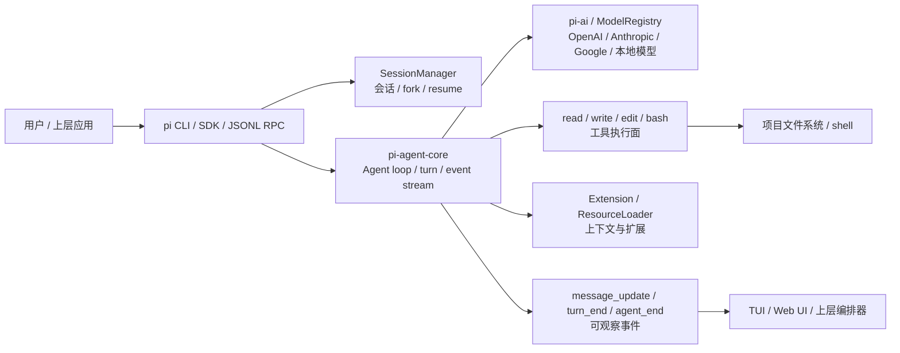

# Pi

## 知识点入口

- 本模块先看宏观流程，再看文章：[知识地图](020104_核心知识点/知识地图.md)。
- 这里的 `Pi` 指终端 coding agent 及其可嵌入 Agent runtime / SDK，不泛化为所有 AI 编程工具体验文章。
- `文章/` 只保留原文锚点，长期知识必须沉淀到 `020104_核心知识点/`。

## 技术定位

| 项 | 内容 |
|---|---|
| 技术名 | Pi |
| 一级类目 | Agent 与 AI 工程 |
| 二级类目 | Agent 框架 |
| 技术本体 | 以终端 coding agent 为入口、以 TypeScript runtime / SDK 为核心的 Agent harness，封装模型 provider、工具调用、事件流、会话和扩展机制 |
| 全局架构位置 | 位于模型 Provider、项目文件系统、终端工具和上层 Agent 应用之间，承担执行循环和会话状态管理 |
| 主要使用者 | AI 编程工具开发者、终端重度用户、Agent 平台工程师、希望嵌入 coding agent 能力的应用开发者 |
| 主要产出 | CLI 会话、工具调用事件、代码/文件修改、命令执行结果、session/fork、SDK/RPC 调用结果 |

## 官方锚点

- 官网：本地文章提到 `pi.dev`，需后续补证
- GitHub：本地文章同时提到 `github.com/badlogic/pi-mono` 和 `github.com/earendil-works/pi`，存在命名和仓库锚点冲突，需后续补证
- 官方文档：后续补证
- 架构文档：后续补证

## 架构图

## 核心模块

| 模块 | 职责 | 重点问题 |
|---|---|---|
| CLI / TUI | 提供终端交互、非交互 prompt、继续会话入口 | 是否适合终端工作流，是否能暴露足够状态给用户 |
| Agent runtime | 推进模型、工具、消息历史和事件流 | loop 是否稳定，turn 边界是否可观察和可恢复 |
| Provider 抽象 | 统一不同模型供应商和认证方式 | provider 差异、订阅登录和 API key 模式需补证 |
| 工具系统 | 默认读文件、写文件、编辑文件、执行命令 | 极简工具降低复杂度，但权限、安全、审计要外接治理 |
| Session 管理 | 继续、恢复、fork、clone、历史树 | 复杂重构和探索任务是否能回溯，不把对话做成单线流程 |
| 事件流 | 暴露工具参数 delta、message、turn、agent 结束事件 | 上层 UI、日志、checkpoint 和调试能否基于事件重放 |
| Extension / RPC | 让上层应用嵌入 Pi 或扩展能力 | 扩展接口、跨语言调用、生命周期和错误契约需补证 |

## 上下游

| 方向 | 对象 | 关系 |
|---|---|---|
| 上游 | 用户任务、项目目录、模型 Provider、认证凭证 | 提供任务、上下文和模型能力 |
| 下游 | 代码修改、shell 命令、上层 GUI/平台、OpenClaw/Craft Agents/agent-wrapper 等封装应用 | 消费 Pi 的 runtime、SDK、RPC 或 provider 能力 |
| 依赖 | TypeScript / Node.js、终端、文件系统、shell、模型 API 或订阅登录 | 决定安装路径、执行安全和跨平台稳定性 |

## 横向对标

| 对标技术 | 对标点 | 优势 | 劣势 | 使用判断 |
|---|---|---|---|---|
| Claude Code | 终端 coding agent | Pi 更可组合、可嵌入、provider 更开放 | Claude Code 生态、模型和产品闭环更强 | 需要可扩展开源 runtime 时看 Pi，Claude 重度用户优先 Claude Code |
| Codex CLI | 终端/云端 coding agent | Pi 更强调本地 runtime、session tree 和 SDK 嵌入 | Codex 与 OpenAI 云端/代码工作流结合更深 | 异步云端任务看 Codex，本地可组合 runtime 看 Pi |
| OpenCode | 开源终端 coding agent | Pi 文章强调 TypeScript SDK、事件流和 provider 抽象 | OpenCode 生态和实现路线需单独补证 | 两者都需做最小实验后再判断 |
| LangGraph | 显式图状态和节点编排 | Pi 更轻，适合 coding agent loop 和终端执行 | 复杂状态图、可视化编排不如 LangGraph 显式 | 需要图式流程控制选 LangGraph，需要终端 agent runtime 选 Pi |
| OpenAI Agents SDK | 官方 Agent SDK 和执行抽象 | Pi 更贴近开源终端 coding agent 与本地文件系统 | 官方能力、沙箱和托管能力需看 Agents SDK | 官方生态选 Agents SDK，可自托管终端工具链看 Pi |
| agent-wrapper | 多 coding agent provider 统一封装 | 可把 Pi 当 provider 接入上层编排 | 不是 Pi 本体，会引入额外协议和治理层 | 多 agent 切换、审批、预算、恢复统一时再看 wrapper |

## 已沉淀核心知识点

| 主题 | 文件 | 问题指纹 | 解决什么问题 | 认知增量 |
|---|---|---|---|---|
| 极简 Coding Agent 与可扩展 Harness | [Pi极简Coding Agent与可扩展Harness](<020104_核心知识点/Pi极简Coding Agent与可扩展Harness.md>) | Pi + CLI/SDK/工具系统/Provider + 四工具/扩展/RPC/session + 终端 coding agent 可组合性 + 极简不是免治理 | 如何理解 Pi 为什么把功能砍到四个核心工具，并把扩展交给 SDK/Extension/上层应用 | Pi 的价值不是“功能少”，而是把运行时、工具和上层产品边界拆开 |
| 运行时事件流与会话边界 | [Pi运行时事件流与会话边界](020104_核心知识点/Pi运行时事件流与会话边界.md) | Pi + agent runtime/event stream/session + tool calling loop/turn_end/agent_end + 可观察和可恢复执行 + 从 ReAct 文本解析转向结构化事件 | 如何通过事件流理解 Agent loop、turn、工具调用和会话恢复 | 现代 coding agent 的核心竞争点是可观察 runtime，而不是显式 ReAct 文本格式 |

## 后续追查

- 关键词：Pi、pi-agent-core、pi-coding-agent、pi-ai、AgentSession、turn_end、agent_end、SessionManager、fork、JSONL RPC、oh-my-pi。
- 待读资料：官网、GitHub README、包名和仓库迁移历史、官方 provider 列表、RPC 文档、extension API。
- 待补实验：跑通最小 SDK 例子，记录事件流、session 恢复、fork、read/write/edit/bash 权限边界和失败日志。
