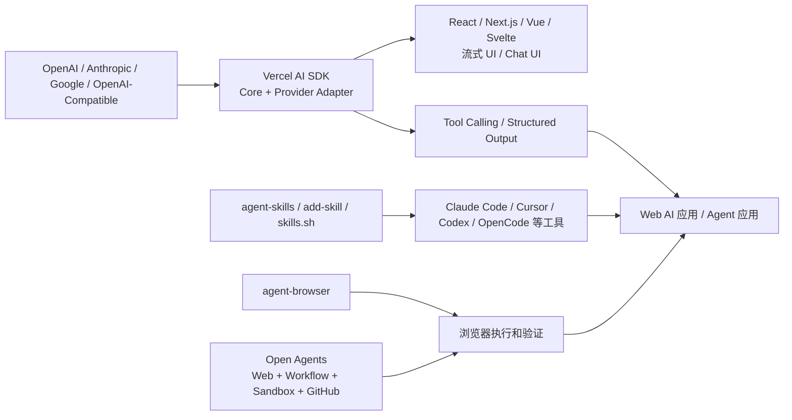

# Vercel

## 知识点入口

- 本模块先看宏观流程，再看文章：[知识地图](020105_核心知识点/知识地图.md)。
- 这里的 `Vercel` 只指 Vercel 在 AI / Agent 工程中的 SDK、Open Agents、Skills 和浏览器执行工具，不泛化为 Vercel 云平台或前端部署教程。
- `文章/` 只保留原文锚点，长期知识必须沉淀到 `020105_核心知识点/`。

## 技术定位

| 项 | 内容 |
|---|---|
| 技术名 | Vercel AI / Agent 工程栈 |
| 一级类目 | Agent 与 AI 工程 |
| 二级类目 | Agent 框架 |
| 技术本体 | 围绕 AI SDK、Open Agents、agent-skills、add-skill、agent-browser 等能力形成的 Web AI 应用和云端 Agent 基础设施栈 |
| 全局架构位置 | 位于模型 Provider、前端交互、工具调用、Skills 分发、浏览器执行和云端 coding agent 工作流之间 |
| 主要使用者 | Web AI 应用开发者、AI 编程工具开发者、内部 Agent 平台工程师 |
| 主要产出 | 多模型调用封装、流式 UI、工具调用、Skills 安装分发、云端 Agent 工作流、沙箱执行任务 |

## 官方锚点

- 官网：本地文章指向 `https://ai-sdk.dev`，需后续补证
- GitHub：本地文章指向 `https://github.com/vercel/ai`、`https://github.com/vercel-labs/add-skill`、`https://github.com/vercel-labs/agent-skills`、`https://github.com/vercel-labs/agent-browser`、`https://github.com/vercel-labs/open-agents`，需后续补证
- 官方文档：后续补证
- 架构文档：后续补证

## 架构图

## 核心模块

| 模块 | 职责 | 重点问题 |
|---|---|---|
| AI SDK Core | 统一文本生成、流式生成、对象生成、工具调用等 API | 是否降低 provider 切换成本，是否保留底层控制 |
| Provider 适配 | 官方 provider、OpenAI 兼容 provider、社区 provider | 模型差异、功能缺口、版本和更新时效 |
| UI 层 | React/Next.js/Vue/Svelte hooks 和流式 UI | UI 状态、流式响应、RSC 边界和生产稳定性 |
| agent-skills | Vercel Labs 技能包集合 | 技能质量、适用范围、跨工具兼容 |
| add-skill / skills.sh | Skills 安装、分发、市场和排行 | 是否从“收藏 prompt”升级为可分发工作流 |
| agent-browser | 为 Agent 提供浏览器控制能力 | 浏览器权限、会话隔离、可观测性 |
| Open Agents | 云端 coding agent 参考平台 | workflow/sandbox/GitHub/control plane 是否分离 |

## 上下游

| 方向 | 对象 | 关系 |
|---|---|---|
| 上游 | 模型 Provider、GitHub 仓库、Skills 仓库、浏览器会话 | 提供模型能力、代码上下文、技能和执行环境 |
| 下游 | Web AI 应用、coding agent、内部开发平台、预览部署 | 消费 SDK、workflow、skills 和 sandbox 能力 |
| 依赖 | TypeScript/Node/React/Next.js、云端 workflow、沙箱、OAuth/GitHub App | 决定生态贴合度和落地复杂度 |

## 横向对标

| 对标技术 | 对标点 | 优势 | 劣势 | 使用判断 |
|---|---|---|---|---|
| LangChain JS | 模型调用、工具和链路编排 | Vercel AI SDK 更贴近 Web/TypeScript/UI 流式体验 | LangChain 生态更广，Agent 编排更完整 | Web AI 应用优先看 AI SDK，复杂 Agent 编排另看 LangGraph/LangChain |
| OpenAI Agents SDK | Agent API、工具和执行控制 | Vercel AI SDK 多 provider 和前端 UI 体验更强 | Agents SDK 更偏官方 Agent 执行抽象 | Web 应用选 AI SDK，Agent 执行面选 Agents SDK |
| Claude/Codex Skills | 技能文档和工具能力包 | Vercel add-skill 尝试做跨工具分发 | 质量、权限和版本治理需补证 | 多工具复用 Skills 时关注 Vercel 生态 |
| 本地 IDE Agent | 本地上下文和人工控制 | Open Agents 更强调云端 workflow、sandbox 和 GitHub 闭环 | 部署和安全成本更高 | 需要后台持续运行和组织接入时看 Open Agents |
| 手写 provider 适配层 | 直接接各模型 API | 控制力强 | 切换成本和重复代码高 | provider 少且定制极深时手写，否则优先 SDK |

## 已沉淀核心知识点

| 主题 | 文件 | 问题指纹 | 解决什么问题 | 认知增量 |
|---|---|---|---|---|
| AI SDK 多 Provider 与工具调用抽象 | [VercelAI SDK多Provider与工具调用抽象](<020105_核心知识点/VercelAI SDK多Provider与工具调用抽象.md>) | Vercel AI SDK + Provider/Core/UI/Tool Calling + 多模型适配/流式 UI/结构化输出 + Web AI 应用工程化 + 从手写适配层转向统一 SDK | 如何用 TypeScript 生态统一模型调用、工具调用和前端交互 | AI SDK 不是单纯 Next.js 插件，而是 Web AI 应用的 provider 和 UI 抽象层 |
| Open Agents 与 Skills 生态 | [Vercel Open Agents与Skills生态](<020105_核心知识点/Vercel Open Agents与Skills生态.md>) | Vercel + Open Agents/add-skill/agent-skills/agent-browser + workflow/sandbox/Skills 分发 + 云端 coding agent 与能力包管理 + 控制面执行面分离 | 如何理解 Vercel 在 Agent 基础设施上的布局 | Vercel 的重点从部署平台扩展到 Agent 运行底盘、技能分发和浏览器执行 |

## 后续追查

- 关键词：Vercel AI SDK、AI SDK 6、Provider、tool calling、streamText、streamObject、Open Agents、add-skill、agent-skills、agent-browser、skills.sh。
- 待读资料：官方文档、仓库 README、版本状态、Open Agents 部署说明；本轮只用本地文章，未联网补证。
- 待补实验：用同一小应用验证 provider 切换、工具调用、结构化输出、流式 UI；用 add-skill 安装一个技能并记录跨工具目录差异。
