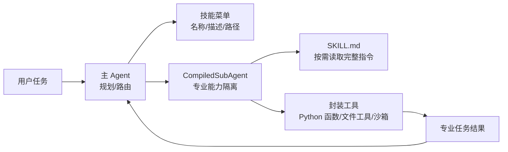

# DeepAgents
## 知识点入口

- 本模块先看宏观流程，再看文章：[流程化知识点总览](knowledge/02_Agent与AI工程/0201_Agent框架/DeepAgents/核心知识点/流程化知识点总览.md)。
- 新文章必须先归入流程节点，再判断是补充、冲突、不同层次还是降权。
- `文章/` 只保留原文锚点，长期知识必须沉淀到 `核心知识点/`。

## 技术定位

| 项 | 内容 |
|---|---|
| 技术名 | DeepAgents |
| 一级类目 | Agent 与 AI 工程 |
| 二级类目 | Agent 框架 |
| 技术本体 | 以工具、子代理、任务规划和技能文档为核心的 Agent 编排框架 |
| 全局架构位置 | 位于 LLM、工具集合和专业任务执行层之间，承担任务路由和能力隔离 |
| 主要使用者 | Agent 应用工程师、AI 工程平台开发者 |
| 主要产出 | 主 Agent、CompiledSubAgent、技能注册表、工具封装、任务计划 |

## 官方锚点

- 官网：后续补证
- GitHub：后续补证
- 官方文档：后续补证
- 架构文档：后续补证

## 架构图

## 核心模块

| 模块 | 职责 | 重点问题 |
|---|---|---|
| 主 Agent | 识别任务、规划步骤、委派子代理 | 路由准确性、上下文控制 |
| CompiledSubAgent | 封装专业能力和工具集 | 能力隔离、输入输出契约 |
| SkillRegistry | 扫描 SKILL.md 元数据并生成技能菜单 | 渐进式披露、避免一次性塞满上下文 |
| 工具封装 | 把脚本或函数变成可调用工具 | 安全边界、参数校验、错误处理 |
| 执行环境 | 运行动态代码或工具脚本 | 本地 REPL 风险、生产沙箱 |

## 上下游

| 方向 | 对象 | 关系 |
|---|---|---|
| 上游 | 用户任务、主 Agent 计划 | 决定是否委派给专业子代理 |
| 下游 | PDF/搜索/RAG 等专业工具 | 产出专业任务结果 |
| 依赖 | LangChain 工具、文件读取、沙箱执行 | 决定安全性和可控性 |

## 横向对标

| 对标技术 | 对标点 | 优势 | 劣势 | 使用判断 |
|---|---|---|---|---|
| Claude Skills | 技能文档驱动能力扩展 | DeepAgents 可把 Skill 进一步封装成子代理 | 原文称核心包内置能力不足，需后续补证 | 需要专业能力隔离时，Skill + SubAgent 比纯文档更稳 |
| LangGraph | 图状态和流程控制 | DeepAgents 更偏主从代理和工具委派 | 底层状态控制不如 LangGraph 显式 | 复杂流程控制选 LangGraph，能力分包选 DeepAgents |
| 普通工具调用 | 函数列表直接暴露给模型 | 子代理降低主 Agent 上下文负担 | 多一层路由和调试成本 | 工具多且专业步骤复杂时使用 |
| PythonREPLTool | 动态代码执行 | 灵活覆盖边缘情况 | 本地执行风险高 | 生产必须换沙箱或最小权限执行环境 |

## 已沉淀核心知识点

| 主题 | 文件 | 问题指纹 | 解决什么问题 | 认知增量 |
|---|---|---|---|---|
| 技能扩展与子代理隔离 | [DeepAgents技能扩展与子代理隔离](核心知识点/DeepAgents技能扩展与子代理隔离.md) | DeepAgents + Skills/SubAgent + 渐进式披露/CompiledSubAgent + 工具扩展与上下文控制 + 把技能从提示词堆叠校准为能力隔离机制 | 如何避免主 Agent 一次性加载大量技能和工具 | 技能系统的关键不是“更多工具”，而是菜单化、按需读取和专业子代理隔离 |

## 后续追查

- 关键词：DeepAgents、CompiledSubAgent、SkillsMiddleware、SkillRegistry、Progressive Disclosure。
- 待读资料：DeepAgents 官方文档、CLI 与核心包能力差异，本轮不联网，全部后续补证。
- 待补实验：构建一个只读文件分析子代理，验证主 Agent 是否能按任务稳定委派并限制工具范围。
