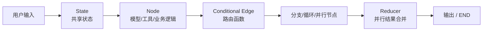

# LangGraph
## 知识点入口

- 本模块先看宏观流程，再看文章：[流程化知识点总览](knowledge/02_Agent与AI工程/0201_Agent框架/LangGraph/核心知识点/流程化知识点总览.md)。
- 新文章必须先归入流程节点，再判断是补充、冲突、不同层次还是降权。
- `文章/` 只保留原文锚点，长期知识必须沉淀到 `核心知识点/`。

## 技术定位

| 项 | 内容 |
|---|---|
| 技术名 | LangGraph |
| 一级类目 | Agent 与 AI 工程 |
| 二级类目 | Agent 框架 |
| 技术本体 | 用图结构组织 Agent 状态、节点、边、条件路由、循环、并行和子图 |
| 全局架构位置 | 位于 LLM、工具调用和业务应用之间，承担 Agent 工作流编排与状态控制 |
| 主要使用者 | AI 应用工程师、Agent 平台工程师 |
| 主要产出 | 图工作流、节点函数、状态对象、路由函数、可执行 Agent |

## 官方锚点

- 官网：[LangGraph](https://www.langchain.com/langgraph)
- GitHub：[langchain-ai/langgraph](https://github.com/langchain-ai/langgraph)
- 官方文档：[LangGraph Docs](https://langchain-ai.github.io/langgraph/)

## 架构图

## 核心模块

| 模块 | 职责 | 重点问题 |
|---|---|---|
| State | 保存节点之间传递的上下文 | 字段合并、状态膨胀、持久化 |
| Node | 执行模型、工具或业务逻辑 | 输入输出契约、错误处理 |
| Edge | 控制节点顺序和路径 | 条件路由、循环终止、分支覆盖 |
| Reducer | 合并并行分支状态 | 冲突字段、幂等性 |
| Subgraph | 封装复杂流程 | 模块边界、状态映射 |

## 横向对标

| 对标技术 | 对标点 | LangGraph 优势 | LangGraph 劣势 | 使用判断 |
|---|---|---|---|---|
| LangChain Agent | Agent 编排 | LangGraph 状态和流程控制更显式 | 上手成本更高 | 复杂流程和可控性优先 LangGraph |
| CrewAI | 多 Agent 协作 | LangGraph 更底层、可组合 | 需要自己设计更多控制逻辑 | 需要精细状态控制时选 LangGraph |
| Dify / n8n | 工作流平台 | LangGraph 代码化、灵活 | 非技术用户门槛高 | 工程团队自定义 Agent 流程 |
| 手写状态机 | 流程控制 | LangGraph 有生态和标准 API | 仍需理解图模型 | 中复杂 Agent 应避免散乱手写 |

## 已沉淀核心知识点

| 主题 | 文件 | 问题指纹 | 解决什么问题 | 认知增量 |
|---|---|---|---|---|
| 流程控制模式 | [LangGraph流程控制模式](核心知识点/LangGraph流程控制模式.md) | LangGraph + 控制流 + 条件边/循环/并行/Send/子图 + Agent 工作流可控性 + 防止框架教程碎片化 | LangGraph 如何表达分支、循环、并行和模块化 | 把 LangGraph 从“Agent 框架名词”校准为“显式状态机和图工作流” |
| 子图与并行状态合并 | [LangGraph子图与并行状态合并](核心知识点/LangGraph子图与并行状态合并.md) | LangGraph + Subgraph/并行阶段 + 嵌套/条件子图/汇聚节点 + 多 Agent 阶段内并行 + 状态合并和失败隔离 | LangGraph 子图如何承载阶段内并行、失败检查和状态合并 | 子图不是越多越好，关键是边界、并行度、汇聚检查和合并规则 |
| 记忆与反馈循环 | [LangGraph记忆与反馈循环](核心知识点/LangGraph记忆与反馈循环.md) | LangGraph + Checkpointer/Store + 反馈触发/记忆管理器/动态 Prompt + 跨会话偏好学习 + 区分短期状态和长期规则 | LangGraph 如何区分线程状态、长期记忆和用户反馈学习 | 长期记忆不是聊天记录堆叠，而是明确反馈触发的受控规则更新 |

## 后续追查

- 关键词：StateGraph、conditional edges、Send API、Reducer、Subgraph、checkpoint。
- 待读资料：LangGraph 持久化、Human-in-the-loop、观测与部署；本轮不联网，官方字段后续补证。
- 待补实验：用 LangGraph 重建当前文章整理流程的路由、复核、沉淀三个节点，并验证 Store 反馈记忆是否会污染长期规则。
