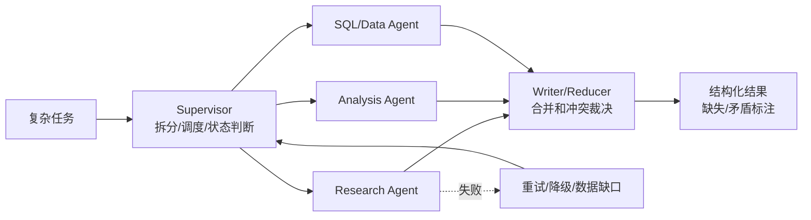

# 多 Agent 协作
## 知识点入口

- 本模块先看宏观流程，再看文章：[流程化知识点总览](knowledge/02_Agent与AI工程/0201_Agent框架/多Agent协作/核心知识点/流程化知识点总览.md)。
- 新文章必须先归入流程节点，再判断是补充、冲突、不同层次还是降权。
- `文章/` 只保留原文锚点，长期知识必须沉淀到 `核心知识点/`。

## 技术定位

| 项 | 内容 |
|---|---|
| 技术名 | 多 Agent 协作 |
| 一级类目 | Agent 与 AI 工程 |
| 二级类目 | Agent 框架 |
| 技术本体 | 通过 Supervisor、子 Agent、共享状态、并行执行和结果合并规则组织多个智能体完成复杂任务 |
| 全局架构位置 | 位于单 Agent 工具调用之上、业务工作流之下，承担任务拆分、并发执行、失败隔离和汇总裁决 |
| 主要使用者 | AI 应用工程师、数据/研究 Agent 设计者、平台工程师 |
| 主要产出 | 子任务计划、子 Agent 结果、降级状态、合并报告、冲突标注 |

## 官方锚点

- 官网：不适用，后续补证同类框架资料
- GitHub：不适用，后续补证同类框架资料
- 官方文档：不适用，后续补证同类框架资料
- 架构文档：后续补证

## 架构图

## 核心模块

| 模块 | 职责 | 重点问题 |
|---|---|---|
| Supervisor | 拆分任务、分配子 Agent、判断下一步 | 决策权集中、避免子 Agent 自行扩散 |
| 子 Agent | 在独立上下文中完成专业子任务 | 输入输出契约、失败隔离 |
| 并行执行器 | 并发运行无依赖子任务 | 并发上限、异常收集、资源限流 |
| 降级策略 | 子任务失败后继续主流程 | 数据缺口标注、重试次数、业务可接受性 |
| Writer/Reducer | 合并重复和矛盾结果 | 优先级规则、证据权重、人工复核点 |

## 上下游

| 方向 | 对象 | 关系 |
|---|---|---|
| 上游 | 复杂分析/研究/报告任务 | 需要拆成可并行或可专业化的子问题 |
| 下游 | 报告生成、数据产品、业务决策 | 消费合并后的结构化结果 |
| 依赖 | LangGraph 等状态框架、异步执行、工具调用 | 决定并行和故障隔离能力 |

## 横向对标

| 对标技术 | 对标点 | 优势 | 劣势 | 使用判断 |
|---|---|---|---|---|
| 单 Agent ReAct | 多步骤任务执行 | 多 Agent 可隔离上下文并并行 | 协调和合并成本更高 | 多维度、低耦合任务才值得拆 |
| LangGraph 子图 | 阶段内并行与状态合并 | 多 Agent 可用子图实现 | 仍需自己定义合并规则 | 需要显式状态控制时组合使用 |
| CrewAI / AutoGen | 角色化多 Agent 协作 | 有较高层抽象 | 可控性和状态细节需验证 | 适合快速角色协作原型 |
| Map-Reduce | 批量任务并行和汇总 | 简单、可解释 | 缺少动态专家协作 | 子任务同质化时优先用 Map-Reduce |

## 已沉淀核心知识点

| 主题 | 文件 | 问题指纹 | 解决什么问题 | 认知增量 |
|---|---|---|---|---|
| Supervisor 控制边界 | [多Agent协作的Supervisor控制边界](核心知识点/多Agent协作的Supervisor控制边界.md) | 多 Agent 协作 + Supervisor/并行/降级/Writer + 任务分配和结果合并 + 生产可控性 + 避免把多个 LLM 调用误认为多 Agent 系统 | 多 Agent 如何处理分配、失败、矛盾和并发上限 | 多 Agent 的价值不在“Agent 数量”，而在决策权、失败隔离和合并规则显式化 |

## 后续追查

- 关键词：Supervisor pattern、multi-agent orchestration、result merge、degraded agent、conflict resolution。
- 待读资料：AutoGen、CrewAI、LangGraph multi-agent 官方材料，本轮不联网，全部后续补证。
- 待补实验：用 3 个子 Agent 并行分析同一主题，强制制造矛盾结论，验证 Writer 是否按显式优先级标注冲突。
