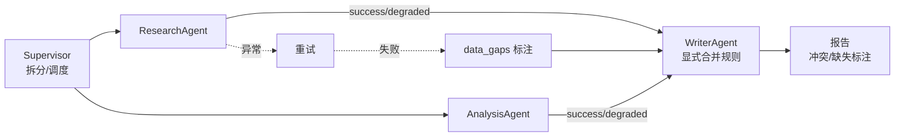

# 多 Agent 协作的 Supervisor 控制边界

## 原文锚点

- 本地文件：[字节面试官问："你说做了 Multi-Agent，Supervisor 怎么分配任务？子 Agent 挂了怎么处理？三个 Agent 同时写报告，结果怎么合并？](../文章/字节面试官问：_你说做了 Multi-Agent，Supervisor 怎么分配任务？子 Agent 挂了怎么处理？三个 Agent 同时写报告，结果怎么合并？.md)
- 原文链接：`https://mp.weixin.qq.com/s?__biz=MzkzMDIwMzg1Mw==&mid=2247490011&idx=1&sn=b0833c131ac585a0fb06b7dd6fba5a28`
- 关键段落：Supervisor 模式、TypedDict 状态、`return_exceptions=True`、重试与降级、WriterAgent 合并矛盾、并行上限。
- 关键图：正文提到 Supervisor 架构和错误处理图，但本地 Markdown 无图。

## 图片处理

| 图片 | 类型 | 是否保留 | 理由 | 处理方式 |
|---|---|---|---|---|
| Supervisor 模式架构 | 架构图 | 原图缺失 | 正文直接引用架构图名称但 Markdown 无图 | Mermaid 重建 |
| 子 Agent 错误处理图 | 流程图 | 原图缺失 | 失败处理是核心机制 | 合并到 Mermaid 重建图 |

## 一句话结论

这篇文章值得精读：它把 Multi-Agent 从“多个 LLM 调用并排”校准为“Supervisor 控制决策权、子 Agent 失败隔离、Writer 显式合并冲突”的工程系统。

## 用户相关性判断

| 项 | 内容 |
|---|---|
| 用户当前认知层级 | Agent 工作流 / 多 Agent：L2 |
| 认知成熟度 | draft |
| 阅读投入建议 | 精读 |
| 阅读投入理由 | 能补任务分配、失败处理、结果合并和并行边界，但性能数字来自原文单一案例，不能直接采信 |
| 对用户的新信息 | 真正的多 Agent 必须回答分配、失败、降级、冲突裁决和并发上限 |
| 问题指纹 | 多 Agent 协作 + Supervisor/子 Agent/Writer + 重试降级/显式合并/并行上限 + 复杂分析任务可控性 + 防止把多个调用误认为系统 |
| 排重判断 | 新建 |
| 置信度 | 中 |

## 认知校准点

| 校准点 | 文章观点/信息 | 与用户认知或价值观的关系 | 处理建议 |
|---|---|---|---|
| 多 Agent 不是数量问题 | 原文批判“几个 LLM 调用摆一起” | 纠偏标题化理解 | 以后按控制权和状态契约判断 |
| 决策权应在 Supervisor | 子 Agent 执行完回到 Supervisor，由它判断下一步 | 补充可控性边界 | 子 Agent 不应自行扩散任务 |
| 子任务失败不能污染全局 | `return_exceptions=True`、重试、降级和 data_gaps | 补失败场景 | 并行任务默认收集异常，不直接整体失败 |
| 合并规则必须显式 | 财务数据优先新闻检索，并标注矛盾 | 符合反泛泛总结偏好 | Writer 需要优先级和冲突模板 |
| 并行有上限 | 2-3 个子 Agent 是原文案例中的平衡点 | 防止“更多 Agent 更好” | 作为待验证经验，不写成通用定律 |

## 冲突点

| 冲突类型 | 具体表现 | 影响 | 处理 |
|---|---|---|---|
| 原目录冲突 | 原文在 `01_LLM与大模型`，主问题是多 Agent 工程架构 | 可能误归为模型能力 | 重路由到 Agent 框架 |
| 图片缺失 | 正文提到架构图和错误处理图但无图 | 缺少快速理解链路 | Mermaid 重建 |
| 证据不足 | 50 个任务 A/B、评分提升、并行数量收益没有完整实验细节 | 不能采信为通用性能结论 | 只保留边界和指标方向 |
| 标题/面试包装 | 面试问答结构有传播包装 | 可能夸大普适性 | 降权营销表达 |

## 待吸收点

| 分级 | 内容 | 为什么值得吸收 | 后续动作 |
|---|---|---|---|
| 记住 | 多 Agent 首先要说清分工、状态、失败和合并 | 是判断系统成熟度的检查表 | 写入多 Agent index |
| 理解 | Supervisor 模式把决策权和执行权分离 | 降低子 Agent 失控扩散 | 后续实验使用中心路由 |
| 记住 | 并行任务用异常作为结果收集，逐项降级 | 避免单点失败中断全局 | 设计 `status=degraded` 协议 |
| 记住 | Writer 合并矛盾时要按证据权重，而不是让 LLM 自由裁决 | 保证一致性和可审计 | 为报告类 Agent 定义来源优先级 |
| 理解 | 并行收益受协调开销和 API 限流约束 | 防止无脑拆 Agent | 后续记录并行度实验 |

## 已知可跳过

| 内容 | 跳过理由 |
|---|---|
| 面试故事铺垫 | 不是技术机制 |
| “怎么答面试”段落 | 用户更关注工程准则 |
| 单一项目性能数字 | 缺基线和复现实验 |
| 往期推荐链接 | 不进入知识点 |

## 实践门槛

| 门槛 | 判断 | 证据 |
|---|---|---|
| 可运行 | 部分 | 有 LangGraph 状态和节点代码片段 |
| 可验证 | 部分 | 有案例指标，但缺完整数据和脚本 |
| 可排障 | 是 | 明确重试、降级、数据缺口和冲突标注 |
| 可迁移 | 是 | 可迁移到用户文章分析、多源数据分析和报告生成 |
| 结论 | 降为精读 | 可作为后续实验设计，不直接判实践 |

## 归类判断

| 项 | 内容 |
|---|---|
| 技术本体 | 多 Agent 协作 / Supervisor 模式 |
| 文章主问题 | 多 Agent 如何分配任务、处理失败、合并冲突和限制并行 |
| 使用场景 | 银行对公风险评估报告 |
| 关键词干扰 | LangGraph 是实现框架；金融场景是案例；LLM 是底层能力 |
| 最终归类 | Agent 与 AI 工程 / Agent 框架 / 多 Agent 协作 |
| 归类理由 | 主问题是 Agent 编排架构和工程控制边界 |

## 技术定位

| 项 | 内容 |
|---|---|
| 技术类型 | 架构模式 / Agent 编排模式 |
| 所属领域 | Agent 与 AI 工程 |
| 二级类目 | Agent 框架 |
| 全局架构位置 | 单 Agent 工具调用之上，业务报告/分析应用之下 |
| 涉及模块 | Supervisor、子 Agent、共享状态、异步并行、重试降级、Writer/Reducer |
| 解决问题 | 复杂任务拆分、多上下文隔离、并行提效、结果冲突裁决 |
| 原文局限 | 实验数据不可复核，缺权限、安全和长期状态讨论 |
| 我的结论 | 以后关注，作为多 Agent 协作成熟度检查表 |

## 纵向理解

| 维度 | 判断 |
|---|---|
| 全局架构 | 任务 -> Supervisor 拆分 -> 子 Agent 并行/串行执行 -> 降级和缺口进入状态 -> Writer 按规则合并 |
| 本文位置 | 多 Agent 控制和结果合并，不覆盖长期记忆、权限、部署 |
| 核心机制 | Supervisor 持有决策权，子 Agent 独立执行，异常被结构化为状态，Writer 按显式优先级合并 |
| 使用链路 | 定义状态 -> 路由子 Agent -> 并行执行 -> 捕获异常 -> 标记 data_gaps -> Writer 合并 |
| 前置条件 | 子任务低耦合、输出格式统一、冲突优先级明确、业务允许部分降级 |
| 边界 | 简单单维查询不需要多 Agent；强顺序依赖不能强行并行；高风险决策需人工复核 |

## 横向对标

| 对标技术 | 实现方式 | 优势 | 劣势 | 适合场景 |
|---|---|---|---|---|
| 单 Agent | 一个 ReAct 循环顺序执行 | 简单、协调成本低 | 长上下文和专业能力冲突 | 单维简单任务 |
| Supervisor 多 Agent | 中心调度、子 Agent 执行 | 控制权清晰、失败隔离 | 中心瓶颈、规则设计成本 | 多维分析和报告 |
| Peer-to-peer 多 Agent | Agent 间互相通信 | 自组织灵活 | 可控性弱、难审计 | 研究实验 |
| Map-Reduce | 同质任务并行后汇总 | 简单可扩展 | 不适合异构专家 | 批量同类任务 |

## 后续追查

- 关键词：Supervisor pattern、multi-agent retry、degraded result、conflict resolution、result merge。
- 相关技术：LangGraph 子图、DeepAgents 子代理、Agent 评估与观测。
- 需要补读的文章：多 Agent 选型、AutoGen/CrewAI/LangGraph 官方多 Agent 文档；本轮不联网，后续补证。
