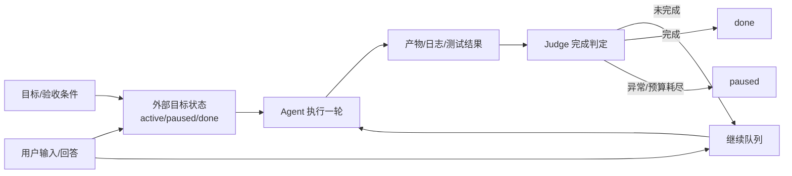

# 长任务 Agent 运行时
## 知识点入口

- 本模块先看宏观流程，再看文章：[流程化知识点总览](knowledge/02_Agent与AI工程/0201_Agent框架/长任务Agent运行时/核心知识点/流程化知识点总览.md)。
- 新文章必须先归入流程节点，再判断是补充、冲突、不同层次还是降权。
- `文章/` 只保留原文锚点，长期知识必须沉淀到 `核心知识点/`。

## 技术定位

| 项 | 内容 |
|---|---|
| 技术名 | 长任务 Agent 运行时 |
| 一级类目 | Agent 与 AI 工程 |
| 二级类目 | Agent 框架 |
| 技术本体 | 把目标、状态、预算、暂停恢复、完成判定和用户输入组织成可持续推进的 Agent 运行控制面 |
| 全局架构位置 | 位于单轮对话和业务任务之间，负责让 Agent 从“回复一轮”升级为“围绕完成条件持续执行” |
| 主要使用者 | Agent 平台工程师、AI 编程/资料整理/报告生成工具开发者 |
| 主要产出 | 目标状态、子目标、暂停态、继续队列、Judge 判定、恢复记录 |

## 官方锚点

- 官网：不适用，后续补证同类框架资料
- GitHub：不适用，后续补证同类框架资料
- 官方文档：不适用，后续补证同类框架资料
- 架构文档：后续补证

## 架构图

## 核心模块

| 模块 | 职责 | 重点问题 |
|---|---|---|
| 目标状态 | 持久化目标、状态、预算和子目标 | 跨会话恢复、可审计 |
| 生命周期管理 | set/pause/resume/clear/mark_done | 不能只有继续和结束 |
| Judge | 判断最近一轮是否满足目标 | 误判完成、格式稳定性 |
| 继续队列 | 未完成时自动投递下一轮提示 | 用户输入优先级、失控循环 |
| 人机交互暂停 | 等待用户回答或审批 | Wait 与 Resume 模式边界 |
| 预算与失败保护 | 限制轮次、处理 Judge 异常 | fail-open 与自动暂停的平衡 |

## 上下游

| 方向 | 对象 | 关系 |
|---|---|---|
| 上游 | 用户目标、验收条件、权限/输入 | 决定是否可自动推进 |
| 下游 | 代码变更、报告、测试结果、审批结果 | 作为 Judge 和用户复核证据 |
| 依赖 | 状态存储、队列、Hook/canUseTool、Judge 模型 | 决定能否暂停、恢复和审计 |

## 横向对标

| 对标技术 | 对标点 | 优势 | 劣势 | 使用判断 |
|---|---|---|---|---|
| 普通聊天循环 | 一轮一回复 | 长任务运行时可持续推进 | 实现复杂，需要状态和判定 | 多轮可验收任务才需要 |
| while true 脚本 | 自动续跑 | 运行时有预算、暂停、Judge | 仍需防误判和权限风险 | 不能用裸循环跑高风险任务 |
| LangGraph checkpoint | 状态持久化 | 长任务运行时把目标和完成条件显式化 | checkpoint 不等于目标控制 | 两者应组合使用 |
| 人工手动继续 | 用户判断是否继续 | 运行时减少人工盯守 | 目标模糊时会摇摆 | 目标写不成验收单时仍需人工 |

## 已沉淀核心知识点

| 主题 | 文件 | 问题指纹 | 解决什么问题 | 认知增量 |
|---|---|---|---|---|
| 状态持久化与暂停恢复 | [长任务Agent运行时的状态持久化与暂停恢复](核心知识点/长任务Agent运行时的状态持久化与暂停恢复.md) | 长任务 Agent 运行时 + 目标状态/Judge/暂停恢复/AskUserQuestion + 持续执行和用户输入 + 可控性边界 + 把 Agent 从聊天校准为有状态执行进程 | 长任务如何避免半途停止、误判完成、无法恢复和抢用户输入 | 长任务的核心不是更长上下文，而是外部状态、明确验收、保守 Judge、暂停态和用户优先 |

## 后续追查

- 关键词：goal state、Judge loop、pause/resume、AskUserQuestion、PreToolUse defer、canUseTool、SSE pending。
- 待读资料：Hermes /goal、Claude/Codex goal、Claude Agent SDK 交互机制官方资料，本轮不联网，全部后续补证。
- 待补实验：用一个本地报告生成任务验证目标状态、轮次预算、用户插话优先级和 Judge 误判保护。
