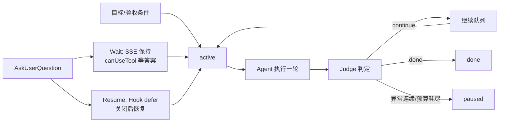

# 长任务 Agent 运行时的状态持久化与暂停恢复

## 原文锚点

- 本地文件 1：[Hermes Agent /goal 长任务运行时架构拆解：状态持久化、Judge 闭环与自主续航](../文章/Hermes Agent _goal 长任务运行时架构拆解：状态持久化、Judge 闭环与自主续航.md)
- 本地文件 2：[Claude Agent SDK 中的交互式问答：AskUserQuestion 暂停/恢复机制详解](../文章/Claude Agent SDK 中的交互式问答：AskUserQuestion 暂停_恢复机制详解.md)
- 原文链接 1：`https://mp.weixin.qq.com/s?__biz=Mzg2OTcxMDIzNA==&mid=2247483798&idx=1&sn=5d0d6863be1075c7bcb1b14d436d553e`
- 原文链接 2：`https://mp.weixin.qq.com/s?__biz=MzAxNjIzOTkyOQ==&mid=2449867812&idx=1&sn=86ed6f99da6e66f564044e61ba5ecd44`
- 关键段落：GoalState、GoalManager、Judge 保守判定、fail-open、自动暂停、用户输入优先、Wait/Resume 模式、Hook defer、canUseTool。
- 关键图：两篇文章均有图名或架构横幅提示，但本地 Markdown 未保留图片。

## 图片处理

| 图片 | 类型 | 是否保留 | 理由 | 处理方式 |
|---|---|---|---|---|
| /goal 状态流转图 | 流程图 | 原图缺失 | 目标状态、Judge 和继续队列是核心机制 | Mermaid 重建 |
| AskUserQuestion 架构图 | 流程图 | 原图缺失 | Wait/Resume 模式需要链路图 | 合并进 Mermaid 重建 |

## 一句话结论

这组文章值得合并精读：长任务 Agent 的核心不是更长上下文，而是把目标、状态、预算、完成判定、暂停恢复和用户输入优先级做成运行时控制面。

## 用户相关性判断

| 项 | 内容 |
|---|---|
| 用户当前认知层级 | Agent 工作流 / 长任务运行控制：L2 |
| 认知成熟度 | draft |
| 阅读投入建议 | 精读 |
| 阅读投入理由 | 能补状态持久化、Judge 边界、暂停恢复和交互式问答；但涉及 Hermes/Claude SDK 的实现事实需后续官方补证 |
| 对用户的新信息 | 长任务要从“回答一轮”升级为“持续满足验收条件”；中途等待用户输入要区分 Wait 和 Resume |
| 问题指纹 | 长任务 Agent 运行时 + GoalState/Judge/AskUserQuestion + 状态持久化/暂停恢复/用户优先 + 长任务可控性 + 防止上下文堆积和半途停止 |
| 排重判断 | 新建，合并 Hermes /goal 与 AskUserQuestion 暂停恢复 |
| 置信度 | 中 |

## 认知校准点

| 校准点 | 文章观点/信息 | 与用户认知或价值观的关系 | 处理建议 |
|---|---|---|---|
| 长任务瓶颈不只是上下文窗口 | Hermes 文中强调会话噪声会进入 Dumb Zone | 纠偏“长上下文能解决长任务” | 长任务优先外部状态和验收条件 |
| 目标应变成状态对象 | GoalState 持久化 goal、status、turns、subgoals 和失败计数 | 补状态管理边界 | 将目标、预算和暂停原因作为运行时状态 |
| 完成判定宁可保守 | Judge 默认继续，只有明确完成/产物/阻塞才 done | 符合质量门禁偏好 | Judge 误判完成比多跑一轮风险更高 |
| fail-open 需要刹车 | Judge API 失败先继续，连续解析失败或预算耗尽则暂停 | 补失败场景 | 不能无脑继续，必须有阈值和 paused |
| 用户输入优先于自动续跑 | 自动继续进入 pending/FIFO，用户显式输入优先 | 强化可控性 | 长任务不能抢用户纠偏 |
| Wait 和 Resume 场景不同 | Chat 长连接用 Wait；Agent Run 断点恢复用 Resume | 补交互边界 | Web/API 场景不能只靠阻塞 Promise |

## 冲突点

| 冲突类型 | 具体表现 | 影响 | 处理 |
|---|---|---|---|
| 原目录冲突 | Hermes 文章在 `raws/claude-code`，AskUserQuestion 在 `raws/ai-agent` | 容易误归 AI 编程工具或 Claude SDK | 按长任务运行控制归入 Agent 框架 |
| 证据不足 | Hermes 与 Claude SDK 实现细节未查官方 | 可能存在版本差异 | 标记后续补证 |
| 图片缺失 | 多处图名但本地无图 | 缺少流程理解 | Mermaid 重建 |
| 实践门槛不足 | 有状态结构和代码片段，但没有完整本地实现 | 不能判实践 | 降为精读 |

## 待吸收点

| 分级 | 内容 | 为什么值得吸收 | 后续动作 |
|---|---|---|---|
| 记住 | 长任务目标要写成验收单：对象、完成条件、验证方式、边界约束 | Judge 才能稳定工作 | 写入长任务 prompt 准则 |
| 理解 | `active/paused/done/cleared` 是长任务最小生命周期 | 防止只有继续和结束 | 后续设计任务状态机 |
| 记住 | `paused` 是异常缓冲层，不是失败 | 支持网络、预算、用户插话、配置异常 | 在 Agent 运行时设计中保留暂停态 |
| 理解 | AskUserQuestion 的 Wait 模式适合浏览器 Chat 长连接 | 保持 SSE，后端 Promise 等答案 | 仅用于单次长连接交互 |
| 理解 | Resume 模式适合 API Run 断点恢复 | Hook defer 后关闭流，稍后恢复 | 用于任务跨请求恢复 |
| 记住 | `canUseTool` 和 Hook 不要同时改 AskUserQuestion 输入 | 避免 updatedInput 覆盖 | 写入交互工具实现注意事项 |

## 已知可跳过

| 内容 | 跳过理由 |
|---|---|
| Hermes 更新命令和体验入口 | 工具操作信息，本轮不实践 |
| 具体模型配置示例 | 未补证且与机制无关 |
| 前端表单渲染细节 | 只保留 Wait/Resume 状态链路 |
| 参考链接列表 | 本轮不联网，不展开外部资料 |

## 实践门槛

| 门槛 | 判断 | 证据 |
|---|---|---|
| 可运行 | 部分 | 有 GoalState、GoalManager、canUseTool/Hook 代码片段 |
| 可验证 | 部分 | 有场景表和决策表，但无本地测试 |
| 可排障 | 是 | 明确预算耗尽、Judge 非 JSON、SSE 断开、过期 questionId 等边缘场景 |
| 可迁移 | 是 | 可迁移到 Codex 长任务、文章整理、代码修复和报告生成 |
| 结论 | 降为精读 | 需要本地最小运行时实验才能判实践 |

## 归类判断

| 项 | 内容 |
|---|---|
| 技术本体 | 长任务 Agent 运行时 |
| 文章主问题 | 如何让 Agent 目标可持续推进、暂停恢复、完成判定和等待用户输入 |
| 使用场景 | `/goal` 长任务、Web API Agent Run、SSE Chat、交互式问答 |
| 关键词干扰 | Hermes、Claude SDK、Codex 是实现载体，不改变本体 |
| 最终归类 | Agent 与 AI 工程 / Agent 框架 / 长任务 Agent 运行时 |
| 归类理由 | 主问题是 Agent 运行控制面和状态生命周期 |

## 技术定位

| 项 | 内容 |
|---|---|
| 技术类型 | 架构模式 / Agent 运行时控制面 |
| 所属领域 | Agent 与 AI 工程 |
| 二级类目 | Agent 框架 |
| 全局架构位置 | 单轮对话之上、业务任务执行之下的目标控制层 |
| 涉及模块 | GoalState、GoalManager、Judge、pending queue、Hook defer、canUseTool、SSE、Answer endpoint |
| 解决问题 | 让 Agent 长任务可恢复、可暂停、可判定完成、可等待用户输入 |
| 原文局限 | 官方实现未补证，缺本地端到端实验 |
| 我的结论 | 以后关注，作为长任务 Agent 可控性检查表 |

## 纵向理解

| 维度 | 判断 |
|---|---|
| 全局架构 | 目标状态持久化 -> Agent 执行一轮 -> Judge 判定 -> 继续队列或暂停/完成 -> 用户输入可插入 |
| 本文位置 | 长任务运行控制和交互暂停，不覆盖工具安全、模型评估全貌 |
| 核心机制 | 把目标外化为状态对象，用保守 Judge 做窄判定，用队列继续推进，用暂停态处理异常 |
| 使用链路 | 用户设置目标 -> 写入状态 -> 每轮执行后 Judge -> 未完成投递继续 -> 异常或预算耗尽暂停 -> 用户恢复 |
| 前置条件 | 明确验收条件、可用状态存储、可观测输出、用户输入通道、预算限制 |
| 边界 | 目标模糊、高风险操作、需要实时授权的任务不适合自动续跑 |

## 横向对标

| 对标技术 | 实现方式 | 优势 | 劣势 | 适合场景 |
|---|---|---|---|---|
| 普通聊天 | 用户每轮手动继续 | 简单可控 | 人要盯守 | 小任务、探索讨论 |
| `/goal` 类运行时 | 目标状态 + Judge + 自动继续 | 长任务可放手推进 | 依赖目标质量和 Judge 稳定性 | 重构、补测、报告生成 |
| LangGraph checkpoint | 保存图执行状态 | 恢复节点状态 | 不定义完成条件 | 工作流中断恢复 |
| AskUserQuestion Wait | Promise 等用户回答，SSE 不断 | 交互自然 | 连接断开即失败 | 浏览器 Chat |
| AskUserQuestion Resume | Hook defer，稍后恢复 | 支持断点恢复 | 实现复杂 | API Run 和长任务 |

## 后续追查

- 关键词：goal state、Judge loop、fail-open、pause resume、AskUserQuestion、PreToolUse defer、canUseTool。
- 相关技术：LangGraph memory/checkpoint、OpenAI Agents SDK snapshot、Agent 评估与观测。
- 需要补读的文章：Hermes /goal、Claude Agent SDK 官方权限与用户输入、Codex goal 文档；本轮不联网，后续补证。
