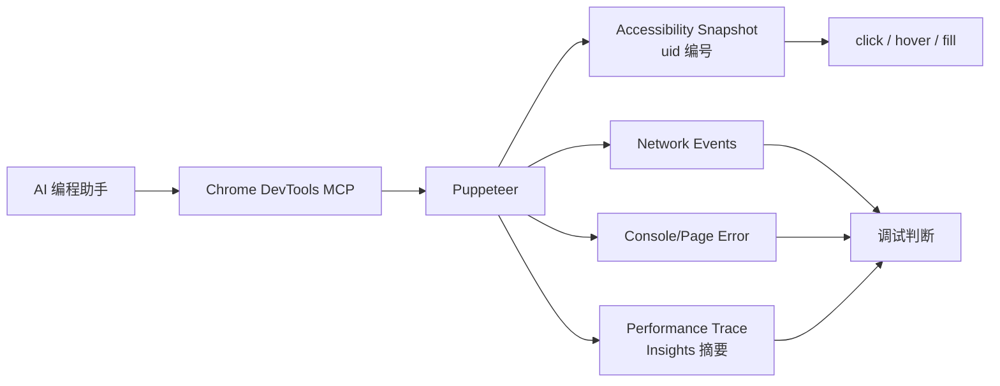

# Chrome DevTools MCP 能力边界

## 原文锚点

- 本地文件：[Chrome DevTools MCP 原理分析](<../文章/done-🪢 [MCP] Chrome DevTools MCP 原理分析.md>)
- 原文链接：https://mp.weixin.qq.com/s?__biz=MzI4OTU0NTU1NA==&mid=2247485375&idx=1&sn=b6918dd4328adf9fb605a299dca7063f
- 官方锚点：[ChromeDevTools/chrome-devtools-mcp](https://github.com/ChromeDevTools/chrome-devtools-mcp)、[Tool Reference](https://github.com/ChromeDevTools/chrome-devtools-mcp/blob/main/docs/tool-reference.md)
- 关键段落：Tools 分类、Puppeteer、Accessibility Snapshot、Performance Summary、Network、Console、能力边界。
- 关键图：原文表格图片缺失，正文足够重建链路。

## 图片处理

| 图片 | 类型 | 是否保留 | 理由 | 处理方式 |
|---|---|---|---|---|
| snapshot 对比图 | 说明图 | 原图缺失 | 说明 DOM snapshot 编号机制 | Mermaid 重建 |

## 一句话结论

这篇文章值得精读：它把 Chrome DevTools MCP 从“可视化调试神器”降回到“基于 Puppeteer + DevTools 预制能力的浏览器调试工具”，边界很清楚。

## 用户相关性判断

| 项 | 内容 |
|---|---|
| 用户当前认知层级 | MCP / 工具调用 L2 draft |
| 认知成熟度 | draft |
| 阅读投入建议 | 精读 |
| 阅读投入理由 | 直接补浏览器 MCP 的工具分类、上下文成本和调试上限；对后续 Browser/Computer Use 权限判断有帮助 |
| 对用户的新信息 | Accessibility Snapshot 会产生大量文本上下文；Performance 能力更像 Lighthouse/DevTools insights 的摘要，不等于全量 trace 分析 |
| 问题指纹 | Chrome DevTools MCP + Browser Tools + Puppeteer/AX Snapshot/Performance Insights/Network/Console + 浏览器调试能力边界 |
| 排重判断 | 新建 |
| 置信度 | 高 |

## 认知校准点

| 校准点 | 文章观点/信息 | 与用户认知或价值观的关系 | 处理建议 |
|---|---|---|---|
| 官方 MCP 也有能力上限 | 基础自动化封装较浅，调试能力主要是 console/network/performance/screenshot | 降权“碾压 Playwright”类标题 | 写入 MCP index |
| DOM snapshot 有上下文成本 | AX Tree 编号后给模型选择 uid，可能占用大量 token | 补工具上下文治理 | 与 Tool Search/渐进披露关联 |
| 性能分析是摘要化视角 | 不把 10-100MB trace 全交给模型，而是提取 insights | 纠偏：不是全能性能专家 | 后续需要人工 Profile |
| 浏览器 MCP 是高权限工具 | 可检查、修改浏览器实例数据 | 补安全边界 | 与 Sandbox 和浏览器执行边界关联 |

## 冲突点

| 冲突类型 | 具体表现 | 影响 | 处理 |
|---|---|---|---|
| 标题降权 | 原目录中另有“碾压 Playwright”类文章 | 容易高估工具能力 | 只吸收原理和边界 |
| 版本时效 | 文章称 0.9.0，官方工具仍在更新 | 工具列表和能力可能变化 | 官方 Tool Reference 校准 |
| 图片缺失 | snapshot 对比图没有保留 | 影响局部理解 | Mermaid 重建 |

## 待吸收点

| 分级 | 内容 | 为什么值得吸收 | 后续动作 |
|---|---|---|---|
| 理解 | Tools 可分为 Input、Navigation、Emulation、Performance、Network、Debugging 等 | 建立浏览器 MCP 纵向模块 | 写入 MCP index |
| 理解 | 点击等动作基于 Accessibility Snapshot 编号和 element handle | 解释模型如何定位页面元素 | 与 Browser 工具对标 |
| 记住 | 浏览器调试要区分 DOM 文本、截图、网络、控制台和性能摘要 | 影响工具选择 | 后续做工具调用评估 |
| 记住 | 性能摘要能发现初级问题，但复杂性能优化仍需人工 trace/Profile | 防止过度自动化 | 写入边界 |
| 实践 | 用本地页面验证 console、network、screenshot、performance 的输出粒度和 token 成本 | 可验证 | 待实验 |

## 已知可跳过

| 内容 | 跳过理由 |
|---|---|
| Chrome DevTools MCP 安装命令 | 需要时查官方即可 |
| 大段示例响应 | 保留结构，不逐字记忆 |
| 对性能优化经验的个人判断 | 只吸收可验证边界 |

## 实践门槛

| 门槛 | 判断 | 证据 |
|---|---|---|
| 可运行 | 部分 | 官方 MCP 可通过 npx 启动 |
| 可验证 | 部分 | 可本地对页面执行工具 |
| 可排障 | 部分 | 有 console/network/performance 输出 |
| 可迁移 | 是 | 可用于本地前端和网页调试 |
| 结论 | 精读，后续可实践 | 需本地浏览器实验 |

## 归类判断

| 项 | 内容 |
|---|---|
| 技术本体 | Chrome DevTools MCP 是浏览器调试与自动化 MCP Server |
| 文章主问题 | 分析其工具实现方式和能力边界 |
| 使用场景 | AI 编程助手调试网页、查看网络、控制台和性能摘要 |
| 关键词干扰 | Chrome、Puppeteer、Lighthouse、Playwright |
| 最终归类 | Agent 与 AI 工程 / 工具调用 / MCP |
| 归类理由 | 主问题是 MCP 工具能力和边界，不是前端性能优化教程 |

## 技术定位

| 项 | 内容 |
|---|---|
| 技术类型 | MCP Server / 浏览器调试工具 |
| 所属领域 | Agent 与 AI 工程 |
| 二级类目 | 工具调用 |
| 全局架构位置 | Agent -> MCP Client -> Chrome DevTools MCP -> Chrome/Puppeteer/DevTools |
| 涉及模块 | Input、Navigation、Performance、Network、Debugging、Memory |
| 解决问题 | 让 Agent 看到浏览器运行状态并执行基础调试 |
| 原文局限 | 基于某个版本分析，工具列表会变化 |
| 我的结论 | 精读并作为浏览器 MCP 边界知识 |

## 纵向理解

| 维度 | 判断 |
|---|---|
| 全局架构 | MCP Server 封装 Puppeteer 和 DevTools 能力，把页面状态转成模型可读文本 |
| 本文位置 | 讲工具实现和输出格式，不讲 MCP 协议细节 |
| 核心机制 | AX Snapshot 编号、element handle 操作、trace insights 摘要、network/console 收集 |
| 使用链路 | 选页面 -> snapshot/console/network/performance -> 模型分析 -> 执行动作/给建议 |
| 前置条件 | Chrome、Node/npm、MCP Client、明确权限边界 |
| 边界 | 不适合全量复杂 trace 分析，也不等于真实用户体验测试 |

## Mermaid 重建

## 横向对标

| 对标技术 | 实现方式 | 优势 | 劣势 | 适合场景 |
|---|---|---|---|---|
| Chrome DevTools MCP | MCP + Puppeteer + DevTools insights | 官方维护，调试信号直接 | 上下文和权限成本高 | AI 编程网页调试 |
| Playwright MCP | MCP + Playwright | 自动化和测试生态强 | DevTools 性能信号不一定同等丰富 | 端到端测试和自动化 |
| Browser Use | 浏览器控制框架 | 面向通用网页任务 | 调试信号依赖实现 | 自动化操作 |
| 手工 DevTools | 人工使用 Chrome DevTools | 判断精细 | 无法自动闭环 | 复杂性能和样式问题 |

## 后续追查

- 关键词：Chrome DevTools MCP、Puppeteer、Accessibility Snapshot、Performance Insights、Network requests、Console messages。
- 相关技术：Playwright MCP、Browser/Computer Use、MCP 安全、Agent 评估。
- 需要补读的文章：官方 Design Principles、Tool Reference、Chrome DevTools MCP 安全说明。
