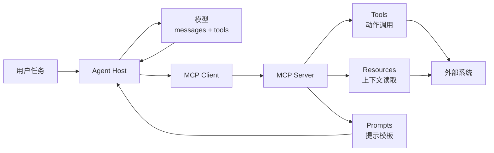

# MCP 协议原语与 Client/Server 边界

## 原文锚点

- 主文：[Solon AI MCP：超越单一工具，全面支持三大原语的创新实践](<../文章/done-Solon AI MCP：超越单一工具，全面支持三大原语的创新实践.md>)
- 辅助锚点：[深入 FastMCP 源码：认识 tool()、resource() 和 prompt() 装饰器](<../文章/done-深入 FastMCP 源码：认识 tool()、resource() 和 prompt() 装饰器.md>)
- 辅助锚点：[AI工程 _ MCP是怎么跟大模型交互的？](<../文章/done-AI工程 _ MCP是怎么跟大模型交互的？.md>)
- 原文链接：见各本地文件 frontmatter；本轮不联网核验。
- 关键段落：Tool/Prompt/Resource 三原语、FastMCP 的 ToolManager/ResourceManager/PromptManager、资源模板、工具定义进入模型 `tools` 字段、messages fallback。
- 关键图：Solon 文章的统一协议图仅为文本块；FastMCP 文章的 Inspector 截图未保留。

## 图片处理

| 图片 | 类型 | 是否保留 | 理由 | 处理方式 |
|---|---|---|---|---|
| Solon 统一协议图 | 架构图 | 重建 | 能说明 Client、Server 与三原语关系 | Mermaid 重建 |
| FastMCP Inspector 截图 | 说明图 | 原图缺失 | 能看到 Resources、Prompts、Tools 注册结果 | 标记缺失，必要时后续本地复现 |

## 一句话结论

这组文章值得精读：MCP Server 不等于“暴露一堆工具”，它至少要区分 Tools、Resources、Prompts 三类原语，并区分模型可见的工具定义、Client/Server 协议通信、Server 后端执行和资源读取边界。

## 用户相关性判断

| 项 | 内容 |
|---|---|
| 用户当前认知层级 | MCP / Skill / 工具调用 L2 draft |
| 认知成熟度 | draft |
| 阅读投入建议 | 精读 |
| 阅读投入理由 | 能补 MCP 协议原语边界和 Client/Server 运行位置；对后续数据库、浏览器、本地文件 MCP 安全判断有基础价值 |
| 对用户的新信息 | Resource 是可读上下文/数据入口，不是 Tool；Prompt 是可复用提示模板，不是 Skill；Tool 才是动作调用入口 |
| 问题指纹 | MCP + Client/Server + Tools/Resources/Prompts + FastMCP 管理器 + 模型 tools/messages 交互 + 原语边界 |
| 排重判断 | 新建；已有 MCP 参数设计、生产接入和 Skill 边界笔记未系统区分三原语和 Client/Server |
| 置信度 | 中；原理可由多篇本地文章互相校准，但框架能力和官方细节需后续补证 |

## 认知校准点

| 校准点 | 文章观点/信息 | 与用户认知或价值观的关系 | 处理建议 |
|---|---|---|---|
| Tool 只是 MCP 原语之一 | Solon 强调 Tool、Prompt、Resource 三原语 | 纠偏“写 MCP 就是写工具函数” | MCP index 要补三原语边界 |
| Resource 不该被当成动作 | FastMCP 中 Resource 可静态或模板化读取，函数到读取时才调用 | 补边界：资源是上下文/数据入口 | 高权限资源要做脱敏、白名单和延迟读取 |
| Prompt 不等于 Skill | Prompt 是 Server 暴露的提示模板；Skill 是 Agent 运行时的能力包/SOP | 避免 Claude 生态混归 | Prompt 归 MCP 原语，Skill 归能力包 |
| 模型并不直接和 MCP Server 对话 | Host/Client 把 Server 工具整理后进入模型请求；模型输出 tool call 后由 Harness 执行 | 补运行链路 | 分清模型、Client、Server、外部系统四层 |
| 框架宣传要降权 | Solon 文章大量“全面超越”“独家能力”措辞 | 符合反标题党价值观 | 只吸收原语和动态管理机制 |

## 冲突点

| 冲突类型 | 具体表现 | 影响 | 处理 |
|---|---|---|---|
| 标题降权 | Solon 文章使用“全面超越”“独家能力”等宣传话术 | 容易把框架优势写成 MCP 事实 | 降权，按原语边界吸收 |
| 原目录冲突 | FastMCP 与 MCP 交互文章在 LLM 与大模型目录 | 容易误归为模型能力 | 重路由到 Agent 与 AI 工程 / 工具调用 / MCP |
| 证据不足 | 官方 Python SDK 细节、Spring AI 对比、本轮未联网核验 | 不能作为最终官方定义 | 标为后续补证 |
| 图片缺失 | Inspector 和架构图未保留 | 影响机制理解 | Mermaid 重建主链路 |
| 实践判定偏宽 | 有 server.py 和 mcp dev 命令，但本轮未运行 | 不能判实践 | 降为精读 |

## 待吸收点

| 分级 | 内容 | 为什么值得吸收 | 后续动作 |
|---|---|---|---|
| 理解 | MCP Server 至少可以暴露 Tools、Resources、Prompts，三者由不同管理器维护 | 补协议纵向结构 | 写入 MCP index 核心模块 |
| 理解 | Resource 可以是静态资源或 URI 模板资源，读取时才调用函数 | 解释 Resource 与 Tool 的区别 | 后续补资源权限边界 |
| 理解 | Tool 定义会被 Host/Client 整理进模型工具定义，模型输出 tool call 后由运行时执行 | 补 Client/Server 与模型交互链路 | 与 ToolCalling index 互链 |
| 记住 | Tool 做动作，Resource 给上下文，Prompt 给模板；Skill 给任务流程知识 | 影响分类和排重 | 作为 MCP/Skill 文章的排重准则 |
| 实践 | 用本地最小 FastMCP Server 暴露 1 个 Tool、1 个 Resource、1 个 Prompt，观察 Inspector 和模型上下文 | 可验证 | 待实验 |

## 已知可跳过

| 内容 | 跳过理由 |
|---|---|
| Python 装饰器基础教学 | 用户不需要基础语法解释 |
| Solon 与 Spring AI 的性能/体积宣传 | 缺少本地验证，不进入稳定知识 |
| `mcp dev` 的多种 uv 命令组合 | 后续实践时再查 |
| 大段示例代码 | 保留机制，不逐字记忆 |

## 实践门槛

| 门槛 | 判断 | 证据 |
|---|---|---|
| 可运行 | 部分 | FastMCP 文章给出 server.py 和 mcp dev，但本轮未执行 |
| 可验证 | 部分 | 可以用 Inspector 查看 Tools/Resources/Prompts 注册结果 |
| 可排障 | 否 | 文章缺少连接失败、权限失败和参数错误排障 |
| 可迁移 | 是 | 可迁移到数据库、知识库、文件系统 MCP Server 设计 |
| 结论 | 降为精读 | 机制清楚，实践需另跑最小 Server |

## 归类判断

| 项 | 内容 |
|---|---|
| 技术本体 | MCP 是 Agent 应用连接外部工具、资源和提示模板的协议 |
| 文章主问题 | 如何理解 MCP Server 暴露的 Tool、Resource、Prompt，以及模型、Client、Server 的交互边界 |
| 使用场景 | MCP Server 开发、工具参数设计、资源读取、提示模板复用 |
| 关键词干扰 | Solon、Spring AI、FastMCP、Function Call、Prompt Engineering |
| 最终归类 | Agent 与 AI 工程 / 工具调用 / MCP |
| 归类理由 | 主问题是工具调用协议原语，不是某个 Java/Python 框架或模型提示词技巧 |

## 技术定位

| 项 | 内容 |
|---|---|
| 技术类型 | 协议 / Server 开发抽象 |
| 所属领域 | Agent 与 AI 工程 |
| 二级类目 | 工具调用 |
| 全局架构位置 | Agent Host / MCP Client 与 MCP Server 之间 |
| 涉及模块 | Client、Server、Tools、Resources、Prompts、Transport、外部系统 |
| 解决问题 | 让 Agent 以统一方式发现和调用外部动作、读取资源、复用提示模板 |
| 原文局限 | 公众号二手解释和框架宣传较多，官方规范需后续补证 |
| 我的结论 | 以后关注；作为 MCP 具体工具文章的基础排重准则 |

## 纵向理解

| 维度 | 判断 |
|---|---|
| 全局架构 | Agent Host 内含 MCP Client，连接 MCP Server；Server 暴露 Tools、Resources、Prompts，背后再接数据库、文件、浏览器或业务系统 |
| 本文位置 | 讲 MCP Server 暴露能力和模型交互入口，不讲 Auth、审计、远程部署 |
| 核心机制 | 装饰器/注册器把函数注册为三类原语；Host 把工具定义送入模型；模型输出调用；Client 再调用 Server |
| 使用链路 | 初始化 Server -> 注册 Tool/Resource/Prompt -> Client 连接 -> list/list/read/call -> 模型选择 -> Server 执行或返回内容 |
| 前置条件 | 明确原语类型、参数 Schema、资源 URI、权限边界和返回结构 |
| 边界 | MCP 原语本身不解决安全、业务权限、幂等性、审计和模型是否选对工具 |

## Mermaid 重建

## 横向对标

| 对标技术 | 实现方式 | 优势 | 劣势 | 适合场景 |
|---|---|---|---|---|
| MCP Tool | 结构化动作调用 | 参数可约束、可审计 | 需要 Server 维护 | 外部系统动作 |
| MCP Resource | URI/模板资源读取 | 适合上下文和数据读取 | 权限和脱敏风险 | schema、配置、文档、文件片段 |
| MCP Prompt | 可复用提示模板 | 复用任务引导 | 不等于完整 SOP/Skill | 某个 Server 内的固定提示 |
| Skill | `SKILL.md` + 脚本/资源 | 能封装任务流程 | 不直接提供外部系统协议 | 文章整理、数据分析、发布流程 |
| Function Calling | 模型 API 工具定义 | 简单直接 | 跨客户端和资源原语弱 | 单应用内工具调用 |

## 后续追查

- 关键词：MCP Tools、MCP Resources、MCP Prompts、Resource Template、FastMCP、MCP Client、MCP Server、Function Calling。
- 相关技术：Tool Calling、Skill、MCP Auth、Tool Search、数据库 MCP、浏览器 MCP。
- 需要补读的文章：后续联网补证 MCP 官方规范、Python SDK / FastMCP 官方文档、Resources/Prompts 权限和生命周期说明。
