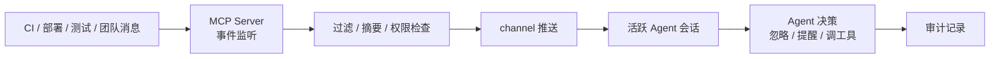

# MCP 异步通道与主动消息边界

## 原文锚点

- 本地文件：[Claude Code 2.1.80_ --channels 来了，MCP 服务器可以主动向你的会话推送消息](<../文章/done-Claude Code 2.1.80_ --channels 来了，MCP 服务器可以主动向你的会话推送消息.md>)
- 原文链接：见本地文件 frontmatter；本轮不联网核验。
- 关键段落：`--channels` 研究预览、MCP Server 主动推送、CI/部署/测试/团队消息场景、`--resume` 并行工具结果修复、sandbox/permissions 导航修复。
- 关键图：无技术图。

## 图片处理

| 图片 | 类型 | 是否保留 | 理由 | 处理方式 |
|---|---|---|---|---|
| 无 | 无图 | 不适用 | 原文无可用技术图 | Mermaid 重建主动消息链路 |

## 一句话结论

这篇版本资讯不适合逐条沉淀，但 `--channels` 值得单独精读：它把 MCP 从“被调用才返回”的同步工具接口，推进到“外部系统可主动把事件推入会话”的消息层，但因此也引入了噪声、权限、优先级和审计问题。

## 用户相关性判断

| 项 | 内容 |
|---|---|
| 用户当前认知层级 | MCP / 工具调用 L2 draft，Agent 工作流 L2 draft |
| 认知成熟度 | draft |
| 阅读投入建议 | 精读 |
| 阅读投入理由 | 主动消息会改变 MCP Client/Server 边界和长程 Agent 运行方式；其他版本更新只需略读 |
| 对用户的新信息 | MCP Server 可能从被动工具变成事件源，CI、测试、部署和团队消息可以反向进入 Agent 会话 |
| 问题指纹 | MCP + channels + Server 主动推送 + 长程 Agent 事件流 + 会话上下文注入 + 权限/噪声边界 |
| 排重判断 | 新建；已有 MCP 生产接入笔记提到远程 Server，但未覆盖主动消息和事件注入 |
| 置信度 | 低到中；文章是版本资讯且本轮不能核验真实版本和 API 形态 |

## 认知校准点

| 校准点 | 文章观点/信息 | 与用户认知或价值观的关系 | 处理建议 |
|---|---|---|---|
| MCP 不一定只是请求-响应 | `--channels` 允许 Server 主动向活跃会话推送消息 | 补协议边界 | 归为异步事件/消息层，而非普通 Tool |
| 主动消息会污染上下文 | 外部 CI、部署、Slack/PR 评论可随时进入会话 | 符合重上下文治理价值观 | 需要优先级、过滤和摘要策略 |
| 事件源不是默认可信 | Server 推送可能携带错误、敏感数据或提示注入 | 补安全边界 | 需要来源标识、权限和审计 |
| 版本资讯要降权 | 文章同时列出 effort、rate_limits、插件、resume、sandbox 等 | 避免把版本清单写成核心知识 | 只沉淀 channels 与工具结果恢复的工程含义 |

## 冲突点

| 冲突类型 | 具体表现 | 影响 | 处理 |
|---|---|---|---|
| 原目录冲突 | 原文在 LLM 与大模型目录 | 容易误归为模型能力更新 | 重路由到工具调用 / MCP |
| 实践资讯混杂 | 一篇文章混合版本更新、插件、状态栏、语音、API、性能 | 容易分散沉淀焦点 | 只吸收主动通道和工具结果恢复 |
| 证据不足 | `--channels` 研究预览、本轮未核验版本状态 | 不能写成稳定能力 | 标为后续补证 |
| 安全边界缺口 | 原文强调想象场景，未给过滤、权限、审计方案 | 生产风险 | 后续追查 MCP 事件安全 |

## 待吸收点

| 分级 | 内容 | 为什么值得吸收 | 后续动作 |
|---|---|---|---|
| 理解 | 主动通道让 MCP Server 成为外部事件源 | 改变 Client/Server 边界 | 写入 MCP 后续追查 |
| 理解 | CI、测试、部署、团队消息等异步结果可以减少轮询 | 对长程 Agent 有价值 | 结合 Agent 工作流沉淀 |
| 记住 | Server 主动推送必须带来源、类型、权限和可审计记录 | 防止上下文污染和提示注入 | 后续补安全专题 |
| 记住 | 恢复会话不能丢失并行工具结果 | 工具结果是 Agent 已完成工作的证据 | 可迁移到会话持久化和复盘 |
| 实践 | 用本地模拟事件源推送“测试完成/部署失败”消息，验证 Agent 是否能安全处理 | 可验证 | 待实验 |

## 已知可跳过

| 内容 | 跳过理由 |
|---|---|
| rate_limits 状态栏细节 | 属于产品 UX，非工具调用主线 |
| 插件安装提示、内联插件声明 | 可归插件生态，非本篇主问题 |
| 语音和 API 代理修复 | 与 MCP 主动通道关系弱 |
| 大仓库内存优化数字 | 时效性强，且不影响 MCP 边界 |

## 实践门槛

| 门槛 | 判断 | 证据 |
|---|---|---|
| 可运行 | 否 | 本轮不运行 Claude Code、不联网核验 `--channels` |
| 可验证 | 部分 | 可设计本地模拟事件源，但尚未执行 |
| 可排障 | 否 | 原文缺日志、失败模式、消息投递语义 |
| 可迁移 | 是 | 可迁移到 CI、测试、部署、监控、团队协作事件流 |
| 结论 | 降为精读 | 只沉淀架构边界和风险，不判实践 |

## 归类判断

| 项 | 内容 |
|---|---|
| 技术本体 | MCP 主动消息/异步通道是工具调用运行时的事件注入能力 |
| 文章主问题 | MCP Server 是否可以主动向 Agent 会话推送事件，以及这对长程 Agent 意味着什么 |
| 使用场景 | CI 结果、部署状态、测试完成、PR Review、团队沟通、监控告警 |
| 关键词干扰 | Claude Code 版本、effort、插件、rate limits、sandbox |
| 最终归类 | Agent 与 AI 工程 / 工具调用 / MCP |
| 归类理由 | 主问题是 MCP Server 与会话之间的消息方向，不是模型能力或普通产品发布 |

## 技术定位

| 项 | 内容 |
|---|---|
| 技术类型 | MCP 事件通道 / 异步消息层 |
| 所属领域 | Agent 与 AI 工程 |
| 二级类目 | 工具调用 |
| 全局架构位置 | 外部系统事件 -> MCP Server -> MCP Client -> Agent 会话上下文 |
| 涉及模块 | MCP Server、活跃会话、消息通道、事件过滤、上下文注入、审计 |
| 解决问题 | 外部系统结果不必等 Agent 轮询，可主动进入任务上下文 |
| 原文局限 | 研究预览、版本信息未核验，缺少安全和协议细节 |
| 我的结论 | 以后关注；先作为长程 Agent 事件流边界记录 |

## 纵向理解

| 维度 | 判断 |
|---|---|
| 全局架构 | 外部系统产生事件，MCP Server 监听并通过 channel 推送到活跃 Agent 会话，Agent 将事件作为新上下文处理 |
| 本文位置 | 讲产品/运行时新增能力，不讲 MCP 协议细节、消息投递保证或鉴权 |
| 核心机制 | 被动工具调用之外的反向消息注入 |
| 使用链路 | Server 订阅事件 -> 过滤/摘要 -> 推送会话 -> Agent 决策是否处理 -> 工具执行或提醒用户 |
| 前置条件 | 活跃会话、可信 Server、事件权限、消息类型、上下文预算和审计记录 |
| 边界 | 不适合让任意外部消息直接进入系统提示或执行链；必须防提示注入和消息风暴 |

## Mermaid 重建

## 横向对标

| 对标技术 | 实现方式 | 优势 | 劣势 | 适合场景 |
|---|---|---|---|---|
| 普通 MCP Tool | Agent 主动调用，Server 返回 | 可控、边界清楚 | 需要轮询 | 查询状态、执行动作 |
| MCP Channel | Server 主动推送事件 | 减少轮询，适合长程任务 | 上下文污染和权限风险 | CI/部署/测试/告警 |
| Webhook | 外部系统推送到服务端 | 生态成熟 | 不直接进入 Agent 会话 | 后端事件集成 |
| 消息队列 | Topic/Consumer 异步消费 | 可缓冲、可重试 | Agent 语义需额外封装 | 高吞吐事件流 |
| 人工通知 | 用户手动告诉 Agent | 安全可控 | 延迟高、打断人工 | 高风险决策 |

## 后续追查

- 关键词：MCP channels、server push、active session、event stream、tool result persistence、resume tool result。
- 相关技术：Agent 工作流、长程任务、事件驱动架构、Webhook、消息队列、MCP 安全。
- 需要补读的文章：后续补证 Claude Code `--channels` 官方说明、MCP 消息投递语义、事件权限和审计设计。
