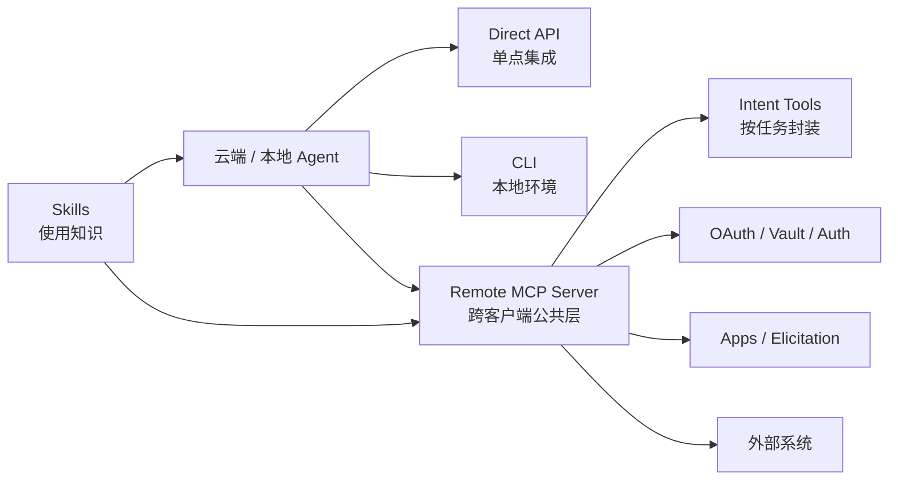

# MCP 生产系统接入设计模式

## 原文锚点

- 本地文件：[还在说 MCP 要被淘汰？Anthropic：这才是 Agent 接入生产环境的正确姿势](<../文章/还在说 MCP 要被淘汰？Anthropic：这才是 Agent 接入生产环境的正确姿势.md>)
- 原文链接：https://mp.weixin.qq.com/s?__biz=MzY5NDExMTI3Mg==&mid=2247483922&idx=1&sn=8e67eab7bf7d7160f8a30f5755e2cbd4&chksm=f5c51134d0d9b38994ba06d49fa6bfe214c810be916876336565573a6bc8b300ea30c3b63e66&mpshare=1&scene=24&srcid=0423fGKBcC2jcTlevXj8F04e&sharer_shareinfo=32aefce7d409201f09d9e452f12f439b&sharer_shareinfo_first=32aefce7d409201f09d9e452f12f439b#rd
- 官方锚点：[Anthropic Blog - Building agents that reach production systems with MCP](https://claude.com/blog/building-agents-that-reach-production-systems-with-mcp)
- 关键段落：API/CLI/MCP 分层、Remote Server、按意图分组工具、代码编排、Apps/Elicitation、Auth、Tool Search、Programmatic Tool Calling、MCP + Skills。
- 关键图：官方原文有配图，本地 Markdown 无图。

## 图片处理

| 图片 | 类型 | 是否保留 | 理由 | 处理方式 |
|---|---|---|---|---|
| Tool Search / Skills + MCP 官方配图 | 架构图 | 原图缺失 | 能说明上下文节省和 MCP+Skills 组合 | 标记原图缺失，Mermaid 重建 |

## 一句话结论

这篇文章值得精读：它把 MCP 从“本地工具协议”校准为“云端生产 Agent 连接外部系统的公共集成层”，并明确 MCP 与 API、CLI、Skills 是分层互补关系。

## 用户相关性判断

| 项 | 内容 |
|---|---|
| 用户当前认知层级 | MCP / Skill / 工具调用 L2 draft |
| 认知成熟度 | draft |
| 阅读投入建议 | 精读 |
| 阅读投入理由 | 能补 MCP 生产接入、上下文成本和 Skill 组合边界；但公众号有二次转述和下载量数字，关键结论以官方博客为准 |
| 对用户的新信息 | 高质量 MCP Server 应按用户意图封装工具，远程化、标准认证、上下文按需加载，并与 Skills 组合 |
| 问题指纹 | MCP + 生产系统接入 + Remote Server/Intent Tools/Auth/Tool Search/Programmatic Tool Calling/Skills + 云端 Agent 集成边界 |
| 排重判断 | 新建 |
| 置信度 | 高 |

## 认知校准点

| 校准点 | 文章观点/信息 | 与用户认知或价值观的关系 | 处理建议 |
|---|---|---|---|
| API、CLI、MCP 不是替代关系 | API 是基础，CLI 适合本地，MCP 适合云端和跨客户端 | 纠偏“淘汰论” | 写入 MCP index |
| MCP 工具不应 1:1 映射 API | 应按用户意图组合工具，减少多步拼装 | 补工具设计准则 | 与参数设计笔记关联 |
| 大 API 曲面可用代码编排 | 暴露 search/execute 类薄工具，让 Agent 在沙箱里组合调用 | 补横向模式 | 需安全边界 |
| Skills 是使用知识，MCP 是工具接口 | 二者互补，不是竞争 | 符合用户对 Skill/MCP 边界的要求 | 写入对标 |
| Tool Search 是上下文治理 | 工具定义按需加载，而不是启动时全塞上下文 | 补上下文成本边界 | 连接 AI 编程工具 |

## 冲突点

| 冲突类型 | 具体表现 | 影响 | 处理 |
|---|---|---|---|
| 二手转述 | 公众号基于 Anthropic 官方博客改写 | 细节可能偏离原文 | 关键锚点指向官方博客 |
| 标题立场 | “淘汰论”标题带争论口吻 | 容易变成立场文 | 只吸收分层和设计模式 |
| 证据时效 | SDK 下载量、生态数量随时间变化 | 数字不沉淀为稳定准则 | 只保留趋势判断 |
| 安全边界缺口 | 代码编排和远程 Server 带来沙箱、权限、审计问题 | 生产风险 | 后续补 Zero Trust/安全文 |

## 待吸收点

| 分级 | 内容 | 为什么值得吸收 | 后续动作 |
|---|---|---|---|
| 理解 | Direct API、CLI、MCP 是三层接入方式，各有场景 | 建立横向对标 | 写入 MCP index |
| 理解 | Remote MCP Server 是云端 Agent 复用外部系统的关键形态 | 补全生产架构位置 | 后续补 auth |
| 记住 | 工具按意图分组，不按 endpoint 镜像 | 影响 MCP Server 质量 | 作为准则 |
| 记住 | MCP + Skills = 工具能力 + 使用知识 | 解决用户此前的边界问题 | 与 Skill index 关联 |
| 实践 | 为本地知识库 MCP 设计 3-5 个意图工具，而不是暴露文件/搜索底层 API | 可落地验证 | 待实验 |

## 已知可跳过

| 内容 | 跳过理由 |
|---|---|
| MCP 是连接外部系统的协议 | 已在 MCP index 覆盖 |
| 生态下载量和目录数量 | 时效数字，不沉淀 |
| 争论式开头 | 不影响技术判断 |

## 实践门槛

| 门槛 | 判断 | 证据 |
|---|---|---|
| 可运行 | 否 | 没有可运行项目 |
| 可验证 | 部分 | 有设计模式，但无验收用例 |
| 可排障 | 部分 | 提到上下文和 auth，但缺日志/审计 |
| 可迁移 | 是 | 可迁移到本地 MCP 设计 |
| 结论 | 降为精读 | 需要具体 MCP Server 实验 |

## 归类判断

| 项 | 内容 |
|---|---|
| 技术本体 | MCP 是 Agent 工具调用和上下文接入协议 |
| 文章主问题 | 生产环境 Agent 如何通过 MCP 接入外部系统，以及 MCP 与 API/CLI/Skills 的边界 |
| 使用场景 | 云端 Agent、企业系统集成、跨客户端工具复用 |
| 关键词干扰 | Skills、CLI、Claude Managed Agents、Plugin |
| 最终归类 | Agent 与 AI 工程 / 工具调用 / MCP |
| 归类理由 | 主问题是 MCP 工具接入和 Server 设计，不是 Claude 模型能力或 AI 编程工具使用体验 |

## 纵向理解

| 维度 | 判断 |
|---|---|
| 全局架构 | Agent Client -> MCP Client -> Remote MCP Server -> Auth/Tools/Apps/Elicitation -> 外部系统 |
| 本文位置 | 讲生产接入设计模式，不讲协议消息细节 |
| 核心机制 | Remote Server、Intent Tools、Code Orchestration、Apps/Elicitation、标准 Auth、Tool Search、Programmatic Tool Calling、Skills 组合 |
| 使用链路 | 选接入层 -> 设计远程 Server -> 按意图封装工具 -> 做 auth/交互/上下文治理 -> 搭配 Skill |
| 前置条件 | 外部系统 API 稳定、权限模型清楚、沙箱和审计可控 |
| 边界 | 不自动解决安全、业务权限、幂等性和危险操作审批 |

## Mermaid 重建

## 横向对标

| 对标技术 | 实现方式 | 优势 | 劣势 | 适合场景 |
|---|---|---|---|---|
| Direct API | Agent 直接调用 HTTP/API | 起步快 | N×M 集成爆炸 | 少量固定服务 |
| CLI | Agent 在 shell 调命令 | 本地强、复用工具生态 | 云端、移动端和 auth 弱 | 本地开发/运维 |
| MCP | 标准协议连接远程 Server | 跨客户端、auth 和工具发现统一 | 需要维护 Server 和安全边界 | 生产 Agent 接外部系统 |
| Skills | 封装操作知识和流程 | 让 Agent 会用工具 | 不直接连接外部系统 | 工具使用 SOP |
| Plugin | 打包 Skills/MCP/Hooks 等 | 分发完整能力 | 依赖客户端生态 | 团队复用 |

## 后续追查

- 关键词：Remote MCP Server、Intent Tools、Tool Search、Programmatic Tool Calling、MCP Apps、Elicitation、Skills with MCP。
- 相关技术：Skill、Plugin、Function Calling、REST API、Agent 权限、安全审计。
- 需要补读的文章：MCP Auth 官方规范、MCP Apps/Elicitation、Zero Trust for AI agents、工具返回结构设计。

