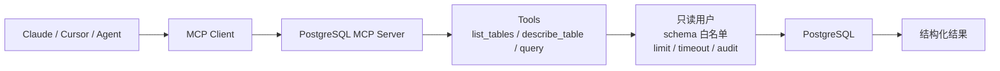

# PostgreSQL MCP Server 结构化数据访问边界

## 原文锚点

- 本地文件：[PostgreSQL MCP Server：让 AI 直接读懂你的数据库](<../文章/done-PostgreSQL MCP Server：让 AI 直接读懂你的数据库.md>)
- 原文链接：https://mp.weixin.qq.com/s?__biz=MzkzNjUxNzI5OA==&mid=2247483700&idx=1&sn=158dd663e7c1e24c25ab5cea19ef3a5f&chksm=c3ec48b9f384494fa22cfaeaf5621448eab51c6057315c7f33ff9003bc135e2ef7256e9dbcc8&mpshare=1&scene=24&srcid=0407W4chceGl26cfL8c8Qbsk&sharer_shareinfo=65570ea8738def77be20bb5ff113a16f&sharer_shareinfo_first=65570ea8738def77be20bb5ff113a16f#rd
- 关键段落：MCP 协议简介、PostgreSQL MCP Server 定位、工具列表、安全考虑、Claude/Cursor/Cline 配置。
- 关键图：原文没有技术图，本地有命令和配置片段。

## 图片处理

| 图片 | 类型 | 是否保留 | 理由 | 处理方式 |
|---|---|---|---|---|
| 无 | 无图 | 不适用 | 架构可用 Mermaid 表达 | Mermaid 重建 |

## 一句话结论

这篇文章可以精读，但必须强降权“让 AI 直接读懂数据库”的宣传口吻；真正要吸收的是 MCP Server 作为结构化数据访问边界，必须以只读、最小权限、限流、审计和脱敏为前提。

## 用户相关性判断

| 项 | 内容 |
|---|---|
| 用户当前认知层级 | MCP / 工具调用 L2 draft |
| 认知成熟度 | draft |
| 阅读投入建议 | 精读 |
| 阅读投入理由 | 数据库 MCP 与用户数据工程、Text-to-SQL、Agent 工具调用高度相关；但安全和治理边界比安装步骤更重要 |
| 对用户的新信息 | MCP 可以把数据库 schema、表结构和只读查询暴露给 Agent，但暴露边界本身就是系统设计问题 |
| 问题指纹 | MCP + PostgreSQL Server + query/list_tables/describe_table/get_schema + 结构化数据访问 + 权限与审计边界 |
| 排重判断 | 新建 |
| 置信度 | 中 |

## 认知校准点

| 校准点 | 文章观点/信息 | 与用户认知或价值观的关系 | 处理建议 |
|---|---|---|---|
| “直接读懂数据库”要降权 | AI 能调用工具和读 schema，不等于理解业务口径 | 纠偏标题夸张 | 写入冲突点 |
| 数据库 MCP 不是 RAG 替代 | 它访问结构化数据，RAG 访问文档证据 | 补横向边界 | 写入 MCP index |
| 安全边界优先于体验 | 只读用户、权限控制、注入防护、审计日志是底线 | 符合重权限治理偏好 | 作为记住点 |
| schema 暴露也是风险 | 表名、字段名、样例数据可能泄露业务信息 | 原文安全讨论不够深 | 后续补脱敏和列级权限 |

## 冲突点

| 冲突类型 | 具体表现 | 影响 | 处理 |
|---|---|---|---|
| 标题降权 | “传统开发模式革命”“直接读懂”偏宣传 | 容易高估能力 | 降权为工具接入案例 |
| 安全边界不足 | 只提只读和权限，缺限流、超时、脱敏、审计字段、结果行数限制 | 可能误接生产库 | 写入待追查 |
| 版本/来源不明 | PostgreSQL 版本支持表和镜像来源需核实 | 实践风险 | 后续查官方 MCP server |
| 实践资讯混杂 | 安装教程和架构判断混在一起 | 容易把能跑当成可用 | 只沉淀边界和结构 |

## 待吸收点

| 分级 | 内容 | 为什么值得吸收 | 后续动作 |
|---|---|---|---|
| 理解 | MCP Server 暴露 `query`、`list_tables`、`describe_table`、`get_schema` 等工具 | 明确工具粒度 | 对照 MCP 参数设计 |
| 理解 | Claude Desktop、Cursor、Cline 只是 MCP Client，不改变 Server 权限边界 | 区分客户端体验和服务端安全 | 写入 MCP 纵向结构 |
| 记住 | 数据库 MCP 默认应只读、最小权限、限制 schema、限制行数和超时 | 影响真实落地 | 作为安全准则 |
| 记住 | 结构化查询需要语义层/口径层，否则 SQL 正确也可能业务错误 | 连接用户 Text-to-SQL 认知 | 后续补语义层 |
| 实践 | 用本地只读示例库验证 schema 暴露、查询限制、审计日志和拒绝危险 SQL | 可形成本地 MCP 实验 | 待实验 |

## 已知可跳过

| 内容 | 跳过理由 |
|---|---|
| MCP 是连接外部工具的协议 | 已在 MCP index 覆盖 |
| Docker/Claude/Cursor/Cline 安装步骤 | 当前知识库不以教程为主 |
| 产品经理可自然语言查数的宣传 | 不提供口径治理和权限细节 |

## 实践门槛

| 门槛 | 判断 | 证据 |
|---|---|---|
| 可运行 | 部分 | 有 Docker/npx 配置片段 |
| 可验证 | 部分 | 可验证表列表和查询，但缺安全验收 |
| 可排障 | 部分 | 有连接、权限、加载失败排查表 |
| 可迁移 | 是 | 可迁移到本地只读数据库 MCP |
| 结论 | 降为精读 | 安全边界未补齐前不判实践 |

## 归类判断

| 项 | 内容 |
|---|---|
| 技术本体 | MCP 是 Agent 工具调用和上下文接入协议 |
| 文章主问题 | 如何通过 MCP Server 让 Agent 查询 PostgreSQL |
| 使用场景 | 结构化数据库问答、开发辅助、分析查询 |
| 关键词干扰 | PostgreSQL、SQL、自然语言查询、Claude/Cursor |
| 最终归类 | Agent 与 AI 工程 / 工具调用 / MCP |
| 归类理由 | 主问题是 Agent 如何通过 MCP 接入数据库，不是 PostgreSQL 内核或 OLAP 查询优化 |

## 纵向理解

| 维度 | 判断 |
|---|---|
| 全局架构 | Agent Client -> MCP Client -> PostgreSQL MCP Server -> 只读数据库用户 -> PostgreSQL |
| 本文位置 | 只讲一个具体 MCP Server 的安装和使用 |
| 核心机制 | 工具暴露、schema 读取、只读 query、客户端配置 |
| 使用链路 | 配置 Server -> 建只读用户 -> Client 加载 -> 模型调用工具 -> 返回结构化结果 |
| 前置条件 | 数据库权限隔离、网络隔离、查询限制、审计日志、数据脱敏 |
| 边界 | 不解决业务口径、指标语义、SQL 正确性校验和数据安全治理 |

## Mermaid 重建

## 横向对标

| 对标技术 | 实现方式 | 优势 | 劣势 | 适合场景 |
|---|---|---|---|---|
| PostgreSQL MCP Server | Agent 通过 MCP 工具查询数据库 | 接入自然语言工作流，工具边界清晰 | 权限、口径、安全风险高 | 开发/分析辅助的只读查询 |
| Text-to-SQL 平台 | 语义层 + SQL 生成 + 校验 | 可治理口径和指标 | 建设成本高 | 企业问数 |
| RAG | 检索非结构化文档 | 可追查文档证据 | 不适合精确聚合计算 | 文档问答 |
| 直接 REST API | 后端封装固定查询 | 权限和口径可控 | 灵活性弱 | 稳定业务查询 |
| BI/语义层 | 指标和维度建模 | 口径稳定 | 不适合自由探索 | 报表和指标分析 |

## 后续追查

- 关键词：PostgreSQL MCP Server、read-only、schema whitelist、SQL injection、audit log、row limit、timeout。
- 相关技术：Text-to-SQL、语义层、MCP 参数设计、数据库权限、RAG。
- 需要补读的文章：官方 PostgreSQL MCP Server、MCP 安全最佳实践、Text-to-SQL 语义层和 SQL 校验。

