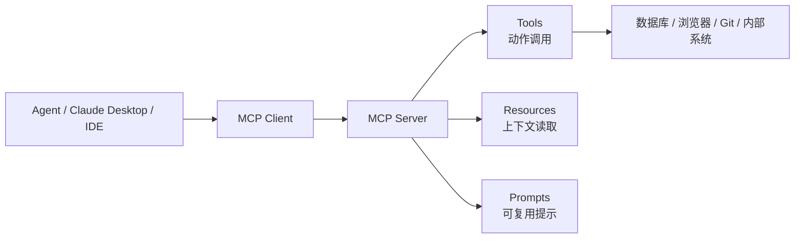

# MCP
## 知识点入口

- 本模块先看宏观流程，再看文章：[知识地图](020202_知识地图.md)。
- 新文章必须先归入流程节点，再判断是补充、冲突、不同层次还是降权。
- `文章/` 只保留原文锚点，长期知识必须沉淀到 `020202_核心知识点/` 下的主题文件。

## 技术定位

| 项 | 内容 |
|---|---|
| 技术名 | Model Context Protocol |
| 一级类目 | Agent 与 AI 工程 |
| 二级类目 | 工具调用 |
| 技术本体 | 让模型应用以统一协议连接外部工具、资源和上下文服务 |
| 全局架构位置 | 位于 Agent 应用和外部系统之间，承担工具发现、参数调用、资源读取和上下文接入 |
| 主要使用者 | AI 应用工程师、平台工程师、工具服务维护者 |
| 主要产出 | MCP Server、工具定义、资源接口、调用结果 |

## 官方锚点

- 官网：[Model Context Protocol](https://modelcontextprotocol.io/)
- GitHub：[modelcontextprotocol](https://github.com/modelcontextprotocol)
- 官方文档：[MCP Documentation](https://modelcontextprotocol.io/docs)

## 架构图

## 核心模块

| 模块 | 职责 | 重点问题 |
|---|---|---|
| Client | 在 Agent 侧发起协议请求 | 权限、连接生命周期、错误处理 |
| Server | 暴露工具、资源和提示 | 参数设计、鉴权、可观测性 |
| Tools | 执行动作 | 幂等性、危险操作审批、返回结构 |
| Resources | 提供上下文 | 规模、缓存、权限、脱敏 |
| Prompts | 提供可复用提示模板 | 与 Skill/SOP 的边界、版本和注入位置 |
| Transport | 负责通信 | 本地 stdio、HTTP、远程部署等差异 |
| Channels / 事件通道 | 让 Server 主动把外部事件推入会话 | 消息过滤、来源可信、上下文污染、审计 |
| 高权限工具 | 浏览器、数据库、文件系统、Shell 等能力 | 登录态、敏感数据、审批、审计和上下文成本 |

## 横向对标

| 对标技术 | 对标点 | MCP 优势 | MCP 劣势 | 使用判断 |
|---|---|---|---|---|
| Skill | 都能扩展 Agent 能力 | MCP 适合连接外部系统，边界更清晰 | 需要维护 Server 和协议接口 | 外部系统/共享工具优先 MCP |
| Function Calling | 都是工具调用抽象 | MCP 更像跨应用协议和工具生态 | 比单模型 API 工具调用更重 | 单应用简单工具用 Function Calling，共享生态用 MCP |
| REST API | 都能调用服务 | MCP 能让 Agent 发现工具和上下文 | 仍需处理鉴权、限流和审计 | 不要把 MCP 当安全问题的自动答案 |
| Plugin | 都可扩展能力 | MCP 更偏协议标准 | 用户体验和分发依赖具体客户端 | 需要跨客户端复用时看 MCP |

## 已沉淀核心知识点

| 主题 | 文件 | 问题指纹 | 解决什么问题 | 认知增量 |
|---|---|---|---|---|
| 与 Skill 和项目规则的边界 | [Skill、MCP、项目规则的边界](../020203_Skill/020203_核心知识点/Skill、MCP、项目规则的边界.md) | MCP + 工具调用 + 外部协议 + 与能力包/项目规则对比 + 避免混淆 | 避免把 MCP、Skill、CLAUDE.md 当成同一类东西 | MCP 是连接外部能力，不是项目规则，也不直接替代 Skill |
| MCP Server 参数设计 | [MCPServer工具参数设计与AI约束](020202_核心知识点/MCPServer工具参数设计与AI约束.md) | MCP + Tools 参数 Schema + 最小参数/枚举/白名单/校验 + 防止模型臆造参数 + 工具调用稳定性 | 避免 MCP Tool 参数过宽导致模型编造参数 | MCP 工具质量不只在“能调用”，还在参数边界、Schema 和后端校验 |
| PostgreSQL MCP Server 结构化数据访问边界 | [PostgreSQLMCPServer结构化数据访问边界](020202_核心知识点/PostgreSQLMCPServer结构化数据访问边界.md) | MCP + PostgreSQL Server + query/list_tables/describe_table/get_schema + 结构化数据访问 + 权限与审计边界 | 判断数据库 MCP 如何安全接入 Agent 工具链 | 数据库 MCP 是结构化数据访问工具，不是 RAG 替代，也不是业务口径治理 |
| MCP 生产系统接入设计模式 | [MCP生产系统接入设计模式](020202_核心知识点/MCP生产系统接入设计模式.md) | MCP + 生产系统接入 + Remote Server/Intent Tools/Auth/Tool Search/Programmatic Tool Calling/Skills + 云端 Agent 集成边界 | 判断生产 Agent 应如何通过 MCP 接入外部系统，以及 MCP 与 API、CLI、Skills 的边界 | 高质量 MCP Server 应按用户意图封装工具，并把 auth、上下文按需加载和使用知识分层处理 |
| Chrome DevTools MCP 能力边界 | [ChromeDevToolsMCP能力边界](020202_核心知识点/ChromeDevToolsMCP能力边界.md) | Chrome DevTools MCP + Browser Tools + Puppeteer/AX Snapshot/Performance Insights/Network/Console + 浏览器调试能力边界 | 判断浏览器 MCP 到底能提供哪些调试信号，以及上下文和权限成本 | Chrome DevTools MCP 是浏览器调试工具，不是全能前端专家；复杂性能和样式问题仍需人工 Profile |
| MCP 协议原语与 Client/Server 边界 | [MCP协议原语与ClientServer边界](020202_核心知识点/MCP协议原语与ClientServer边界.md) | MCP + Client/Server + Tools/Resources/Prompts + FastMCP 管理器 + 模型 tools/messages 交互 + 原语边界 | 判断 MCP Server 暴露的是动作、资源还是提示模板，以及模型、Client、Server 的真实运行边界 | Tool 做动作，Resource 给上下文，Prompt 给模板，Skill 给任务流程知识 |
| MCP 异步通道与主动消息边界 | [MCP异步通道与主动消息边界](020202_核心知识点/MCP异步通道与主动消息边界.md) | MCP + channels + Server 主动推送 + 长程 Agent 事件流 + 会话上下文注入 + 权限/噪声边界 | 判断 MCP Server 从被动工具变成事件源时的价值和风险 | 主动消息减少轮询，但必须处理来源、过滤、优先级、提示注入和审计 |
| MCP 与 CLI / 代码执行边界 | [MCP与CLI代码执行边界](020202_核心知识点/MCP与CLI代码执行边界.md) | MCP + CLI + Skill + 代码执行 + 上下文成本 + 执行权限 + 连接层/知识层/执行层边界 | 避免把 MCP、CLI、Skill、代码执行混为竞争关系 | MCP 偏连接层，Skill 偏知识层，CLI 偏执行层，代码执行偏多工具编排 |

## 后续追查

- 关键词：MCP Server、MCP Client、Remote MCP Server、Intent Tools、Tool Search、Programmatic Tool Calling、Chrome DevTools MCP、AX Snapshot、tools、resources、prompts、channels、参数设计、权限边界、JSON Schema、additionalProperties、read-only、audit log。
- 待读资料：MCP 权限设计、MCP Auth、MCP Apps/Elicitation、Resources/Prompts 官方边界、Channels/事件通道、Chrome DevTools MCP Design Principles、Playwright MCP、PostgreSQL MCP Server、工具返回结构设计。
- 待补实验：给本地知识库做只读 MCP Server，按“找主题、读技术卡、跑健康检查、追加文章锚点”设计 3-5 个意图工具；用本地只读 PostgreSQL 示例库验证 schema 白名单、行数限制、超时和审计；用本地网页验证 Chrome DevTools MCP 的 console、network、screenshot、performance 输出粒度和 token 成本；用最小 Server 验证 1 个 Tool、1 个 Resource、1 个 Prompt 的注册和调用边界；模拟 CI/测试事件推送，验证主动消息过滤与审计。

<!-- AUTO-DISTILL-02-START -->

## 本轮文章处理收口

- 已归档来源：`54` 篇，全部位于 `文章/` 且使用 `done-` 前缀。
- 长期入口：[MCP生产接入与治理边界.md](020202_核心知识点/MCP生产接入与治理边界.md)。
- 新文章进入时先对照知识地图、AGENTS 排重准则和已有主题页；只有新增机制、边界、反例、版本差异或实践证据时才新建主题页。

<!-- AUTO-DISTILL-02-END -->
