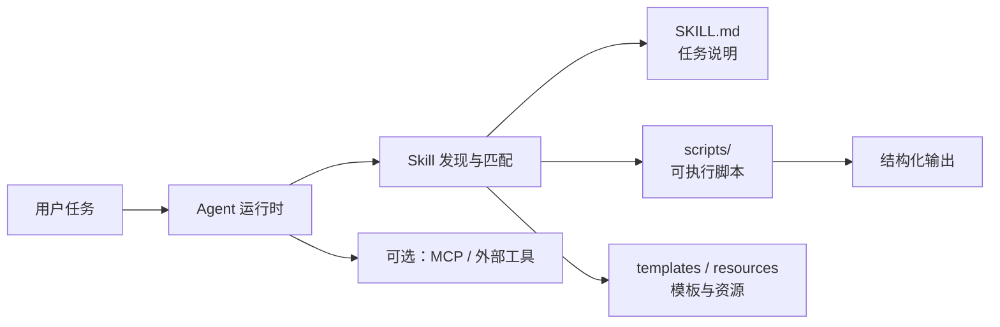

# Skill
## 知识点入口

- 本模块先看宏观流程，再看文章：[知识地图](020203_知识地图.md)。
- 新文章必须先归入流程节点，再判断是补充、冲突、不同层次还是降权。
- `文章/` 只保留原文锚点，长期知识必须沉淀到 `020203_核心知识点/` 下的主题文件。

## 技术定位

| 项 | 内容 |
|---|---|
| 技术名 | Skill |
| 一级类目 | Agent 与 AI 工程 |
| 二级类目 | 工具调用 |
| 技术本体 | 将任务说明、脚本、资源、模板打包成可被 Agent 动态调用的能力包 |
| 全局架构位置 | 位于项目规则和外部工具之间，负责把标准化任务流程交给 Agent 选择和执行 |
| 主要使用者 | AI 工程师、平台工程师、数据工程师、研发团队 |
| 主要产出 | `SKILL.md`、脚本、模板、资源文件、可复用任务流程 |

## 官方锚点

- 官方文档入口：[Anthropic Docs](https://docs.anthropic.com/)
- GitHub：无统一仓库，以具体运行时或团队仓库为准
- 架构文档：待读官方 Skill 机制页确认

## 架构图

## 核心模块

| 模块 | 职责 | 重点问题 |
|---|---|---|
| `SKILL.md` | 说明触发场景、执行流程、输入输出要求 | 描述太宽会误触发，太窄会漏触发 |
| `scripts/` | 承载可重复执行的脚本动作 | 权限、依赖、幂等性、错误处理 |
| `templates/` | 提供稳定产物结构 | 避免每次输出格式漂移 |
| `resources/` | 放参考资料、示例、素材 | 需要控制上下文体积 |
| 运行时选择 | Agent 判断是否加载 Skill | 动态加载不是完全零上下文成本 |

## 横向对标

| 对标技术 | 对标点 | Skill 优势 | Skill 劣势 | 使用判断 |
|---|---|---|---|---|
| 项目规则文件 | 都能指导 Agent 行为 | Skill 更适合标准化任务流程和脚本复用 | 项目级常驻规则仍应放 AGENTS.md/CLAUDE.md | 长期规则放项目规则，专项任务放 Skill |
| MCP | 都能扩展 Agent 能力 | Skill 本地轻量，能打包流程和资源 | MCP 更适合连接外部系统和服务 | 单点任务流程用 Skill，系统连接用 MCP |
| Plugin | 都像能力扩展 | Skill 更容易团队内自定义和审计 | Plugin 生态分发更完整但质量不一 | 内部流程优先 Skill，生态能力再评估 Plugin |
| Hook | 都可能执行动作 | Skill 由任务触发，语义更完整 | Hook 更适合事件钩子和自动门禁 | 标准任务用 Skill，生命周期事件用 Hook |

## 已沉淀核心知识点

| 主题 | 文件 | 问题指纹 | 解决什么问题 | 认知增量 |
|---|---|---|---|---|
| Skill、MCP、项目规则边界 | [Skill、MCP、项目规则的边界](020203_核心知识点/Skill、MCP、项目规则的边界.md) | Skill + 工具调用 + 动态能力包/外部协议/项目规则 + 区分边界 + 避免 Claude 生态混归 | 区分 Skill、MCP、CLAUDE.md、Plugin | 把“Claude 相关能力”拆成能力包、协议、规则和生态分发 |

## 后续追查

- 关键词：Skill 动态加载、`SKILL.md`、能力包、MCP、Hook、项目规则。
- 待读资料：官方 Skill 机制文档、团队内 Skill 示例。
- 待补实验：为一个数据分析或文章整理任务写最小 Skill，验证触发、脚本、模板和权限边界。

<!-- AUTO-DISTILL-02-START -->

## 本轮文章处理收口

- 已归档来源：`128` 篇，全部位于 `文章/` 且使用 `done-` 前缀。
- 长期入口：[Skill能力封装与治理边界.md](020203_核心知识点/Skill能力封装与治理边界.md)。
- 新文章进入时先对照知识地图、AGENTS 排重准则和已有主题页；只有新增机制、边界、反例、版本差异或实践证据时才新建主题页。

<!-- AUTO-DISTILL-02-END -->
