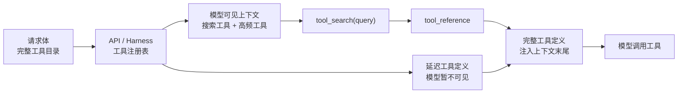

# Tool Search 与工具上下文治理

## 原文锚点

- 本地文件：[OpenAI 和 Anthropic 同时押注：Tool Search 正在重定义 Agent 工具调用](<../文章/done-OpenAI 和 Anthropic 同时押注：Tool Search 正在重定义 Agent 工具调用.md>)
- 辅助锚点：[Agent Harness 架构真相：Prompt Cache 如何决定 Skill、MCP 与 SubAgent 设计](<../../../0209_Harness Engineering/文章/done-Agent Harness 架构真相：Prompt Cache 如何决定 Skill、MCP 与 SubAgent 设计.md>)
- 原文链接：见本地文件 frontmatter；本轮不联网核验。
- 关键段落：HTTP 请求体不等于模型上下文、`defer_loading`、工具注册表、工具注入末尾、Prompt Cache 前缀稳定、工具数量膨胀。
- 关键图：原文使用大量 ASCII 架构图，无本地图片。

## 图片处理

| 图片 | 类型 | 是否保留 | 理由 | 处理方式 |
|---|---|---|---|---|
| 传统工具全量加载 vs Tool Search | 架构图 | 重建 | 能说明模型上下文和工具注册表的边界 | Mermaid 重建 |
| Prompt Cache 与末尾注入 | 说明图 | 重建 | 能说明稳定前缀和动态工具定义的边界 | Mermaid 重建 |

## 一句话结论

这组文章值得精读：Tool Search 的核心不是“多一个搜索工具”，而是把大量工具定义从常驻上下文移到可搜索的工具注册表，按需注入，从而治理工具膨胀、缓存失效和模型误选。

## 用户相关性判断

| 项 | 内容 |
|---|---|
| 用户当前认知层级 | MCP / Skill / 工具调用：L2 draft，知道工具调用概念，但需要稳定区分协议层、模型请求层和上下文治理层 |
| 认知成熟度 | draft |
| 阅读投入建议 | 精读 |
| 阅读投入理由 | 能补“工具越多越强”这一常见误区的边界，并和 MCP、Skill、CLI 的上下文成本形成横向对标 |
| 对用户的新信息 | `defer_loading` 更像 API/Harness 对工具定义的装载策略，不等于模型已经看到所有工具；工具发现、工具调用、工具编排是三件事 |
| 问题指纹 | Tool Calling + Tool Search + defer loading + 工具注册表 + Prompt Cache + 工具膨胀治理 + 按需加载边界 |
| 排重判断 | 新建；MCP 生产接入笔记提到 Tool Search，但没有展开工具注册表、缓存和按需加载机制 |
| 置信度 | 中；文章引用大量最新平台能力和数字，本轮未联网核验，只沉淀机制，不沉淀版本结论 |

## 认知校准点

| 校准点 | 文章观点/信息 | 与用户认知或价值观的关系 | 处理建议 |
|---|---|---|---|
| 工具数量不是越多越好 | 大量工具定义会占用上下文、降低工具选择准确率、破坏缓存 | 纠偏“接入更多 MCP Server 就更强” | 工具目录必须分层、分组、按需加载 |
| HTTP 请求体不等于模型上下文 | 延迟工具可被提交给 API/Harness，但不进入模型可见上下文 | 补关键边界 | 设计时区分“注册给运行时”和“暴露给模型” |
| Tool Search 不是普通搜索框 | 它会返回工具引用，并触发完整工具定义注入 | 补机制理解 | 将其归为工具上下文治理机制 |
| 缓存稳定性是架构约束 | 动态增删工具、工具顺序变化、参数更新都会破坏前缀缓存 | 与用户重工程落地一致 | 工具集合要“只加不减”，状态用消息表达 |
| 文章数字需要降权 | Token 节省、准确率、平台版本均为外部时效信息 | 证据不足 | 本轮只保留趋势和机制，数字标为后续补证 |

## 冲突点

| 冲突类型 | 具体表现 | 影响 | 处理 |
|---|---|---|---|
| 证据不足 | 文章引用多个官方文档、论文和 issue，但本轮不联网核验 | 不能把版本、支持模型、收益数字写成稳定事实 | 标为后续补证 |
| 关键词误导 | 同时出现 OpenAI、Anthropic、Spring AI、MCP、Claude Code | 容易误归为模型能力或 MCP 生态新闻 | 归为 Tool Calling / 工具上下文治理 |
| 实践判定偏宽 | 文章有代码片段和配置模式，但没有本地可运行验证 | 不能直接判实践 | 降为精读，后续做本地模拟实验 |
| 排重冲突 | MCP 生产接入笔记已有 Tool Search 关键词 | 容易重复 | 本文只补机制、缓存和工具注册表边界 |

## 待吸收点

| 分级 | 内容 | 为什么值得吸收 | 后续动作 |
|---|---|---|---|
| 理解 | Tool Search 把工具定义拆成“轻量搜索入口 + 工具注册表 + 命中后注入” | 这是工具调用规模化的核心机制 | 写入 ToolCalling index |
| 理解 | `defer_loading` 是运行时装载策略，不是模型自动理解所有工具 | 防止误判模型可见范围 | 后续补官方验证 |
| 记住 | 稳定内容放前缀，动态工具定义注入末尾 | 影响 Prompt Cache 和长程 Agent 成本 | 作为工具上下文治理准则 |
| 记住 | 保留少数高频工具常驻，长尾工具按需搜索 | 可迁移到 MCP 多 Server 和 CLI 工具目录 | 后续做本地工具目录实验 |
| 实践 | 构造模拟工具库，比较全量注入、Namespace 分组、按需搜索的成本和误选率 | 可转化为工具调用评估 | 待实验 |

## 已知可跳过

| 内容 | 跳过理由 |
|---|---|
| 平台发布时间、模型版本号 | 本轮不能联网核验，且时效性强 |
| 具体节省百分比 | 没有本地复现实验，不作为稳定结论 |
| 大段 API 请求示例 | 保留机制，不逐字记忆 |
| “行业共识”“标配”等判断 | 观点强，需后续证据校准 |

## 实践门槛

| 门槛 | 判断 | 证据 |
|---|---|---|
| 可运行 | 否 | 本轮没有使用真实 Tool Search API，也不联网补文档 |
| 可验证 | 部分 | 可用本地模拟工具目录验证 token 和误选，但尚未执行 |
| 可排障 | 部分 | 文章给出缓存失效原因，但缺本地日志和指标 |
| 可迁移 | 是 | 可迁移到 MCP 多 Server、Skill 延迟加载、CLI 工具目录设计 |
| 结论 | 降为精读 | 当前沉淀机制和判断准则，实验另做 |

## 归类判断

| 项 | 内容 |
|---|---|
| 技术本体 | Tool Calling / Tool Search 是模型工具调用与工具上下文治理机制 |
| 文章主问题 | 大量工具定义如何按需发现、加载、调用，并保持缓存稳定 |
| 使用场景 | 多 MCP Server、多业务工具、长程 Agent、Claude Code/Codex 类工具运行时 |
| 关键词干扰 | OpenAI、Anthropic、Spring AI、MCP、Prompt Cache |
| 最终归类 | Agent 与 AI 工程 / 工具调用 / Tool Calling |
| 归类理由 | 主问题是工具定义如何进入模型上下文，不是某个 MCP Server 或模型能力发布 |

## 技术定位

| 项 | 内容 |
|---|---|
| 技术类型 | 工具调用上下文治理机制 |
| 所属领域 | Agent 与 AI 工程 |
| 二级类目 | 工具调用 |
| 全局架构位置 | Agent Harness / 模型 API 的 tools 管理层 |
| 涉及模块 | 工具注册表、搜索索引、工具引用、延迟加载、Prompt Cache、工具结果回流 |
| 解决问题 | 工具数量增长后，如何减少上下文成本、降低误选、保护缓存 |
| 原文局限 | 外部版本和数字未核验，对平台实现差异可能有二手转述 |
| 我的结论 | 以后关注；作为多工具系统设计和排重的重要准则 |

## 纵向理解

| 维度 | 判断 |
|---|---|
| 全局架构 | 用户任务进入 Agent Harness，模型先看到少量常驻工具和搜索工具；长尾工具保存在注册表，命中后再注入上下文 |
| 本文位置 | 讲工具定义装载和缓存，不讲具体外部系统权限、业务工具实现 |
| 核心机制 | 工具注册表、BM25/Regex/语义搜索、工具引用、末尾注入、稳定前缀缓存 |
| 使用链路 | 注册工具 -> 标记常驻/延迟 -> 模型搜索 -> 返回工具引用 -> 注入完整定义 -> 执行工具 -> 回传结果 |
| 前置条件 | 工具命名清楚、描述可搜索、工具返回结构稳定、运行时支持延迟加载 |
| 边界 | 搜索可能漏召；多一次往返；危险工具不能只靠搜索隐藏，仍需权限、沙箱和审计 |

## Mermaid 重建

## 横向对标

| 对标技术 | 实现方式 | 优势 | 劣势 | 适合场景 |
|---|---|---|---|---|
| 全量 Tool Calling | 所有工具定义常驻 `tools` | 简单直接，无搜索往返 | 上下文膨胀、缓存脆弱、误选增加 | 少量稳定工具 |
| Tool Search | 搜索入口常驻，长尾工具延迟加载 | 成本低、缓存稳定、可扩展 | 依赖工具描述质量，可能漏召 | 10+ 工具、多 MCP Server |
| Skill 延迟加载 | 先暴露 name/description，命中后读完整 Skill | 注入流程知识，适合 SOP | 不直接连接外部系统 | 任务流程和工具使用知识 |
| CLI `--help` 按需读取 | Agent 运行命令获取子命令说明 | 复用命令行生态，上下文省 | 权限和命令安全风险高 | 本地/云工具已有 CLI |

## 后续追查

- 关键词：Tool Search、defer loading、tool reference、Namespace、Prompt Cache、Programmatic Tool Calling、Tool Use Examples。
- 相关技术：MCP、Skill、CLI、Agent Harness、工具调用评估。
- 需要补读的文章：后续联网补证官方 Tool Search 文档、Prompt Cache 文档、工具调用评测与 SDK 支持状态。
