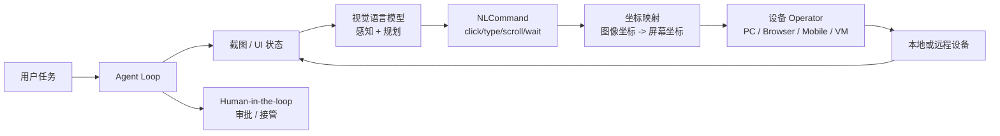

# Computer Use
## 知识点入口

- 本模块先看宏观流程，再看文章：[流程化知识点总览](knowledge/02_Agent与AI工程/0202_工具调用/ComputerUse/核心知识点/流程化知识点总览.md)。
- 新文章必须先归入流程节点，再判断是补充、冲突、不同层次还是降权。
- `文章/` 只保留原文锚点，长期知识必须沉淀到 `核心知识点/`。

## 技术定位

| 项 | 内容 |
|---|---|
| 技术名 | Computer Use |
| 一级类目 | Agent 与 AI 工程 |
| 二级类目 | 工具调用 |
| 技术本体 | 让 Agent 通过截图、视觉理解、动作空间和设备执行器操作 GUI、浏览器、远程桌面或虚拟机 |
| 全局架构位置 | 位于 Agent Harness 与本地/远程设备之间，是高权限工具调用的一类执行层 |
| 主要使用者 | AI 应用工程师、自动化测试工程师、平台工程师、RPA/Agent 系统维护者 |
| 主要产出 | 截图、动作指令、坐标映射、设备操作、执行日志、人工接管点 |

## 官方锚点

- 官网：后续补证
- GitHub：后续补证
- 官方文档：后续补证
- 架构文档：后续补证

## 架构图

## 核心模块

| 模块 | 职责 | 重点问题 |
|---|---|---|
| 屏幕感知 | 获取截图、页面状态、可访问性树或 DOM 信息 | 视觉误识别、上下文成本、隐私暴露 |
| 动作空间 | 定义 click、type、scroll、hotkey、drag、wait、finished 等操作 | 动作是否可审计、是否可回滚 |
| 坐标映射 | 将模型坐标转换为真实屏幕坐标 | 分辨率、缩放、多显示器、窗口遮挡 |
| Operator | 执行具体设备动作 | 操作系统权限、浏览器登录态、文件系统写入 |
| 沙箱 | 隔离运行环境 | 防止误操作真实桌面、泄露凭证或破坏文件 |
| 人工接管 | 在高风险或低置信动作前暂停 | 审批粒度和交互成本 |

## 上下游

| 方向 | 对象 | 关系 |
|---|---|---|
| 上游 | Agent Harness、用户任务、模型多模态能力 | 决定目标、观察和下一步动作 |
| 下游 | 本地桌面、浏览器、移动端、远程虚拟机、数据中心沙箱 | 承接真实操作 |
| 依赖 | 截图权限、输入控制权限、沙箱、审计、Human-in-the-loop | 决定是否能安全落地 |

## 横向对标

| 对标技术 | 对标点 | 优势 | 劣势 | 使用判断 |
|---|---|---|---|---|
| RPA | 都能操作 GUI | Computer Use 能处理未知界面和弹窗 | 不如固定流程稳定 | 非固定流程、探索式操作优先 Computer Use |
| Playwright MCP | 都能操作浏览器 | Playwright 基于结构化页面状态更稳定 | 只覆盖浏览器，不能操作任意桌面 | Web 自动化优先 Playwright |
| Chrome DevTools MCP | 都能操作浏览器 | DevTools 调试信号更深 | 仅 Chrome，权限和上下文成本高 | 性能/网络调试用 DevTools |
| CLI + Skill | 都能执行外部动作 | CLI 可审计、可复现、上下文省 | GUI 任务覆盖弱 | 有 CLI 时优先 CLI，无接口再考虑 Computer Use |
| MCP Server | 都能暴露外部能力 | MCP 接口边界清楚 | GUI 能力仍要高权限执行器 | 需要跨客户端复用时包装成 MCP |

## 已沉淀核心知识点

| 主题 | 文件 | 问题指纹 | 解决什么问题 | 认知增量 |
|---|---|---|---|---|
| 高权限 Computer Use 与沙箱边界 | [高权限ComputerUse与沙箱边界](核心知识点/高权限ComputerUse与沙箱边界.md) | Computer Use + 视觉感知 + 坐标映射 + 设备 Operator + 沙箱/审批 + 本地文件和浏览器权限 | 判断 GUI Agent 什么时候值得用，什么时候必须降级或隔离 | Computer Use 是高权限执行层，不是普通工具调用能力 |

## 后续追查

- 关键词：Computer Use、GUI Agent、UI-TARS、Operator、坐标映射、Human-in-the-loop、sandbox、browser use、remote computer。
- 待读资料：后续补证 Computer Use 官方文档、UI-TARS 技术报告、secure computer use、浏览器和桌面权限隔离。
- 待补实验：在隔离虚拟机或临时浏览器 profile 中验证截图、点击、输入、文件写入、失败接管和审计日志，不在真实主桌面直接放权。
