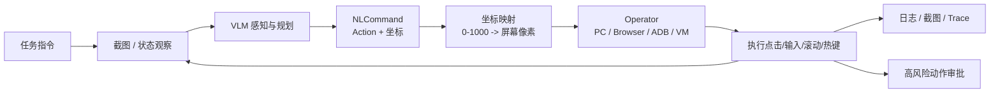

# 高权限 Computer Use 与沙箱边界

## 原文锚点

- 主文：[基于 UI-TARS 的 Computer Use 实现](../文章/基于 UI-TARS 的 Computer Use 实现.md)
- 安全反例：[开源神器！给 Claude Code 开上帝模式，解锁24+ 隐藏命令！无需 Pro_Max 也能用 Computer Use](../文章/开源神器！给 Claude Code 开上帝模式，解锁24+ 隐藏命令！无需 Pro_Max 也能用 Computer Use.md)
- 横向案例：[从 Computer Use到 Datacenter Use：如何让 AI Agent 像调用函数一样驱动数据中心？](../文章/从 Computer Use到 Datacenter Use：如何让 AI Agent 像调用函数一样驱动数据中心？.md)
- 辅助锚点：[用AI+MCP带你玩转本地Office，跨文档协作 一句话一杯茶，工作竟如此轻松](../文章/用AI+MCP带你玩转本地Office，跨文档协作 一句话一杯茶，工作竟如此轻松.md)
- 原文链接：见各本地文件 frontmatter；本轮不联网核验。
- 关键段落：UI-TARS 的系统组件、任务感知、坐标映射、指令转换、命令执行；ClawGod 移除确认和安全限制；Datacenter Use 的 Sandbox API、C/R、可观测性。
- 关键图：多处正文提到流程图和架构图，但 Markdown 未保留图片。

## 图片处理

| 图片 | 类型 | 是否保留 | 理由 | 处理方式 |
|---|---|---|---|---|
| UI-TARS 整体架构图 | 架构图 | 原图缺失 | 说明 VLM、Agent Server、Devices/MCP Services 的关系 | Mermaid 重建 |
| 坐标映射示意图 | 说明图 | 原图缺失 | 说明图像坐标到屏幕坐标的转换 | 文本化保留，后续回原文补图 |
| AKernel 架构图和 Trace 图 | 架构图/说明图 | 原图缺失 | 可说明沙箱和可观测性，但不是本主题主线 | 不进入本篇主图，留后续追查 |

## 一句话结论

Computer Use 值得精读，但只能在沙箱、审计、审批和可回滚边界清楚时实践；它的核心价值是补 GUI/桌面没有 API 的动作缺口，核心风险是把本地屏幕、文件、登录态和系统输入交给模型驱动。

## 用户相关性判断

| 项 | 内容 |
|---|---|
| 用户当前认知层级 | Agent 安全与权限 L1-L2 draft，MCP/工具调用 L2 draft |
| 认知成熟度 | draft |
| 阅读投入建议 | 精读 |
| 阅读投入理由 | 能补高权限工具的纵向链路和安全边界；但真实落地必须实验验证，不适合只照文章配置 |
| 对用户的新信息 | Computer Use 的链路不是简单“模型点屏幕”，而是截图感知、动作二元组、坐标映射、设备 Operator、循环反馈和人工接管的组合 |
| 问题指纹 | Computer Use + GUI Agent + VLM 截图感知 + 坐标映射 + Operator 执行 + 沙箱/审批/审计 + 高权限本地操作 |
| 排重判断 | 新建；Chrome DevTools MCP 已覆盖浏览器调试边界，但未覆盖通用桌面/设备操作和沙箱风险 |
| 置信度 | 中；主文技术链路清楚，安全反例和 Datacenter Use 案例需要后续补证 |

## 认知校准点

| 校准点 | 文章观点/信息 | 与用户认知或价值观的关系 | 处理建议 |
|---|---|---|---|
| Computer Use 不是普通工具调用 | 它需要截图权限、输入控制权限、文件/浏览器/系统状态访问 | 补高权限边界 | 默认归入安全敏感工具 |
| 视觉方案有天然误差 | 只看截图会丢失 DOM/UI 层次、后台窗口和隐藏状态 | 纠偏“看见就能操作” | 有结构化接口时优先用 CLI/API/Playwright |
| ClawGod 是安全反例 | 文章明确提到绕过订阅、安全拒绝、操作确认和 Feature Flag | 与用户重权限治理冲突 | 不沉淀为实践，只作为风险清单 |
| 本地 Office MCP 是高权限文件工具 | 文章要求使用绝对路径并可创建/修改 Word/Excel | 补本地文件写入风险 | 必须限制目录、备份和审计 |
| Datacenter Use 强调沙箱化 | 把 Agent 执行力放入可观测、可恢复、可调度的沙箱 | 补落地路线 | 高权限动作应优先在隔离环境运行 |

## 冲突点

| 冲突类型 | 具体表现 | 影响 | 处理 |
|---|---|---|---|
| 原目录冲突 | UI-TARS、ClawGod、Datacenter Use 多篇在 LLM 或 raw 目录 | 容易误归为模型能力或资讯 | 重路由到工具调用 / Computer Use |
| 标题降权 | “上帝模式”“隐藏命令”“无需 Pro/Max” | 容易诱导不安全实践 | 仅作为反例，不写安装步骤 |
| 图片缺失 | UI-TARS 和 Datacenter Use 多处图缺失 | 影响机制理解 | Mermaid 重建主链路，后续补图 |
| 实践判定偏宽 | UI-TARS 有 SDK 片段，但本轮不运行、不联网、不接设备 | 不能判实践 | 降为精读 |
| 证据不足 | 账号风险、服务条款、模型能力和延迟数据未核验 | 不能作为确定结论 | 标为待验证 |

## 待吸收点

| 分级 | 内容 | 为什么值得吸收 | 后续动作 |
|---|---|---|---|
| 理解 | Computer Use 由感知、规划、坐标映射、指令转换、命令执行和反馈循环组成 | 建立纵向链路 | 写入 ComputerUse index |
| 理解 | Operator 可替换为 PC、浏览器、ADB、远程虚拟机等设备适配层 | 区分模型能力和设备执行器 | 后续对标 Browser/Playwright |
| 记住 | 能用结构化接口就不要先用视觉点击；能用沙箱就不要直接操作真实桌面 | 影响高权限工具选型 | 写入安全准则 |
| 记住 | 本地文件、浏览器登录态、系统输入、剪贴板都属于敏感能力 | 防止把体验工具误当低风险工具 | 后续补安全与权限专题 |
| 实践 | 用隔离 VM 或临时浏览器 profile 验证截图、点击、输入、文件写入、人工接管和日志 | 可形成真实边界 | 待实验 |

## 已知可跳过

| 内容 | 跳过理由 |
|---|---|
| Computer Use 的科幻式愿景叙述 | 不能直接改变工程判断 |
| ClawGod 安装命令和绕过步骤 | 安全风险高，不进入知识库操作指南 |
| Office MCP 的配置截图和公众号演示 | 只保留本地文件写入边界 |
| Datacenter Use 的完整云基础设施细节 | 主体属于基础设施/沙箱专题，本篇只吸收沙箱化方向 |

## 实践门槛

| 门槛 | 判断 | 证据 |
|---|---|---|
| 可运行 | 否 | 本轮不安装 UI-TARS、不运行 MCP、不控制桌面 |
| 可验证 | 部分 | 可设计隔离桌面任务和验收，但尚未执行 |
| 可排障 | 部分 | 原文给出链路模块，但缺本地日志、截图序列和失败样例 |
| 可迁移 | 是 | 可迁移到浏览器测试、本地文档处理、远程虚拟机和高权限工具治理 |
| 结论 | 降为精读 | 机制和边界可沉淀，实践必须另开隔离环境 |

## 归类判断

| 项 | 内容 |
|---|---|
| 技术本体 | Computer Use 是 Agent 操作 GUI/设备的高权限执行层 |
| 文章主问题 | 如何通过视觉模型、MCP/Operator 和设备接口完成桌面/浏览器/远程环境操作 |
| 使用场景 | 本地电脑、浏览器、远程虚拟机、移动端、Office 文件、数据中心沙箱 |
| 关键词干扰 | VLM、MCP、Claude Code、UI-TARS、RPA、Datacenter Use |
| 最终归类 | Agent 与 AI 工程 / 工具调用 / Computer Use |
| 归类理由 | 主问题是 Agent 如何调用设备能力执行动作，不是模型训练或单纯 MCP Server 开发 |

## 技术定位

| 项 | 内容 |
|---|---|
| 技术类型 | 高权限 GUI/设备工具调用 |
| 所属领域 | Agent 与 AI 工程 |
| 二级类目 | 工具调用 |
| 全局架构位置 | Agent Harness -> 视觉/状态观察 -> Operator/MCP Services -> 本地或远程设备 |
| 涉及模块 | 截图、VLM、动作空间、坐标映射、Operator、沙箱、Human-in-the-loop、审计 |
| 解决问题 | 没有稳定 API/CLI 时，让 Agent 以类人方式操作 GUI 和设备 |
| 原文局限 | 缺少可复现实验、权限模型和失败案例；部分文章明显营销或绕过安全 |
| 我的结论 | 以后关注；真实使用前必须先做隔离实验和权限门禁 |

## 纵向理解

| 维度 | 判断 |
|---|---|
| 全局架构 | 用户任务进入 Agent Loop，系统截屏交给 VLM，模型输出动作，坐标映射后由设备 Operator 执行，再用新截图验证 |
| 本文位置 | 主文讲 GUI Agent 工程链路，安全反例讲权限绕过，Datacenter Use 讲沙箱化执行基础设施 |
| 核心机制 | 截图感知、动作二元组、坐标归一化、设备指令转换、循环反馈、人工接管 |
| 使用链路 | 选择隔离环境 -> 授权截图和输入 -> 运行任务 -> 逐步执行 -> 记录日志/截图 -> 高风险动作审批 |
| 前置条件 | 明确可操作范围、临时账号/临时 profile、文件备份、网络和凭证隔离、回滚策略 |
| 边界 | 不适合无监督操作真实生产系统、个人主桌面、支付/发信/删改文件等不可逆动作 |

## Mermaid 重建

## 横向对标

| 对标技术 | 实现方式 | 优势 | 劣势 | 适合场景 |
|---|---|---|---|---|
| Computer Use | 截图 + VLM + 坐标动作 | 通用 GUI 覆盖强 | 慢、误点、高权限风险 | 无 API/CLI、探索式 GUI 操作 |
| Playwright MCP | 可访问性树 / 浏览器自动化 | 稳定、可测试、可复现 | 只覆盖浏览器 | Web 表单、E2E、数据采集 |
| Chrome DevTools MCP | CDP/Puppeteer/DevTools 信号 | 网络、控制台、性能调试强 | Chrome 绑定、上下文成本高 | 前端调试和性能分析 |
| CLI + Skill | 命令行 + SOP | 可审计、可复现、上下文省 | GUI 覆盖不足 | 已有命令行工具的工程任务 |
| RPA | 固定流程脚本 | 稳定、可治理 | 应对未知界面弱 | 重复固定流程 |
| Datacenter Use / Sandbox API | 资源请求 + 沙箱 + C/R + 监控 | 隔离、可恢复、可观测 | 基础设施成本高 | 长程 Agent、并发任务、危险实验 |

## 后续追查

- 关键词：Computer Use、GUI Agent、UI-TARS、Operator、Set-of-Mark、coordinate mapping、Human-in-the-loop、secure computer use、sandbox。
- 相关技术：Playwright MCP、Chrome DevTools MCP、MCP 安全、RPA、CLI、Datacenter Use。
- 需要补读的文章：后续联网补证官方 Computer Use 文档、UI-TARS 技术报告、secure computer use、E2B/虚拟机沙箱实践。
