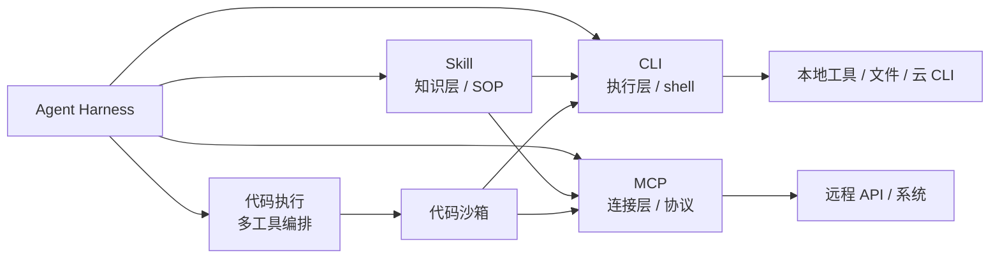

# MCP 与 CLI / 代码执行边界

## 原文锚点

- 主文：[从 MCP 到 CLI：Agent 工具调用的范式转移](../文章/从 MCP 到 CLI：Agent 工具调用的范式转移.md)
- 辅助锚点：[Agent Harness 架构真相：Prompt Cache 如何决定 Skill、MCP 与 SubAgent 设计](../文章/Agent Harness 架构真相：Prompt Cache 如何决定 Skill、MCP 与 SubAgent 设计.md)
- 辅助锚点：[OpenAI 和 Anthropic 同时押注：Tool Search 正在重定义 Agent 工具调用](../文章/OpenAI 和 Anthropic 同时押注：Tool Search 正在重定义 Agent 工具调用.md)
- 原文链接：见各本地文件 frontmatter；本轮不联网核验。
- 关键段落：CLI 是执行层、Skill 是知识层、MCP 是连接层；MCP 上下文重；Skill/CLI 按需读取；Agent Harness 中 system/tools/messages 的放置位置。
- 关键图：无技术图。

## 图片处理

| 图片 | 类型 | 是否保留 | 理由 | 处理方式 |
|---|---|---|---|---|
| 无 | 无图 | 不适用 | 原文主要是观点和表格 | Mermaid 重建层次关系 |

## 一句话结论

这篇文章要精读但必须强降权“CLI 终局/MCP 边缘化”的标题判断；真正可吸收的是分层准则：MCP 偏连接协议，Skill 偏使用知识，CLI 偏执行入口，代码执行偏多工具编排和中间结果压缩。

## 用户相关性判断

| 项 | 内容 |
|---|---|
| 用户当前认知层级 | MCP / Skill / 工具调用 L2 draft，Claude Code L3 draft |
| 认知成熟度 | draft |
| 阅读投入建议 | 精读 |
| 阅读投入理由 | 能补 MCP、Skill、CLI、代码执行的边界和上下文成本取舍；但观点过强，不能直接采信 |
| 对用户的新信息 | CLI + Skill 能用 `--help` 和 SOP 按需加载命令知识，避免大量 MCP 工具定义常驻上下文；但 CLI 的权限和可审计边界更重 |
| 问题指纹 | MCP + CLI + Skill + 代码执行 + 上下文成本 + 执行权限 + 连接层/知识层/执行层边界 |
| 排重判断 | 新建；已有 Skill/MCP 边界笔记未覆盖 CLI 和代码执行的执行层取舍 |
| 置信度 | 中；分层判断可信，行业趋势和“终局”结论需后续补证 |

## 认知校准点

| 校准点 | 文章观点/信息 | 与用户认知或价值观的关系 | 处理建议 |
|---|---|---|---|
| “CLI 终局”要降权 | 原文称 CLI + Skill 正在取代 MCP | 标题/观点过强 | 写成适用场景对标，不写成结论 |
| CLI 的优势来自按需说明和训练分布 | Agent 可读 `--help`、stdout/stderr、JSON 输出 | 补横向对标 | 有成熟 CLI 时优先考虑 |
| CLI 的风险不比 MCP 小 | shell 权限、环境变量、文件系统、网络和破坏性命令都在执行层 | 补安全边界 | 需要沙箱、审批和 prefix allowlist |
| MCP 的价值仍在远程和跨客户端 | 文章也承认 MCP 适合复杂远程 API、权限严格场景 | 纠偏“淘汰论” | 按连接层保留 MCP |
| 代码执行能压缩中间结果 | Programmatic Tool Calling 用代码编排多工具，只回传最终结果 | 补上下文治理 | 必须和沙箱绑定 |

## 冲突点

| 冲突类型 | 具体表现 | 影响 | 处理 |
|---|---|---|---|
| 标题降权 | “范式转移”“终局”“MCP 边缘化” | 容易形成过度结论 | 降权为分层对标 |
| 证据不足 | 大厂 CLI 开源和趋势判断未核验 | 不能作为行业事实 | 标为后续补证 |
| 安全边界缺口 | 原文强调 CLI 轻量，但弱化 shell 权限风险 | 可能误导实践 | 补沙箱、审批、审计 |
| 排重冲突 | Skill/MCP 边界已有笔记 | 容易重复 | 本篇只补 CLI/代码执行层 |

## 待吸收点

| 分级 | 内容 | 为什么值得吸收 | 后续动作 |
|---|---|---|---|
| 理解 | MCP、Skill、CLI 分别偏连接层、知识层、执行层 | 建立横向对标 | 更新 MCP 和 Skill index |
| 理解 | CLI 可通过 `--help`、子命令和 JSON stdout 做按需上下文加载 | 补工具上下文治理 | 与 Tool Search 对照 |
| 记住 | 有 API/CLI 时，先用结构化、可审计接口；GUI/Computer Use 是最后手段 | 影响高权限工具选型 | 写入工具调用二级 index |
| 记住 | CLI 不是低风险能力，危险命令必须进沙箱和审批 | 防止“命令行天然可靠”误区 | 后续补权限专题 |
| 实践 | 为一个本地知识库任务设计 CLI + Skill 与 MCP 两套最小方案，对比上下文、审计、权限和复用 | 可验证 | 待实验 |

## 已知可跳过

| 内容 | 跳过理由 |
|---|---|
| “CLI 才是终局”等口号 | 观点强，证据不足 |
| 大厂项目热度和社区趋势描述 | 本轮不联网核验 |
| OpenCLI/CLI-Anything 的项目热度 | 可后续单独补证，不写成稳定事实 |
| CLI 基础定义 | 用户大概率已知 |

## 实践门槛

| 门槛 | 判断 | 证据 |
|---|---|---|
| 可运行 | 否 | 本轮不安装或执行任何 CLI 项目 |
| 可验证 | 部分 | 可本地构造 CLI + Skill 与 MCP 对比实验 |
| 可排障 | 部分 | CLI 有 stdout/stderr/exit code，但文章未给失败样例 |
| 可迁移 | 是 | 可迁移到数据分析、知识整理、Git/GitLab、发布流程 |
| 结论 | 降为精读 | 先沉淀分层准则，不判实践 |

## 归类判断

| 项 | 内容 |
|---|---|
| 技术本体 | MCP、CLI、Skill、代码执行都是 Agent 调用外部能力的不同层级 |
| 文章主问题 | Agent 工具调用中，连接协议、执行命令和任务知识应如何分层 |
| 使用场景 | 本地开发、运维、业务工具自动化、MCP Server 替代/补充方案 |
| 关键词干扰 | OpenCLI、CLI-Anything、Claude Code、Skill、MCP |
| 最终归类 | Agent 与 AI 工程 / 工具调用 / MCP |
| 归类理由 | 主问题是 MCP 与相邻工具执行方式的边界，不是单纯 CLI 工具介绍 |

## 技术定位

| 项 | 内容 |
|---|---|
| 技术类型 | 工具调用架构对标 / 执行层边界 |
| 所属领域 | Agent 与 AI 工程 |
| 二级类目 | 工具调用 |
| 全局架构位置 | Agent Harness 的工具执行和上下文治理层 |
| 涉及模块 | MCP Server、Skill、CLI、shell、代码沙箱、stdout/stderr、Prompt Cache |
| 解决问题 | 在多种外部能力接入方式之间做选型，控制上下文、权限和复用成本 |
| 原文局限 | 趋势判断较强，安全和失败场景不足 |
| 我的结论 | 以后关注；作为 MCP 与 CLI/Skill 选型准则使用 |

## 纵向理解

| 维度 | 判断 |
|---|---|
| 全局架构 | Agent Harness 把稳定规则放 system，工具 Schema 放 tools，动态状态放 messages；MCP/CLI/Skill 都是在不同入口影响这三层 |
| 本文位置 | 讲外部能力接入方式，不讲具体 CLI 规范、MCP Auth 或 shell 沙箱实现 |
| 核心机制 | MCP 标准化连接，Skill 延迟加载 SOP，CLI 执行命令，代码执行编排多工具并压缩中间结果 |
| 使用链路 | 先判断是否已有 API/CLI -> 用 Skill 记录 SOP -> 必要时用 MCP 做远程/跨客户端连接 -> 高风险动作进入沙箱审批 |
| 前置条件 | CLI 输出稳定、支持 `--help`/JSON、权限最小化、命令白名单、可审计日志 |
| 边界 | CLI 适合本地和成熟命令生态，不适合无审计地操作生产系统或用户真实桌面 |

## Mermaid 重建

## 横向对标

| 对标技术 | 实现方式 | 优势 | 劣势 | 适合场景 |
|---|---|---|---|---|
| MCP | Client/Server 协议 | 跨客户端、远程、权限模型可标准化 | Server 开发和工具上下文成本 | 企业系统、共享工具、远程能力 |
| CLI | shell 命令 | 生态成熟、模型熟悉、按需 `--help` | 权限大、命令注入和破坏性操作风险 | 本地开发、运维、成熟工具 |
| Skill | Markdown + 脚本/资源 | 封装 SOP 和使用知识 | 不直接连接外部系统 | 任务流程、团队规范、工具用法 |
| Programmatic Tool Calling | 沙箱中用代码编排工具 | 中间结果不污染上下文 | 沙箱和代码安全要求高 | 多工具批处理、数据整理 |
| Computer Use | 视觉 + GUI 动作 | 覆盖无 API/CLI 的界面 | 慢、误点、高权限 | 最后手段或隔离环境 |

## 后续追查

- 关键词：CLI for agents、Skill + CLI、Programmatic Tool Calling、shell sandbox、stdout JSON、tool context、Prompt Cache。
- 相关技术：Tool Calling、Tool Search、MCP、Skill、Computer Use、安全与权限。
- 需要补读的文章：后续补证 OpenCLI、CLI-Anything、Agent CLI 安全规范、代码执行沙箱实践。
