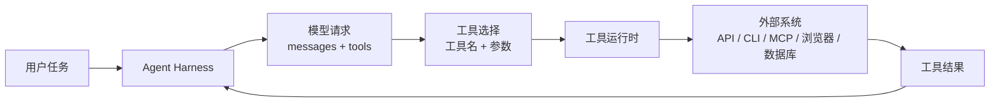

# Tool Calling
## 知识点入口

- 本模块先看宏观流程，再看文章：[流程化知识点总览](knowledge/02_Agent与AI工程/0202_工具调用/ToolCalling/核心知识点/流程化知识点总览.md)。
- 新文章必须先归入流程节点，再判断是补充、冲突、不同层次还是降权。
- `文章/` 只保留原文锚点，长期知识必须沉淀到 `核心知识点/`。

## 技术定位

| 项 | 内容 |
|---|---|
| 技术名 | Tool Calling |
| 一级类目 | Agent 与 AI 工程 |
| 二级类目 | 工具调用 |
| 技术本体 | 让模型在推理过程中选择外部工具、生成结构化参数，并把工具结果接回对话循环 |
| 全局架构位置 | 位于模型 API / Agent Harness 与具体外部工具之间，是 MCP、CLI、浏览器工具、数据库工具的共同抽象层 |
| 主要使用者 | AI 应用工程师、Agent 平台工程师、工具服务维护者 |
| 主要产出 | 工具定义、参数 Schema、工具选择策略、工具调用结果、工具检索索引 |

## 官方锚点

- 官网：后续补证
- GitHub：后续补证
- 官方文档：后续补证
- 架构文档：后续补证

## 架构图

## 核心模块

| 模块 | 职责 | 重点问题 |
|---|---|---|
| 工具定义 | 描述工具名、用途、参数和返回结构 | 描述是否可搜索、是否会诱导误选 |
| 参数 Schema | 约束模型生成的参数 | 枚举、必填、默认值、后端校验 |
| 工具选择 | 判断是否调用、调用哪个工具 | 工具数量膨胀后准确率下降 |
| Tool Search | 按需发现并加载工具定义 | 搜索漏召、额外往返、缓存稳定性 |
| 工具编排 | 多工具、多步骤执行 | 中间结果是否污染上下文 |
| 结果接回 | 把 stdout、JSON、截图、数据库结果等转回上下文 | 结构化、截断、脱敏、审计 |

## 上下游

| 方向 | 对象 | 关系 |
|---|---|---|
| 上游 | 用户任务、系统规则、Skill、Agent Harness | 决定什么时候需要工具能力 |
| 下游 | MCP Server、CLI、浏览器、数据库、文件系统、业务 API | 承接实际动作或数据读取 |
| 依赖 | 模型工具调用能力、运行时权限、沙箱、审计 | 决定能不能安全调用 |

## 横向对标

| 对标技术 | 对标点 | 优势 | 劣势 | 使用判断 |
|---|---|---|---|---|
| MCP | 都描述外部工具能力 | Tool Calling 更贴近模型请求层 | 不负责跨应用协议和资源发现 | 单应用内工具用 Tool Calling，跨客户端复用用 MCP |
| CLI | 都能执行外部动作 | Tool Calling 参数更结构化 | 需要预定义 Schema | 命令生态成熟时 CLI 更轻，危险动作仍要沙箱 |
| Skill | 都会影响 Agent 行为 | Tool Calling 负责动作接口 | 不提供任务 SOP | Skill 教模型怎么用工具，Tool Calling 提供工具入口 |
| RAG | 都是检索后注入上下文 | Tool Search 检索工具定义 | 需要工具元数据质量 | 文档查证用 RAG，能力发现用 Tool Search |

## 已沉淀核心知识点

| 主题 | 文件 | 问题指纹 | 解决什么问题 | 认知增量 |
|---|---|---|---|---|
| Tool Search 与工具上下文治理 | [ToolSearch与工具上下文治理](核心知识点/ToolSearch与工具上下文治理.md) | Tool Calling + 工具检索 + defer loading + Prompt Cache + 工具膨胀治理 | 避免大量工具定义常驻上下文导致成本、缓存和选择准确率问题 | Tool Search 是上下文治理机制，不是简单工具列表搜索 |

## 后续追查

- 关键词：Tool Calling、Function Calling、Tool Search、defer loading、tool reference、Namespace、Programmatic Tool Calling、Tool Use Examples、Prompt Cache。
- 待读资料：后续补证 Tool Calling / Tool Search 官方文档、工具选择评测、工具返回结构设计。
- 待补实验：在本地构造 30 个模拟工具，对比全量工具注入、分组注入、Tool Search/按需加载三种方式的输入 token、误选率和缓存稳定性。
