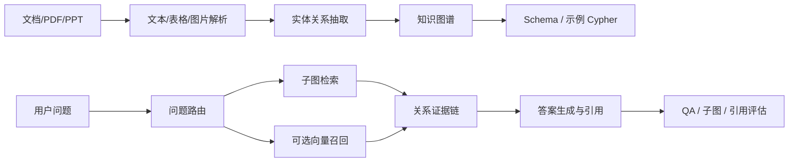

# GraphRAG 图谱构建、检索与多模态边界

## 原文锚点

- 本地文件：[03.从图数据库到RAG：用LangChain构建知识图谱应用](../文章/done-03.从图数据库到RAG：用LangChain构建知识图谱应用.md)
- 本地文件：[04.构建图RAG管道：用LangChain+Neo4j构建与评估图RAG管道的全流程](../文章/done-04.构建图RAG管道：用LangChain+Neo4j构建与评估图RAG管道的全流程.md)
- 本地文件：[MegaRAG：打破 GraphRAG 的文本次元壁，基于多模态知识图谱的 RAG 新范式](<../文章/done-MegaRAG：打破 GraphRAG 的文本次元壁，基于多模态知识图谱的 RAG 新范式.md>)
- 原文链接：三个链接均保留在本地文件 frontmatter。
- 关键段落：向量提供相似性、图提供关系；LLMGraphTransformer 抽取实体关系；GraphCypherQAChain 需要 Schema 和 few-shot；QAEvalChain 评估答案；MegaRAG 把视觉实体加入知识图谱并做双路检索。
- 关键图：MegaRAG 文章描述整体架构图和 refinement 前后对比，但本地 Markdown 没有图片文件。

## 图片处理

| 图片 | 类型 | 是否保留 | 理由 | 处理方式 |
|---|---|---|---|---|
| MegaRAG 整体架构 | 架构图 | 原图缺失 | 文章明确提到“整体架构”但本地无图 | Mermaid 重建 |
| 图 RAG 管道执行结果截图 | 配图/运行截图 | 删除 | 不影响机制理解，且本轮不复现实验 | 不进入知识点 |

## 一句话结论

GraphRAG 的价值是把“相似文本召回”补成“实体关系和多跳证据链”，但只有在关系确实决定答案、Schema 可控且评估能覆盖图查询错误时才值得上。

## 用户相关性判断

| 项 | 内容 |
|---|---|
| 用户当前认知层级 | RAG / 知识库 L2 draft |
| 认知成熟度 | draft |
| 阅读投入建议 | 精读 |
| 阅读投入理由 | 能补齐 RAG 横向边界：向量 RAG 适合相似性，GraphRAG 适合关系和全局问题；但原文实践依赖外部服务和 API，不能本轮实践 |
| 对用户的新信息 | 图谱增强检索的关键不是“换成图数据库”，而是实体关系抽取、Schema 约束、图查询安全、子图证据和评估闭环 |
| 问题指纹 | GraphRAG + 实体关系抽取/Schema/Cypher/多模态图谱 + 多跳关系问答 + 向量 RAG 边界 |
| 排重判断 | 新建 GraphRAG 技术目录和主题笔记 |
| 置信度 | 中 |

## 认知校准点

| 校准点 | 文章观点/信息 | 与用户认知或价值观的关系 | 处理建议 |
|---|---|---|---|
| 图不替代向量 | 原文说向量适合相似性，图适合关系和深度关联 | 补充 RAG 横向边界 | 写入 GraphRAG index |
| GraphRAG 成本在建图和 Schema | LangChain/Neo4j 示例强调 Schema、few-shot、Cypher 生成 | 纠偏：不是把文本塞进 Neo4j 就完成 | 后续实验必须先设计 Schema |
| LLM 抽图有不确定性 | 原文提示每次运行图可能不一样 | 符合用户重可验证偏好 | 抽取结果要有人工/规则校验 |
| 多模态 GraphRAG 不能只靠 OCR | MegaRAG 强调图片/图表/布局作为实体 | 补充复杂文档 RAG 边界 | 标为后续补证，先吸收机制 |

## 冲突点

| 冲突类型 | 具体表现 | 影响 | 处理 |
|---|---|---|---|
| 原目录冲突 | MegaRAG 在 `01_LLM与大模型`，主问题是 RAG/知识图谱架构 | 可能误归类 | 重路由到 GraphRAG |
| 证据不足 | MegaRAG 的胜率、准确率、论文时间和模型细节本轮未联网核验 | 不能作为确定结论 | 标“后续补证” |
| 实践门槛不足 | LangChain+Neo4j 示例需要外部模型、凭证、Neo4j 实例 | 本轮不能本地复现 | 降为精读 |
| 权限风险 | GraphCypherQAChain 示例开启 `allow_dangerous_requests=True` | 可能误导生产实践 | 只读凭证和查询白名单应作为门槛 |
| 图片缺失 | MegaRAG 架构图缺失 | 影响理解多模态链路 | Mermaid 重建 |

## 待吸收点

| 分级 | 内容 | 为什么值得吸收 | 后续动作 |
|---|---|---|---|
| 理解 | 向量召回回答“相似上下文在哪里”，图检索回答“实体之间如何关联” | 明确是否需要 GraphRAG | 写入横向对标 |
| 理解 | GraphRAG 管道包含文档解析、分块、图文档生成、图存储、Schema 注入、图查询、答案评估 | 建立纵向链路 | 新建 GraphRAG index |
| 记住 | LLM 生成 Cypher 必须有 Schema、few-shot、只读权限和评估集 | 直接影响安全与正确性 | 后续实验门槛 |
| 记住 | 多模态图谱要把图表作为实体，而不是把图片 OCR 成普通文本后丢掉 | 对 PDF/PPT/研报知识库很关键 | 与 RAGFlow 多格式切分关联 |
| 实践 | 用一组小文档做“向量 RAG vs GraphRAG vs 混合检索”的多跳问答对比 | 可验证是否值得建图 | 后续实验 |

## 已知可跳过

| 内容 | 跳过理由 |
|---|---|
| LangChain 基础 prompt/chain 入门 | 用户大概率不需要入门解释 |
| Neo4j 凭证读取代码逐行说明 | 本轮不搭环境，保留流程即可 |
| MegaRAG 性能数字 | 未本地核验，且时效性强 |
| 宣传性标题“新范式、打破次元壁” | 只保留可证据化机制 |

## 实践门槛

| 门槛 | 判断 | 证据 |
|---|---|---|
| 可运行 | 否 | 需要 Neo4j、模型 API、本地 PDF 和凭证，本轮未运行 |
| 可验证 | 部分 | 04 文章有少量测试集和 QAEvalChain，但样本太少且 LLM-as-judge 有偏差 |
| 可排障 | 部分 | 能定位到 Schema、Cypher、图抽取、QA 评估层，但缺日志和错误分类 |
| 可迁移 | 是 | 可迁移到需要实体关系和多跳检索的知识库 |
| 结论 | 降为精读 | 机制值得吸收，实践需单独准备环境和评估集 |

## 归类判断

| 项 | 内容 |
|---|---|
| 技术本体 | GraphRAG 是用知识图谱增强检索和推理的 RAG 变体 |
| 文章主问题 | 如何从文档构建图谱、用图查询回答问题，并判断与向量 RAG 的边界 |
| 使用场景 | 法律、医疗、技术文档、项目资料、研报、PPT、跨段落关系问答 |
| 关键词干扰 | LangChain、Neo4j、GPT、MegaRAG、PDF、视觉模型 |
| 最终归类 | Agent 与 AI 工程 / RAG 与知识库 / GraphRAG |
| 归类理由 | 主问题是知识库检索架构，不是图数据库教程或模型能力评测 |

## 技术定位

| 项 | 内容 |
|---|---|
| 技术类型 | RAG 架构模式 / 知识图谱增强检索 |
| 所属领域 | Agent 与 AI 工程 |
| 二级类目 | RAG 与知识库 |
| 全局架构位置 | 文档解析后、答案生成前的图谱建模和图检索层 |
| 涉及模块 | 文档解析、实体抽取、关系抽取、图数据库、Schema、Cypher、子图检索、向量召回、评估 |
| 解决问题 | 多跳关系、全局总结、实体消歧、证据链追踪 |
| 原文局限 | 实践样本小，外部依赖强，性能数字未补证，安全边界不足 |
| 我的结论 | 以后关注；先作为 RAG 横向边界和复杂文档候选方案 |

## 纵向理解

| 维度 | 判断 |
|---|---|
| 全局架构 | Parse -> Chunk -> Entity/Relation Extraction -> Graph Store -> Schema/Prompt -> Graph Retrieval -> Answer -> Evaluation |
| 本文位置 | 覆盖图构建、图查询和初步评估；不完整覆盖图谱治理、版本管理和生产权限 |
| 核心机制 | 实体关系抽取、Schema 注入、few-shot Cypher、子图检索、多模态实体 |
| 使用链路 | 准备资料 -> 抽取图谱 -> 写入 Neo4j -> 注入 Schema -> 生成/执行查询 -> 用子图证据生成答案 |
| 前置条件 | 高质量解析、明确实体关系类型、只读图查询权限、gold 问题和答案 |
| 边界 | 关系弱或问题主要是语义相似时不必上图；抽图错误会污染后续检索 |

## 横向对标

| 对标技术 | 实现方式 | 优势 | 劣势 | 适合场景 |
|---|---|---|---|---|
| 向量 RAG | chunk embedding 相似度召回 | 简单、覆盖大规模文本 | 多跳关系弱，解释链弱 | FAQ、语义问答 |
| GraphRAG | 实体关系图 + 图查询/子图检索 | 关系、多跳、全局问题强 | 建图和评估成本高 | 法律、医疗、项目关系 |
| Neo4j KGQA | Cypher 查询图数据库 | 可解释、结构清晰 | 依赖 Schema 和查询正确性 | 关系明确的图谱 |
| MegaRAG 类多模态图谱 | 图表/图片作为视觉实体 | 保留复杂文档视觉语义 | 模型成本高，证据需补证 | PPT、研报、图表文档 |
| LLM Wiki | 预编译 Markdown 网络 | 认知校准和可读性强 | 自动多跳查询弱 | 个人长期知识沉淀 |

## 后续追查

- 关键词：GraphRAG、Neo4j GraphCypherQAChain、LLMGraphTransformer、schema prompting、subgraph retrieval、multimodal knowledge graph、MegaRAG、LightRAG。
- 相关技术：RAG 文档解析、RAGFlow 多格式切分、RAG 评估、LLM Wiki。
- 需要补读的文章：GraphRAG 官方/论文、LightRAG、Neo4j GraphRAG、MegaRAG 原文与代码。

