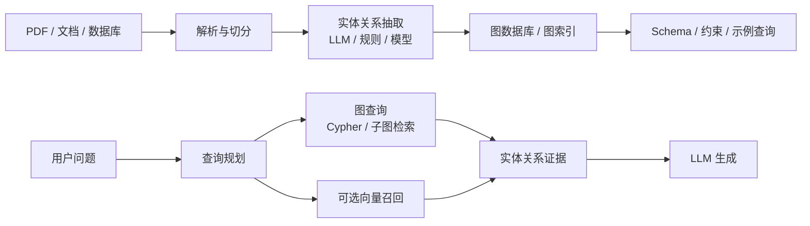

# GraphRAG
## 知识点入口

- 本模块先看宏观流程，再看文章：[知识地图](020301_核心知识点/知识地图.md)。
- 新文章必须先归入流程节点，再判断是补充、冲突、不同层次还是降权。
- `文章/` 只保留原文锚点，长期知识必须沉淀到 `020301_核心知识点/`。

## 技术定位

| 项 | 内容 |
|---|---|
| 技术名 | GraphRAG |
| 一级类目 | Agent 与 AI 工程 |
| 二级类目 | RAG 与知识库 |
| 技术本体 | 把文档、实体和关系构造成知识图谱，再利用图结构进行检索、推理、问答或全局总结的 RAG 变体 |
| 全局架构位置 | 位于文档解析/知识抽取和 LLM 问答之间，承担实体关系建模、多跳检索、Schema 约束和图证据追踪 |
| 主要使用者 | AI 应用工程师、知识图谱工程师、企业知识库维护者 |
| 主要产出 | 实体、关系、图谱、Cypher/图查询、子图证据、图增强答案 |

## 官方锚点

- 官网：后续补证
- GitHub：后续补证
- 官方文档：后续补证
- 架构文档：后续补证

## 架构图

## 核心模块

| 模块 | 职责 | 重点问题 |
|---|---|---|
| 文档解析 | 从 PDF、网页、报告等资料中抽取文本、表格和视觉信息 | 输入质量、结构保真、页码和来源 |
| 实体关系抽取 | 把文本转成节点和边 | 抽取准确率、同义实体合并、关系类型约束 |
| 图存储 | 存储实体、关系、来源和属性 | Schema、索引、权限、版本 |
| 图查询 | 用 Cypher/子图检索回答关系问题 | Schema 注入、查询正确性、安全 |
| 混合检索 | 图检索与向量/全文检索结合 | 何时用关系，何时用相似度 |
| 评估 | 评估答案、Cypher、证据链和图覆盖率 | gold 子图、LLM-as-judge 偏差、可追溯性 |

## 上下游

| 方向 | 对象 | 关系 |
|---|---|---|
| 上游 | 文档解析器、LLMGraphTransformer、业务数据库、PDF/PPT/图表 | 提供可抽取实体关系的原始资料 |
| 下游 | LLM 问答、Agent、知识库检索、分析应用 | 使用子图证据生成答案 |
| 依赖 | 图数据库、Schema、Embedding、LLM、评估集 | 决定可控性和成本 |

## 横向对标

| 对标技术 | 对标点 | 优势 | 劣势 | 使用判断 |
|---|---|---|---|---|
| 向量 RAG | 都做外部知识检索 | GraphRAG 更擅长关系、多跳和全局问题 | 建图成本高，抽取错误会传播 | 关系明确、需要解释链时看 GraphRAG |
| KGQA | 都用知识图谱问答 | GraphRAG 更容易从非结构化文档构建 | 图质量不如人工知识图谱稳定 | 文档驱动知识库可用 GraphRAG |
| Neo4j GraphCypherQAChain | 图查询问答 | 可直接利用图数据库和 Cypher | LLM 生成 Cypher 有安全和正确性风险 | 需要 Schema、few-shot 和只读权限 |
| 多模态 RAG | 都处理图文资料 | MegaRAG 类路线把视觉实体纳入图 | 模型成本和评估难度高 | PPT、研报、图表文档优先关注 |
| LLM Wiki | 都做结构化知识 | LLM Wiki 更适合人工可读知识沉淀 | 不擅长自动多跳图查询 | 长期认知沉淀仍保留 knowledge |

## 已沉淀核心知识点

| 主题 | 文件 | 问题指纹 | 解决什么问题 | 认知增量 |
|---|---|---|---|---|
| GraphRAG 图谱构建、检索与多模态边界 | [GraphRAG图谱构建检索与多模态边界](020301_核心知识点/GraphRAG图谱构建检索与多模态边界.md) | GraphRAG + 实体关系抽取/Schema/Cypher/多模态图谱 + 多跳关系问答 + 向量 RAG 边界 | 判断什么时候从向量 RAG 升级到图谱增强检索 | 图提供关系和可解释路径，但建图、Schema、评估和权限是主要门槛 |

## 后续追查

- 关键词：GraphRAG、Knowledge Graph RAG、Neo4j、Cypher QA、LLMGraphTransformer、subgraph retrieval、global QA、multimodal knowledge graph。
- 待读资料：GraphRAG 官方/论文/源码、LightRAG、Neo4j GraphRAG、MegaRAG 原文。
- 待补实验：用一个小型技术文档集合抽取实体关系，比较向量 RAG、图查询、混合检索在多跳问题上的引用正确率。

