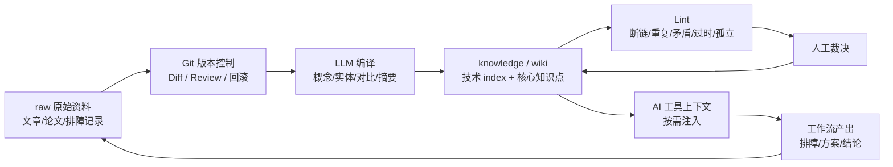

# Git 预编译知识库与 Lint 闭环

## 原文锚点

- 本地文件：[别用飞书文档当知识库了，试试 Git + LLM 自动编译](<../文章/别用飞书文档当知识库了，试试 Git + LLM 自动编译.md>)
- 本地文件：[来自Karpathy的知识库管理方法](../文章/来自Karpathy的知识库管理方法.md)
- 本地补充：LLM Wiki 知识库模式（本地锚点缺失：`../../../../../wiki/concepts/llm-wiki.md`）、Wiki Ingest/Query/Lint 操作流程（本地锚点缺失：`../../../../../wiki/concepts/wiki-ingest-flow.md`）、知识生命周期管理（本地锚点缺失：`../../../../../wiki/concepts/knowledge-lifecycle-management.md`）、RAG vs LLM Wiki（本地锚点缺失：`../../../../../wiki/comparisons/rag-vs-llm-wiki.md`）
- 原文链接：两个微信公众号链接保留在本地文件 frontmatter。
- 关键段落：Raw/Wiki/Schema 三层；Git 大仓 + LLM 自动编译；CI/CD 触发知识编译；知识注入 AI 工具上下文再反哺知识库；Lint/健康检查；三级成熟度和引用追踪。
- 关键图：文章里多为装饰照片，本地 wiki 无技术图。

## 图片处理

| 图片 | 类型 | 是否保留 | 理由 | 处理方式 |
|---|---|---|---|---|
| Photo by Pexels / Luis Gomes | 配图 | 删除 | 无技术信息 | 不进入知识点 |
| Git + LLM 知识闭环 | 流程图 | 重建 | 版本化、编译、注入、回流是核心机制 | Mermaid 重建 |

## 一句话结论

Git + LLM/LLM Wiki 对当前 knowledge 的可吸收价值不是“多建 wiki 页”，而是版本化预编译、三级索引、引用追踪、成熟度衰减和 lint 质量门禁。

## 用户相关性判断

| 项 | 内容 |
|---|---|
| 用户当前认知层级 | RAG/知识库/LLM Wiki L2 draft |
| 认知成熟度 | draft |
| 阅读投入建议 | 精读 |
| 阅读投入理由 | 直接服务当前 knowledge 初始化流程改进；但团队 Git 落地、外部数字和原始 Karpathy 链接本轮未联网补证 |
| 对用户的新信息 | 知识库维护问题的核心不是存储工具，而是“谁编译、谁审查、谁裁决、谁清腐烂知识” |
| 问题指纹 | LLM Wiki + Git/Markdown/CI/Lint/成熟度/引用追踪 + 预编译知识库治理 + 改进 knowledge 初始化闭环 |
| 排重判断 | 新建；补充已有 LLM Wiki 预编译模式的工程化治理和 Git 闭环 |
| 置信度 | 高 |

## 认知校准点

| 校准点 | 文章观点/信息 | 与用户认知或价值观的关系 | 处理建议 |
|---|---|---|---|
| 知识库问题不是“放在哪里” | 原文认为团队知识库失败常因没人维护、过时、上下文散落 | 与用户重长期沉淀一致 | 把维护闭环写进流程，而不是只补目录 |
| Git 的价值是审查，不只是存储 | diff、review、rollback 让 LLM 大规模改写可控 | 补充当前 knowledge 的质量门禁 | 后续 lint/变更报告优先 |
| LLM Wiki 强在预编译，弱在文章价值筛选 | Karpathy 模式默认来源值得 ingest | 与当前 skill 的“认知校准优先”互补 | 保留文章筛选，不照搬全量 ingest |
| Lint 是控制面 | 本地 wiki 定义孤立页、死链、index 完整性、矛盾、过时、重复等检查 | 直接可改进当前初始化流程 | 后续写项目 skill 或 lint 脚本 |

## 冲突点

| 冲突类型 | 具体表现 | 影响 | 处理 |
|---|---|---|---|
| 原目录冲突 | Git+LLM 文章在 `01_LLM与大模型`，主问题是知识库工程化 | 可能误归模型能力 | 重路由到 LLM Wiki / RAG 与知识库 |
| 证据不足 | 浏览量、收藏数、外部链接、团队实践效果未本轮补证 | 不能写成事实结论 | 只保留本地可验证机制 |
| 目标差异 | LLM Wiki 偏概念网络，当前 knowledge 偏文章价值判断和技术定位 | 照搬会增加维护成本 | 吸收 lint/索引/成熟度，不照搬“一概念一页” |
| 实践门槛 | CI/CD、Skills、自动提交回流需要脚本和权限 | 本轮禁止改脚本 | 写入后续追查 |

## 待吸收点

| 分级 | 内容 | 为什么值得吸收 | 后续动作 |
|---|---|---|---|
| 理解 | Raw/Wiki/Schema 或 原文/knowledge/规则 三层分工 | 防止原文、规则和沉淀内容混杂 | 当前目录已基本具备，可继续强化 |
| 理解 | 三级渐进索引：全景目录、分类清单、完整条目 | 控制上下文膨胀 | 对 `AGENTS.md`、`本地文章目录`、核心知识点形成渐进入口 |
| 记住 | Lint 比多写笔记更重要 | 防止断链、重复、矛盾和过时 | 后续优先写项目内规则或脚本 |
| 记住 | 成熟度 draft/verified/proven 必须靠引用和实践提升 | 防止单篇文章结论过度稳定化 | 当前核心知识点继续保留 draft |
| 实践 | 给 knowledge 做轻量 lint：断链、重复问题指纹、原图缺失、低置信分类、未更新 index | 可直接提升初始化质量 | 后续单独实现，不在本轮改脚本 |

## 已知可跳过

| 内容 | 跳过理由 |
|---|---|
| Obsidian Graph View 和可视化前端 | 对当前核心流程不是关键 |
| 社交传播数字 | 未补证且不影响机制 |
| 非开发同学用 Git 的产品化包装 | 当前用户场景优先是本地知识初始化 |
| 完整团队协作制度 | 本轮只吸收个人/项目 knowledge 可落地机制 |

## 实践门槛

| 门槛 | 判断 | 证据 |
|---|---|---|
| 可运行 | 部分 | 本地已有 `wiki/`、`knowledge/`、index 和规则文件 |
| 可验证 | 部分 | 可检查断链、重复、孤立、原图缺失、成熟度字段 |
| 可排障 | 部分 | Lint 检查项明确，但未有脚本输出 |
| 可迁移 | 是 | 直接迁移到当前 knowledge 初始化流程 |
| 结论 | 精读，后续可实践 | 本轮只沉淀机制，不改脚本 |

## 归类判断

| 项 | 内容 |
|---|---|
| 技术本体 | LLM Wiki 是由 Agent 预编译和维护的 Markdown 知识网络；Git + LLM 是其版本化工程化实现 |
| 文章主问题 | 如何让知识库持续编译、审查、注入上下文并防腐烂 |
| 使用场景 | 个人知识库、团队知识库、AI 工具上下文、项目知识沉淀 |
| 关键词干扰 | 飞书、Notion、Obsidian、Git、Skills、CI/CD |
| 最终归类 | Agent 与 AI 工程 / RAG 与知识库 / LLM Wiki |
| 归类理由 | 主问题是知识库治理和预编译流程，不是普通文档工具或代码仓库管理 |

## 技术定位

| 项 | 内容 |
|---|---|
| 技术类型 | 知识库架构模式 / 工程治理流程 |
| 所属领域 | Agent 与 AI 工程 |
| 二级类目 | RAG 与知识库 |
| 全局架构位置 | 原始资料和 Agent/用户查询之间的预编译、索引、健康检查和上下文注入层 |
| 涉及模块 | raw、knowledge/wiki、schema、index、log、Git、diff、lint、maturity、引用追踪 |
| 解决问题 | 防止知识散落、过时、重复、矛盾和无法被 AI 工具稳定使用 |
| 原文局限 | 外部证据未补证，团队落地需要权限、流程和自动化脚本 |
| 我的结论 | 以后关注；当前先吸收为 knowledge 初始化质量门禁 |

## 纵向理解

| 维度 | 判断 |
|---|---|
| 全局架构 | Raw -> Git -> LLM Compile -> Knowledge/Wiki -> Index/Log -> Query/Context -> Work Output -> Lint/Review |
| 本文位置 | 讲知识库生命周期和治理，不讲向量召回算法 |
| 核心机制 | 预编译、版本控制、增量更新、三级索引、Lint、成熟度、引用追踪、人类裁决 |
| 使用链路 | 新原文进入 -> 先查重 -> 编译核心知识点 -> 更新 index -> 记录冲突 -> lint -> 后续查询按需读取 |
| 前置条件 | 明确规则、可追查原文、稳定索引、人工裁决入口 |
| 边界 | 不适合把所有低价值资讯都正式沉淀，也不能替代原文检索 |

## 横向对标

| 对标技术 | 实现方式 | 优势 | 劣势 | 适合场景 |
|---|---|---|---|---|
| RAG | 原文 chunk + 向量/全文检索 | 覆盖大量资料 | 噪声、矛盾、过时难治理 | 海量原文检索 |
| LLM Wiki | Agent 预编译 Markdown 网络 | 知识密度高，可 lint | 维护成本高 | 高价值知识沉淀 |
| 当前 knowledge | 技术 index + 核心知识点 + 用户画像 | 认知校准强 | 自动 lint 仍弱 | 用户个人知识初始化 |
| 飞书/Notion 文档 | 人工维护富文本 | 协作体验好 | 版本审查、AI 批量改写、结构化弱 | 团队普通文档 |
| Git + Markdown | 文本版本化和 review | diff、回滚、自动化强 | 非技术门槛和流程成本 | 技术团队/Agent 维护知识 |

## 后续追查

- 关键词：LLM Wiki、Git knowledge base、knowledge lint、draft verified proven、reference tracking、progressive index、knowledge lifecycle。
- 相关技术：RAG、RAGFlow、GraphRAG、Obsidian、qmd、Skills。
- 需要补读的文章：Karpathy 原始 gist、LLM Wiki 自动 lint 实现、当前 knowledge 断链/重复问题指纹检查方案。

