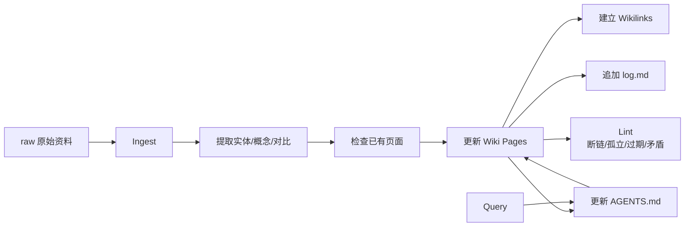

# LLM Wiki 预编译知识库模式

## 原文锚点

- 本地文件：wiki/concepts/llm-wiki.md（本地锚点缺失：`../../../../../wiki/concepts/llm-wiki.md`）、wiki/concepts/wiki-ingest-flow.md（本地锚点缺失：`../../../../../wiki/concepts/wiki-ingest-flow.md`）、wiki/comparisons/rag-vs-llm-wiki.md（本地锚点缺失：`../../../../../wiki/comparisons/rag-vs-llm-wiki.md`）
- 原始模式：[Karpathy LLM Wiki gist](https://gist.github.com/karpathy/442a6bf555914893e9891c11519de94f)
- 关键段落：预编译知识、raw/wiki/Schema 三层架构、Ingest/Query/Lint、RAG vs LLM Wiki、知识复利效应。
- 关键图：本地 wiki 无技术图，使用 Mermaid 重建。

## 图片处理

| 图片 | 类型 | 是否保留 | 理由 | 处理方式 |
|---|---|---|---|---|
| 无 | 无图 | 不适用 | 本地 wiki 主要是结构化文字 | Mermaid 重建 |

## 一句话结论

LLM Wiki 对当前 knowledge 仍有可吸收价值，但不能照搬：要吸收 Ingest/Query/Lint、index/log 和互链健康检查，同时保留当前 knowledge 的认知校准、阅读投入和问题指纹。

## 用户相关性判断

| 项 | 内容 |
|---|---|
| 用户当前认知层级 | RAG/知识库 L2 draft |
| 认知成熟度 | draft |
| 阅读投入建议 | 精读 |
| 阅读投入理由 | 直接回应“旧 wiki 参考 LLM Wiki 但使用不好”的问题，能指导 knowledge 后续流程设计 |
| 对用户的新信息 | LLM Wiki 的核心不是目录多，而是预编译、互链、lint 和人类裁决；当前 knowledge 需要把“文章判断”补进这个流程 |
| 问题指纹 | LLM Wiki + Ingest/Query/Lint + 预编译 Markdown 网络 + 个人知识库沉淀 + 与 RAG/knowledge 边界 |
| 排重判断 | 新建 |
| 置信度 | 高 |

## 认知校准点

| 校准点 | 文章观点/信息 | 与用户认知或价值观的关系 | 处理建议 |
|---|---|---|---|
| 旧 wiki 的问题不是 LLM Wiki 模式本身无效 | 更可能是缺少持续 lint、人工裁决和阅读价值判断 | 纠偏：不要全盘否定 | 吸收流程，不照搬目录 |
| LLM Wiki 强在知识网络，不强在文章筛选 | 它默认来源值得 ingest，较少判断“是否值得读” | 补当前 knowledge 的优势 | 保留认知校准优先 |
| RAG 与 LLM Wiki 不是二选一 | RAG 适合大规模原文检索，LLM Wiki 适合高质量预编译知识 | 补横向边界 | 写入 RAG index |
| Lint 是可复用机制 | 断链、孤立页、index 完整性、过期、矛盾检查可迁移到 knowledge | 明确可落地动作 | 后续做 knowledge lint |

## 冲突点

| 冲突类型 | 具体表现 | 影响 | 处理 |
|---|---|---|---|
| 流程目标差异 | LLM Wiki 偏知识编译，当前 knowledge 偏认知初始化和文章价值判断 | 照搬会忽略用户痛点 | 融合流程 |
| 结构过重 | 每篇文章可能更新 5-15 个页面 | 对当前 2974 篇材料成本过高 | 只对高价值主题正式沉淀 |
| 互链成本 | 每页至少 2 个 wikilink，维护压力较大 | 容易变成形式主义 | 只做关键 cross-link |
| 旧 wiki 使用放弃 | 本地已有 wiki 但慢慢不用 | 说明运营成本或查询价值不足 | 新 knowledge 要有排重和报告闭环 |

## 待吸收点

| 分级 | 内容 | 为什么值得吸收 | 后续动作 |
|---|---|---|---|
| 理解 | LLM Wiki 是 raw/wiki/schema 三层结构 | 能解释来源、知识页和规则的职责 | 对照 knowledge |
| 理解 | Ingest/Query/Lint 是核心操作 | 可迁移为文章沉淀、知识查询、健康检查 | 写入后续流程 |
| 记住 | 预编译知识库的价值在于“查询前已经整理好” | 区分 RAG 的实时检索 | 写入 LLM Wiki index |
| 记住 | Lint 比多建页面更重要 | 防止知识腐烂 | 做 knowledge lint |
| 实践 | 为 knowledge 增加断链、重复问题指纹、孤立技术 index、未更新画像证据检查 | 可直接落地 | 待实现 |

## 已知可跳过

| 内容 | 跳过理由 |
|---|---|
| Obsidian 可视化和 Graph View | 对当前目标不是核心 |
| 旧 wiki 的完整页面列表 | 不需要整体迁移 |
| Token 成本估算 | 随模型和价格变化，不能沉淀为准则 |

## 实践门槛

| 门槛 | 判断 | 证据 |
|---|---|---|
| 可运行 | 是 | 本地已有 wiki、SCHEMA、index、log |
| 可验证 | 部分 | 可检查断链/index/log，但未与 knowledge 流程整合 |
| 可排障 | 部分 | Lint 检查项明确 |
| 可迁移 | 是 | 可迁移到 knowledge 健康检查 |
| 结论 | 精读，后续可实践 | 先吸收机制，再实现 lint |

## 归类判断

| 项 | 内容 |
|---|---|
| 技术本体 | LLM Wiki 是 Agent 维护的预编译 Markdown 知识库模式 |
| 文章主问题 | 旧 wiki 的哪些机制能服务新的 knowledge 认知库 |
| 使用场景 | 个人知识沉淀、技术概念网络、RAG 替代/补充、Agent 查询 |
| 关键词干扰 | Obsidian、qmd、OpenClaw、raw |
| 最终归类 | Agent 与 AI 工程 / RAG 与知识库 / LLM Wiki |
| 归类理由 | 主问题是知识库架构和 Agent 维护流程，不是普通文档工具 |

## 纵向理解

| 维度 | 判断 |
|---|---|
| 全局架构 | raw 原始资料 -> Ingest -> wiki 页面 -> index/log -> Query/Lint |
| 本文位置 | 讲知识库模式和流程，不讲向量检索算法 |
| 核心机制 | 预编译、互链、增量更新、lint、矛盾显式处理、人类裁决 |
| 使用链路 | 读 schema/index/log -> 读来源 -> 检查已有页面 -> 更新概念页 -> 更新 index/log -> lint |
| 前置条件 | 有稳定规则、可追溯来源、持续维护意愿和人工裁决 |
| 边界 | 不适合大量低价值资讯全量 ingest，也不替代原文检索 |

## Mermaid 重建

## 横向对标

| 对标技术 | 实现方式 | 优势 | 劣势 | 适合场景 |
|---|---|---|---|---|
| LLM Wiki | Agent 预编译 Markdown 网络 | 可读、互链、低延迟、可审查 | 维护成本高 | 高价值个人知识 |
| RAG | 原文 chunk + 检索 + 生成 | 覆盖大规模原文 | 噪声、矛盾和结构弱 | 大量资料检索 |
| 当前 knowledge | 技术 index + 核心知识点 + 画像 | 认知校准强，读文章省时间 | 互链和自动 lint 还弱 | 用户个人认知初始化 |
| Obsidian 手工库 | 人工写 Markdown | 自由、可视化 | 难规模化，缺自动评估 | 笔记写作 |

## 后续追查

- 关键词：LLM Wiki、Ingest、Query、Lint、wikilinks、knowledge lifecycle、RAG vs LLM Wiki。
- 相关技术：RAG、RAGFlow、Langfuse、knowledge、Obsidian、qmd。
- 需要补读的文章：`wiki/maps/知识管理.md`、`wiki/concepts/knowledge-lifecycle-management.md`、Karpathy 原始 gist。

