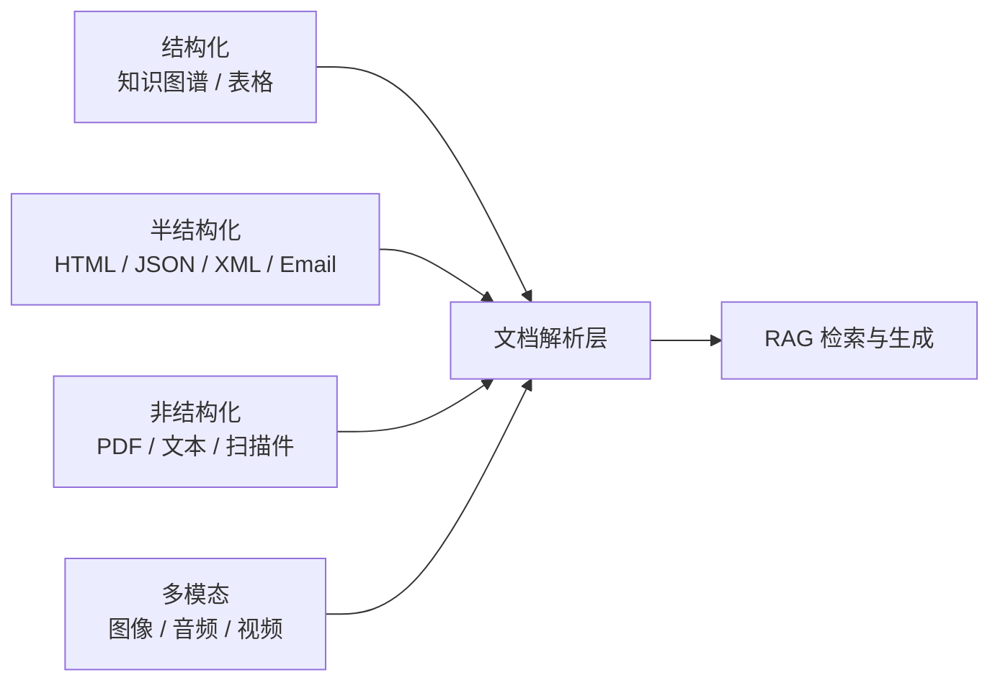

# RAG 文档解析分层选型

## 原文锚点

- 本地文件：[RAG 文档解析工具选型指南](<../文章/RAG 文档解析工具选型指南.md>)
- 原文链接：`https://mp.weixin.qq.com/s?__biz=MzkzMTI3MTg5MQ==&mid=2247487653&idx=1&sn=eabdd180ab8a28880af698315b5055cc`
- 原文外部链接：`https://aiexpjourney.substack.com/p/when-rag-meets-document-parsing-a`
- 关键段落：文章按结构化、半结构化、非结构化、多模态四类知识讨论解析工具。
- 关键图：正文提到 `Figure 1: RAG 系统整合的多种知识类型`，但 Markdown 没有图片。

## 图片处理

| 图片 | 类型 | 是否保留 | 理由 | 处理方式 |
|---|---|---|---|---|
| Figure 1 | 说明图 | 原图缺失 | 文章用它说明 RAG 整合多种知识类型，是核心结构图 | 标记“原图缺失，需要回原文查看”；下方用 Mermaid 重建简图 |

## 一句话结论

这篇文章的价值不在工具清单，而在提醒：RAG 的质量上限首先受文档解析层限制，不同知识类型要用不同解析策略。

## 用户相关性判断

| 项 | 内容 |
|---|---|
| 用户当前认知层级 | RAG / 知识库：L2 |
| 认知成熟度 | draft |
| 阅读投入建议 | 精读 |
| 阅读投入理由 | 能补上 RAG 链路中“解析层”的纵向位置，但缺少实测指标，不能直接按工具推荐选型 |
| 对用户的新信息 | 文档解析应按结构化、半结构化、非结构化、多模态拆层，不应只按“向量库 + embedding”理解 RAG |
| 问题指纹 | RAG + 文档解析 + 多类型知识解析 + 输入质量 + 工具选型边界 |
| 排重判断 | 新建 |
| 置信度 | 高 |

## 认知校准点

| 校准点 | 文章观点/信息 | 与用户认知或价值观的关系 | 处理建议 |
|---|---|---|---|
| RAG 不是从向量库开始 | 原文强调信息提取质量决定最终输出质量 | 补充用户对 RAG 的链路理解 | 记住“解析层是第一道质量门槛” |
| 工具清单不能直接变成选型结论 | 原文列出大量工具，如 MinerU、Marker、GPTPDF、CLIP | 用户重视准则和证据，不接受工具罗列 | 只吸收分类框架，具体工具要另做实测 |
| “MinerU 最佳”要降权 | 结尾说作者实践中 MinerU 是最佳开源工具 | 缺少数据集、指标、版本、对比环境 | 标记为作者经验，不沉淀为稳定结论 |
| 多模态 RAG 不能只靠文本抽取 | 原文提到共享嵌入空间 | 补充 RAG 横向边界 | 后续需要单独补多模态解析和评估 |

## 冲突点

| 冲突类型 | 具体表现 | 影响 | 处理 |
|---|---|---|---|
| 图片缺失 | Figure 1 在正文出现，Markdown 无图 | 失去知识类型总览图 | 标记原图缺失并重建简图 |
| 证据不足 | 工具推荐缺少统一 benchmark | 不能直接当成选型结论 | 只保留选型维度 |
| 实践资讯混杂 | 有工具介绍，但缺少可复现实验 | 容易误判为实践 | 降为精读 |

## 待吸收点

| 分级 | 内容 | 为什么值得吸收 | 后续动作 |
|---|---|---|---|
| 理解 | 结构化知识包括知识图谱和表格，重点不是抽文本，而是结构查询、子图检索、表结构理解 | 区分 KG-RAG、TableRAG 和普通文本 RAG | 后续补知识图谱和表格 RAG 专题 |
| 理解 | 半结构化 HTML/JSON/XML/Email 需要保留结构，不宜直接压成纯文本 | 影响网页知识库质量 | 对网页文章抽取流程保留标题层级和 DOM 语义 |
| 理解 | PDF/扫描件是非结构化解析重点，OCR、版面分析、公式、表格决定质量 | 公众号、论文、报告类资料常见 | 建立 PDF 解析工具实测清单 |
| 了解 | 多模态 RAG 需要把文本、图像、音频、视频对齐到共享嵌入空间 | 这是未来知识库扩展方向 | 暂不作为当前 knowledge 主线 |
| 记住 | 解析质量差时，后面的向量召回和生成优化只是在补救 | 会反复影响知识库选型 | 写入 RAG index 的核心模块 |

## 已知可跳过

| 内容 | 跳过理由 |
|---|---|
| RAG 需要外部知识源 | 用户已知基础 |
| 各工具名称的完整罗列 | 没有实测指标，单独记名价值低 |
| 结尾社群和互动内容 | 不进入长期知识点 |

## 实践门槛

| 门槛 | 判断 | 证据 |
|---|---|---|
| 可运行 | 否 | 没有给统一运行命令 |
| 可验证 | 否 | 没有解析准确率、结构保真度、检索命中率等指标 |
| 可排障 | 否 | 没有失败样例和排障路径 |
| 可迁移 | 是 | 分层框架可迁移到当前知识库初始化 |
| 结论 | 降为精读 | 先沉淀选型框架，后续另做工具实验 |

## 归类判断

| 项 | 内容 |
|---|---|
| 技术本体 | RAG 文档解析与知识接入 |
| 文章主问题 | 不同文档类型如何选择解析工具 |
| 使用场景 | 知识库、RAG 应用、文档问答 |
| 关键词干扰 | MinerU、PDF、CLIP 等工具名可能抢分类 |
| 最终归类 | Agent 与 AI 工程 / RAG与知识库 |
| 归类理由 | 文章主问题是 RAG 输入知识如何解析，不是单个 PDF 工具或多模态模型 |

## 技术定位

| 项 | 内容 |
|---|---|
| 技术类型 | 架构模式 / 工具选型框架 |
| 所属领域 | Agent 与 AI 工程 |
| 二级类目 | RAG/知识库 |
| 全局架构位置 | RAG 链路的 ingestion / parsing 层 |
| 涉及模块 | 文档解析、结构保留、表格、OCR、多模态、索引前处理 |
| 解决问题 | 避免把所有资料都当普通文本切 chunk |
| 原文局限 | 工具推荐缺 benchmark，图缺失 |
| 我的结论 | 以后关注，作为 RAG 文档解析选型框架 |

## 跨域判断

| 问题 | 判断 |
|---|---|
| 它本体属于哪里 | Agent 与 AI 工程 / RAG与知识库 |
| 这篇文章为什么可能跨域 | 提到 PDF 工具、知识图谱、多模态模型 |
| 当前文章主问题是否改变分类 | 不改变，主问题是 RAG 输入解析 |
| 应避免的误归类 | 不因 MinerU 归工程工具，不因 CLIP 归 LLM 多模态 |

## 纵向理解

| 维度 | 判断 |
|---|---|
| 全局架构 | 数据源 -> 文档解析 -> 结构化/切分 -> 索引 -> 召回 -> 重排 -> 生成 -> 评估 |
| 本文位置 | 只讲文档解析和知识类型，不深入召回、重排和评估 |
| 核心机制 | 按知识结构选择解析方式，而不是统一转纯文本 |
| 使用链路 | 先识别资料类型，再选择解析器，再用检索指标验证 |
| 前置条件 | 有代表性样本文档、结构保真指标、回源锚点 |
| 边界 | 工具清单不能替代选型实验 |

## 横向对标

| 对标技术 | 实现方式 | 优势 | 劣势 | 适合场景 |
|---|---|---|---|---|
| KG-RAG | 图谱子图检索和关系推理 | 结构关系强，适合实体关系问答 | 构建和维护成本高 | 业务实体、规则、关系明确 |
| TableRAG / Text-to-SQL | 表结构、单元格或 SQL 检索 | 对数据密集表格更可靠 | 对自然语言长文不适合 | 报表、表格、结构化指标 |
| HTML RAG | 保留 DOM/标题/链接结构 | 网页结构信息损失少 | 站点差异大，清洗复杂 | 网页知识库 |
| PDF Parser / OCR | 版面分析、表格公式抽取 | 覆盖报告、论文、扫描件 | 质量差异大，需要实测 | PDF、扫描报告 |
| LLM Wiki | 预编译 Markdown 知识网络 | 更适合长期认知沉淀和排重 | 自动覆盖原文能力弱 | 当前 `knowledge` 的治理参考 |

## 后续追查

- 关键词：Document parsing、MinerU、Marker、MarkItDown、TableRAG、KG-RAG、HtmlRAG、RAG evaluation。
- 相关技术：Hybrid Search、Rerank、Citation、LLM Wiki。
- 需要补读的文章：RAGFlow 切分策略、RAG 首字响应 5 秒、RAG 检索工程化。
