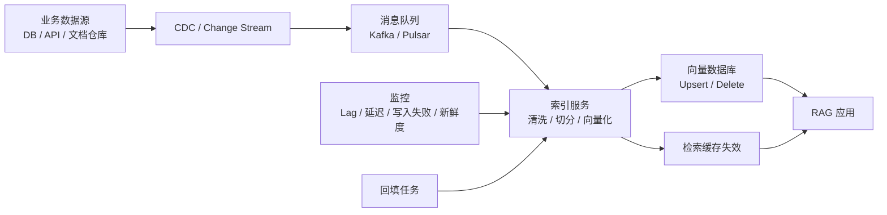

# RAG 知识生命周期与实时更新

## 原文锚点

- 本地文件：[别让你的RAG生产环境数据滞后_实时更新与时效性架构设计_看完这篇再动手_](../文章/done-别让你的RAG生产环境数据滞后_实时更新与时效性架构设计_看完这篇再动手_.md)
- 本地补充：知识生命周期管理（本地锚点缺失：`../../../../../wiki/concepts/knowledge-lifecycle-management.md`）
- 原文链接：`https://mp.weixin.qq.com/s?__biz=MzIxMjY3NzMwNw==&mid=2247488252&idx=1&sn=d749ae1a413f69729ebee32c860ab5ca`
- 关键段落：离线全量重建的时效性问题；CDC/Change Stream -> 消息队列 -> 索引服务 -> 向量数据库 Upsert/Delete；chunk ID、分块一致性、缓存失效、监控、回填。
- 关键图：原文用文字描述实时更新架构和增量索引流程，本地 Markdown 无实际图片。

## 图片处理

| 图片 | 类型 | 是否保留 | 理由 | 处理方式 |
|---|---|---|---|---|
| RAG 实时更新架构图 | 架构图 | 重建 | 原文明确描述数据源到向量库的更新链路 | Mermaid 重建 |
| RAG 增量索引更新流程图 | 流程图 | 重建 | chunk ID、Upsert/Delete 是核心机制 | Mermaid 重建 |

## 一句话结论

生产级 RAG 不是“把文档入库一次”就结束，真正的质量边界在知识生命周期：稳定 chunk ID、确定性切分、增量 Upsert/Delete、缓存失效、回填和新鲜度监控。

## 用户相关性判断

| 项 | 内容 |
|---|---|
| 用户当前认知层级 | RAG / 知识库 L2 draft |
| 认知成熟度 | draft |
| 阅读投入建议 | 精读 |
| 阅读投入理由 | 直接补上当前 RAG index 缺少的知识生命周期和更新闭环；但原文没有具体向量库配置、指标阈值和失败样例 |
| 对用户的新信息 | 知识库质量不只取决于召回，也取决于源数据变更能否正确传播到 chunk、索引、缓存和引用层 |
| 问题指纹 | RAG + 知识生命周期/增量索引 + CDC/稳定 chunk ID/Upsert/Delete/缓存失效/回填 + 防止数据滞后和幽灵数据 |
| 排重判断 | 新建；与已有 RAG 文档解析、召回、评估互补 |
| 置信度 | 高 |

## 认知校准点

| 校准点 | 文章观点/信息 | 与用户认知或价值观的关系 | 处理建议 |
|---|---|---|---|
| 数据滞后是架构问题 | 离线全量重建会导致白天更新第二天才可见 | 补充 RAG 生产边界，不再只看检索效果 | 写入 RAG index 的生命周期模块 |
| Delete 和 Upsert 同等重要 | 删除数据如果不删向量，会形成“幽灵数据” | 与用户重证据和可追责偏好一致 | 记住：RAG 删除链路必须可验证 |
| chunk ID 是生命周期主键 | 更新时必须能定位旧 chunk | 补缺：切分策略必须确定性，否则旧向量无法替换 | 后续 knowledge 初始化要设计稳定问题指纹或 chunk ID |
| 实时性不是越高越好 | 原文提醒秒级更新有成本 | 纠偏：实时、成本、一致性要分层 | 按资料类型设置更新等级 |

## 冲突点

| 冲突类型 | 具体表现 | 影响 | 处理 |
|---|---|---|---|
| 原目录冲突 | 原文在 `01_LLM与大模型`，但主问题是 RAG 架构和索引生命周期 | 可能误归为模型能力 | 重路由到 RAG 与知识库 / RAG |
| 证据不足 | 没有给具体向量数据库、吞吐、延迟、失败率指标 | 不能直接作为生产方案 | 沉淀原则，后续补实验 |
| 图片缺失 | 原文描述架构图和流程图，本地 Markdown 无图 | 影响链路理解 | Mermaid 重建 |
| 实践门槛不足 | 有架构链路但无最小可运行配置 | 不能判实践 | 降为精读 |

## 待吸收点

| 分级 | 内容 | 为什么值得吸收 | 后续动作 |
|---|---|---|---|
| 理解 | CDC/Change Stream 捕获源数据变化，消息队列解耦写入峰值 | 把 RAG 入库从批处理变成事件驱动 | 作为生产 RAG 架构候选 |
| 理解 | 索引服务负责清洗、确定性切分、向量化和 Upsert/Delete | 明确生命周期责任边界 | 与切分策略笔记互链 |
| 记住 | 稳定 chunk ID 是增量更新、删除和审计的基础 | 会反复影响知识库治理 | 写入 RAG 排重准则 |
| 记住 | 缓存失效必须跟索引更新联动 | 防止检索结果已经更新但应用仍返回旧答案 | 后续评估加入新鲜度指标 |
| 实践 | 为 knowledge 初始化流程补“源文件 hash -> 问题指纹 -> chunk ID -> 引用锚点”的设计 | 可直接改进当前流程 | 后续单独设计 lint 或脚本，不在本轮改脚本 |

## 已知可跳过

| 内容 | 跳过理由 |
|---|---|
| RAG 用于降低幻觉 | 已知基础 |
| 金融、电商、新闻等泛场景铺垫 | 只作为时效性例子，不进入准则 |
| “看完再动手”式标题话术 | 不影响机制判断 |

## 实践门槛

| 门槛 | 判断 | 证据 |
|---|---|---|
| 可运行 | 否 | 无具体 CDC、队列、向量库和配置命令 |
| 可验证 | 部分 | 可设计 lag、新鲜度、ghost hit 等指标，但原文未提供测试集 |
| 可排障 | 部分 | 监控项包括队列积压、处理延迟、写入失败、缓存失效 |
| 可迁移 | 是 | 可迁移到 knowledge 初始化和后续 lint |
| 结论 | 降为精读 | 架构原则强，缺少本地最小实验 |

## 归类判断

| 项 | 内容 |
|---|---|
| 技术本体 | RAG 是外部知识检索增强生成架构 |
| 文章主问题 | 生产环境 RAG 如何避免数据滞后和索引不一致 |
| 使用场景 | 频繁更新的企业知识库、业务数据问答、实时文档问答 |
| 关键词干扰 | CDC、Kafka、缓存、数据库事务 |
| 最终归类 | Agent 与 AI 工程 / RAG 与知识库 / RAG |
| 归类理由 | 主问题是 RAG 知识生命周期，不是通用数据集成或消息队列 |

## 技术定位

| 项 | 内容 |
|---|---|
| 技术类型 | 架构模式 / 生产治理机制 |
| 所属领域 | Agent 与 AI 工程 |
| 二级类目 | RAG 与知识库 |
| 全局架构位置 | 数据源变更和 RAG 查询之间的 ingestion、index lifecycle、cache lifecycle 层 |
| 涉及模块 | CDC、消息队列、索引服务、切分、Embedding、向量数据库、缓存、监控、回填 |
| 解决问题 | 防止知识滞后、幽灵数据、重复索引和缓存旧答案 |
| 原文局限 | 没有具体向量库实现、SLA、错误样本和回放机制 |
| 我的结论 | 以后关注；作为当前 knowledge 初始化流程的治理补丁 |

## 纵向理解

| 维度 | 判断 |
|---|---|
| 全局架构 | Source Change -> Event -> Indexer -> Chunk/Embedding -> Vector CRUD -> Cache Invalidate -> RAG Query -> Monitor/Backfill |
| 本文位置 | 主要讲 ingestion/update 生命周期，不讲召回排序和答案评估 |
| 核心机制 | 增量更新、稳定 chunk ID、确定性切分、Upsert/Delete、缓存失效、回填 |
| 使用链路 | 数据变更 -> 生成事件 -> 消费事件 -> 重新切分和向量化 -> 删除旧块/写入新块 -> 刷新缓存 |
| 前置条件 | 源数据变更可捕获、chunk ID 可复现、向量库支持写入删除、监控可见 |
| 边界 | 对低频更新资料不必秒级实时；对人工沉淀知识要先做认知校准和审核 |

## 横向对标

| 对标技术 | 实现方式 | 优势 | 劣势 | 适合场景 |
|---|---|---|---|---|
| 全量离线重建 | 定时全量解析和替换索引 | 简单，易实现 | 滞后、成本高、替换风险大 | POC、低频资料 |
| 增量索引 | 源变更触发 Upsert/Delete | 新鲜度高，成本可控 | ID、幂等、回填复杂 | 生产知识库 |
| LLM Wiki/knowledge | Agent 预编译并人工校准 | 质量密度高，可审查 | 覆盖慢，不适合高频原文 | 高价值知识沉淀 |
| 数据仓库 CDC | binlog/stream 到下游 | 成熟工程模式 | 不能直接解决 chunk 和语义索引 | 结构化业务数据 |

## 后续追查

- 关键词：incremental indexing、RAG freshness、chunk id、vector upsert、delete tombstone、cache invalidation、backfill、knowledge lifecycle、ghost document。
- 相关技术：RAG 评估、RAGFlow 召回、LLM Wiki lint、数据集成 CDC。
- 需要补读的文章：向量数据库 Upsert/Delete 一致性、RAGFlow 知识库更新机制、knowledge lint 设计。

