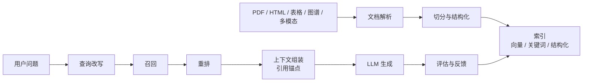

# RAG
## 知识点入口

- 本模块先看宏观流程，再看文章：[知识地图](020303_知识地图.md)。
- 知识地图放在三级节点根部；`020303_核心知识点/` 只放长期主题页。
- 新文章必须先归入流程节点，再判断是补充、冲突、不同层次还是降权。
- `文章/` 只保留原文锚点，长期知识必须沉淀到 `020303_核心知识点/` 下的主题文件。

## 技术定位

| 项 | 内容 |
|---|---|
| 技术名 | Retrieval-Augmented Generation |
| 一级类目 | Agent 与 AI 工程 |
| 二级类目 | RAG 与知识库 |
| 技术本体 | 在生成前从外部知识源检索相关上下文，降低幻觉并接入私有知识 |
| 全局架构位置 | 位于数据/文档源和 LLM 应用之间，承担解析、索引、召回、重排、引用和评估 |
| 主要使用者 | AI 应用工程师、知识库维护者、数据平台工程师 |
| 主要产出 | 解析文档、chunk、向量索引、检索结果、引用答案、评估报告 |

## 官方锚点

- 官网：无单一官网，RAG 是架构模式
- GitHub：以具体框架为准，例如 RAGFlow、LlamaIndex、LangChain、Haystack
- 本地补充：rag-retrieval-engineering（本地锚点缺失：`../../../../wiki/concepts/rag-retrieval-engineering.md`）、rag-vs-llm-wiki（本地锚点缺失：`../../../../wiki/comparisons/rag-vs-llm-wiki.md`）
- 相邻技术：[LLM Wiki](<../020302_LLM Wiki/AGENTS.md>)

## 架构图

## 核心模块

| 模块 | 职责 | 重点问题 |
|---|---|---|
| 文档解析 | 从原文中提取文本、结构、表格、图像语义 | 版面、表格、公式、扫描件、多模态 |
| Chunk 与结构化 | 把内容切成可检索单元 | 切分粒度、标题层级、上下文丢失 |
| 索引 | 建立向量、关键词、结构化索引 | 覆盖率、召回率、更新成本 |
| 召回与重排 | 找到相关证据并排序 | 语义漂移、同义词、混合召回 |
| 上下文组装 | 给模型提供可用证据 | 引用、去重、token 成本 |
| 评估 | 判断检索、生成和系统是否可信 | Recall@K、MRR、忠实性、引用正确性、延迟、复现性 |
| 知识生命周期 | 维护文档变更、chunk ID、增量索引、删除、缓存和回填 | 新鲜度、幽灵数据、Upsert/Delete、稳定 ID、回源审计 |

## 横向对标

| 对标技术 | 对标点 | RAG 优势 | RAG 劣势 | 使用判断 |
|---|---|---|---|---|
| LLM Wiki | 都服务知识问答 | RAG 可直接接入大规模原文 | 知识结构和矛盾治理弱 | 原文多且变化快用 RAG，稳定知识沉淀用 LLM Wiki/knowledge |
| Fine-tuning | 都能改善领域回答 | RAG 可追查引用、更新快 | 检索质量差会直接拖累答案 | 私有知识优先 RAG，风格/能力调整才看微调 |
| 纯全文搜索 | 都能找资料 | RAG 能做语义召回和生成整合 | 容易生成超出证据的内容 | 需要精确查找时保留全文搜索 |
| 手工知识库 | 都能沉淀知识 | RAG 可自动覆盖大量资料 | 人工筛选和认知校准弱 | 个人长期知识库应先沉淀准则，再用 RAG 辅助检索 |

## 已沉淀核心知识点

| 主题 | 文件 | 问题指纹 | 解决什么问题 | 认知增量 |
|---|---|---|---|---|
| RAG 文档解析分层选型 | [RAG文档解析分层选型](020303_核心知识点/RAG文档解析分层选型.md) | RAG + 文档解析 + 结构化/半结构化/非结构化/多模态 + 输入质量 + 解析工具选型 | 把 RAG 质量问题前置到文档解析层 | 文档类型决定解析策略，解析质量是 RAG 的第一道门槛 |
| RAG 切分策略与重排边界 | [RAG切分策略与重排边界](020303_核心知识点/RAG切分策略与重排边界.md) | RAG + chunking/rerank + 证据边界/粗召回/精排序 + 提升召回质量与上下文质量 + 参数需本地评估 | 解释切分和 Rerank 分别控制什么质量问题 | 切分决定候选证据边界，Rerank 决定候选证据排序 |
| Agentic RAG 查询链路治理 | [AgenticRAG查询重写多路召回与质量评估](020303_核心知识点/AgenticRAG查询重写多路召回与质量评估.md) | RAG + 查询重写/混合召回/RRF/Cross-Encoder/质量评估/补救搜索 + 检索质量治理 + 成本延迟边界 | 把 RAG 查询侧从“直接向量召回”扩展为可控的多阶段质量治理 | Agentic RAG 的价值是链路决策和失败补救，不是给 RAG 简单套 Agent 名字 |
| RAG 评估体系 | [RAG评估体系](020303_核心知识点/RAG评估体系.md) | RAG + 评估 + Recall/Precision/MRR/nDCG/Faithfulness/Latency + 检索生成系统闭环 | 判断 RAG 是否真的找到了证据、忠实生成并能稳定上线 | RAG 质量要同时看检索、生成和系统层，不能只看答案是否顺眼 |
| RAG 知识生命周期与实时更新 | [RAG知识生命周期与实时更新](020303_核心知识点/RAG知识生命周期与实时更新.md) | RAG + 知识生命周期/增量索引 + CDC/稳定 chunk ID/Upsert/Delete/缓存失效/回填 + 防止数据滞后和幽灵数据 | 把 RAG 入库从一次性构建扩展为可维护生命周期 | chunk ID、确定性切分、Upsert/Delete 和缓存失效是生产 RAG 的治理边界 |
| LLM Wiki 对比 | [LLM Wiki 预编译知识库模式](<../020302_LLM Wiki/020302_核心知识点/LLMWiki预编译知识库模式.md>) | LLM Wiki + Ingest/Query/Lint + 预编译 Markdown 网络 + 与 RAG/knowledge 边界 | 判断当前 knowledge 应吸收旧 wiki 的哪些机制 | RAG 适合大规模原文检索，LLM Wiki/knowledge 适合高价值预编译知识和认知校准 |
| GraphRAG 边界 | [GraphRAG 图谱构建、检索与多模态边界](../020301_GraphRAG/020301_核心知识点/GraphRAG图谱构建检索与多模态边界.md) | GraphRAG + 实体关系抽取/Schema/Cypher/多模态图谱 + 多跳关系问答 + 向量 RAG 边界 | 判断什么时候需要从向量 RAG 升级到图谱增强检索 | 图提供关系和可解释路径，但建图、Schema、评估和权限是主要门槛 |

## 后续追查

- 关键词：document parsing、chunking、hybrid search、query rewriting、rerank、citation、RAG evaluation、Faithfulness、Recall@K、freshness、incremental indexing、GraphRAG。
- 待读资料：RAGFlow 切分、RAGFlow 召回、RAG 首字响应优化、MinerU/Marker/MarkItDown 对比、RAG 质量评估指标、GraphRAG 官方资料。
- 待补实验：用同一篇复杂 PDF 对比解析工具的结构保真度和检索命中率；给 knowledge 做查询重写、混合召回、Rerank 和引用正确率最小实验；设计 chunk ID 与增量更新检查；构造 RAG 评估小样本集。

<!-- AUTO-DISTILL-02-START -->

## 本轮文章处理收口

- 已归档来源：`60` 篇，全部位于 `文章/` 且使用 `done-` 前缀。
- 核心知识点总览：[RAG生命周期与评估边界.md](020303_核心知识点/RAG生命周期与评估边界.md)，承接来源锚点和粗分流记录。
- 新文章进入时先对照根部知识地图和已沉淀主题页；只有新增机制、边界、反例、版本差异或实践证据时才新建主题页。

<!-- AUTO-DISTILL-02-END -->
