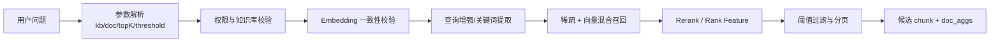

# RAGFlow 召回策略

## 原文锚点

- 本地文件：[【解密源码】 RAGFlow 召回策略全解](<../文章/done-【解密源码】 RAGFlow 召回策略全解.md>)
- 原文链接：https://mp.weixin.qq.com/s?__biz=Mzk4ODg5NTU4Mg==&mid=2247483749&idx=1&sn=d79f0fd9189e440b9621aa3fc83c0a01&chksm=c47aaebf0d7029ac9290d0de4d320c1326fb9ff5179e35a466548acb40e5ff66e3176623e153&mpshare=1&scene=24&srcid=1125NlDsJpVPMwR1uasprhq1&sharer_shareinfo=e1aa6e7279cd904b0286c58098788170&sharer_shareinfo_first=e1aa6e7279cd904b0286c58098788170#rd
- 关键段落：参数解析、模型一致性校验、查询增强、混合召回、重排序、阈值过滤与分页。
- 关键图：无技术图，原文主要是源码片段和流程描述。

## 图片处理

| 图片 | 类型 | 是否保留 | 理由 | 处理方式 |
|---|---|---|---|---|
| 无 | 无图 | 不适用 | 可用文字和 Mermaid 表达召回链路 | Mermaid 重建流程 |

## 一句话结论

这篇文章值得精读：它把 RAGFlow 从“向量库检索”校准为“参数约束、Embedding 一致性、查询增强、稀疏/稠密融合、重排、阈值过滤”的多阶段召回系统。

## 用户相关性判断

| 项 | 内容 |
|---|---|
| 用户当前认知层级 | RAGFlow / RAG L2 draft |
| 认知成熟度 | draft |
| 阅读投入建议 | 精读 |
| 阅读投入理由 | 直接补齐 RAGFlow 已有 Markdown 切块之后的召回链路；但源码版本和权重解释需验证 |
| 对用户的新信息 | 多知识库查询必须校验 Embedding 模型一致性，否则语义空间不一致会污染召回 |
| 问题指纹 | RAGFlow + 召回链路 + Embedding 一致性/查询增强/混合召回/Rerank/阈值过滤 + 知识库召回质量 |
| 排重判断 | 新建 |
| 置信度 | 高 |

## 认知校准点

| 校准点 | 文章观点/信息 | 与用户认知或价值观的关系 | 处理建议 |
|---|---|---|---|
| RAGFlow 召回不是纯向量检索 | 包含 token/sparse、vector、rerank、rank feature | 纠偏：RAG 质量不只看 embedding | 写入 RAGFlow index |
| Embedding 一致性是硬边界 | 多知识库必须使用同一 embedding 模型 | 补充知识库治理边界 | 作为记住点 |
| 查询增强可能改变召回意图 | 通过模型提取关键词、扩展查询 | 补充：增强不是无风险 | 需要评估是否引入偏差 |
| 权重和兜底逻辑有版本风险 | 原文中默认参数、代码权重和阈值描述存在可疑不一致 | 符合批判性阅读 | 后续查源码版本 |

## 冲突点

| 冲突类型 | 具体表现 | 影响 | 处理 |
|---|---|---|---|
| 原目录冲突 | 原文在 `01_LLM与大模型`，但主问题是 RAGFlow 召回工程 | 可能误归到模型能力 | 重路由到 Agent 与 AI 工程 / RAG 与知识库 |
| 证据不足 | 源码片段无 commit、版本、测试集和指标 | 不能直接当当前实现 | 标记 draft |
| 版本/表述冲突 | 文本权重、向量权重、兜底阈值解释存在不一致 | 可能误用参数 | 后续查源码 |
| 实践门槛不足 | 有代码片段但无可运行环境 | 不能判实践 | 降为精读 |

## 待吸收点

| 分级 | 内容 | 为什么值得吸收 | 后续动作 |
|---|---|---|---|
| 理解 | 召回链路从参数解析到候选 chunk 输出是多阶段流水线 | 建立 RAGFlow 纵向链路 | 写入 RAGFlow index |
| 理解 | 查询预处理包含中英文、繁简、大小写、标点等归一化 | 解释为什么检索前处理影响召回 | 后续实验保留 |
| 记住 | 不同 Embedding 模型的知识库不应直接混查 | 直接影响个人知识库治理 | 写入排重/路由规则 |
| 记住 | rerank 前的 topK、阈值和权重决定“找得到”和“排得准”的平衡 | 影响 RAG 评估 | 与 RAG 评估关联 |
| 实践 | 用固定问题集比较 sparse/vector/hybrid/rerank 的 Recall@K 和引用正确率 | 能验证召回收益 | 待实验 |

## 已知可跳过

| 内容 | 跳过理由 |
|---|---|
| RAG 需要召回文档 | 已知基础 |
| “精准匹配、多模融合、动态优化”类口号 | 需要落到参数和指标 |
| 源码片段逐行复述 | 后续查版本时再看 |

## 实践门槛

| 门槛 | 判断 | 证据 |
|---|---|---|
| 可运行 | 否 | 无仓库版本和最小运行命令 |
| 可验证 | 部分 | 有参数和输出字段，但无测试集 |
| 可排障 | 部分 | 能定位召回/重排/阈值层，但缺日志 |
| 可迁移 | 是 | 可迁移到本地 knowledge 检索实验 |
| 结论 | 降为精读 | 需要补源码版本和评估集 |

## 归类判断

| 项 | 内容 |
|---|---|
| 技术本体 | RAGFlow 是 RAG/知识库平台 |
| 文章主问题 | RAGFlow 如何从问题生成候选 chunk 并排序过滤 |
| 使用场景 | 企业知识库问答、个人知识库检索、多知识库查询 |
| 关键词干扰 | LLM、源码、Embedding、ES、Infinity |
| 最终归类 | Agent 与 AI 工程 / RAG 与知识库 / RAGFlow |
| 归类理由 | 主问题是 RAG 系统召回，不是模型本身优化 |

## 纵向理解

| 维度 | 判断 |
|---|---|
| 全局架构 | 文档解析/切块 -> 索引 -> 查询预处理 -> 混合召回 -> rerank -> 阈值过滤 -> 上下文组装 |
| 本文位置 | 只讲召回和重排序，不讲文档解析和生成评估 |
| 核心机制 | Embedding 一致性校验、query enhancement、sparse/vector fusion、rerank、similarity threshold |
| 使用链路 | 请求参数 -> 权限/模型校验 -> 关键词和向量生成 -> 检索 -> 重排 -> 分页过滤 |
| 前置条件 | 知识库 embedding 统一、chunk 质量稳定、评估问题集可用 |
| 边界 | 不解决文档解析质量、答案忠实性和知识生命周期维护 |

## Mermaid 重建

## 横向对标

| 对标技术 | 实现方式 | 优势 | 劣势 | 适合场景 |
|---|---|---|---|---|
| 纯向量召回 | query embedding 与 chunk embedding 相似度 | 简单，语义覆盖好 | 关键词、数字、专名可能不稳 | 语义问答 |
| BM25/稀疏召回 | 关键词和倒排索引匹配 | 精确词命中好 | 同义表达弱 | 专名、代码、术语 |
| Hybrid Search | 稀疏和稠密融合 | 兼顾语义和关键词 | 权重和归一化复杂 | 技术知识库 |
| Cross-Encoder/Rerank | 对候选逐条重排 | 排序质量高 | 成本和延迟高 | 高价值问答 |
| LLM Wiki 编译知识 | 预先沉淀结构化知识点 | 认知校准强 | 覆盖慢，依赖维护 | 长期个人知识库 |

## 后续追查

- 关键词：RAGFlow retrieval、hybrid search、rerank、similarity_threshold、vector_similarity_weight、doc_aggs。
- 相关技术：RAG 评估、RAGFlow Markdown 切块、LLM Wiki、BM25、Cross-Encoder。
- 需要补读的文章：RAGFlow 当前源码、RAGFlow 评估、混合召回权重调优。

