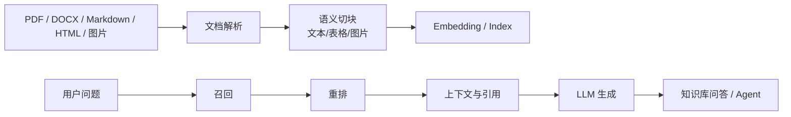

# RAGFlow
## 知识点入口

- 本模块先看宏观流程，再看文章：[知识地图](020304_知识地图.md)。
- 知识地图放在三级节点根部；`020304_核心知识点/` 只放长期主题页。
- 新文章必须先归入流程节点，再判断是补充、冲突、不同层次还是降权。
- `文章/` 只保留原文锚点，长期知识必须沉淀到 `020304_核心知识点/` 下的主题文件。

## 技术定位

| 项 | 内容 |
|---|---|
| 技术名 | RAGFlow |
| 一级类目 | Agent 与 AI 工程 |
| 二级类目 | RAG 与知识库 |
| 技术本体 | 面向文档解析、知识库构建、检索增强生成和智能问答的开源 RAG 平台 |
| 全局架构位置 | 位于原始文档和 LLM 应用之间，承担解析、切分、索引、召回、重排、问答和可视化管理 |
| 主要使用者 | AI 应用工程师、知识库维护者、企业知识平台负责人 |
| 主要产出 | 解析后的文档块、知识库、检索结果、引用答案、Agent/RAG 应用 |

## 官方锚点

- 官网：[RAGFlow](https://ragflow.io/)
- GitHub：[infiniflow/ragflow](https://github.com/infiniflow/ragflow)
- 官方文档：[RAGFlow Docs](https://ragflow.io/docs/dev/)

## 架构图

## 核心模块

| 模块 | 职责 | 重点问题 |
|---|---|---|
| 文档解析 | 识别文档结构、表格、图片和文本 | 格式保真、复杂表格、图片语义 |
| 切块 | 把文档转换成可检索语义块 | chunk 粒度、标题层级、跨块上下文 |
| 多模态增强 | 给图片、图表生成语义描述并与文本关联 | 图片质量、模型成本、引用准确性 |
| 检索与重排 | 召回相关块并排序 | 召回率、相关性、重排成本 |
| 知识库管理 | 管理文档、索引、版本和问答应用 | 更新、删除、权限、可观测性 |

## 上下游

| 方向 | 对象 | 关系 |
|---|---|---|
| 上游 | PDF、Markdown、网页、表格、图片、本地知识库 | 被解析和切块 |
| 下游 | LLM、Agent、问答应用、业务助手 | 使用检索结果生成答案 |
| 依赖 | OCR、视觉模型、Embedding、向量索引、重排模型 | 决定成本和质量 |

## 横向对标

| 对标技术 | 对标点 | RAGFlow 优势 | RAGFlow 劣势 | 使用判断 |
|---|---|---|---|---|
| LlamaIndex | RAG 开发框架 | RAGFlow 更偏平台化和文档解析流水线 | LlamaIndex 更适合代码级灵活编排 | 需要平台和解析流水线看 RAGFlow，需要代码集成看 LlamaIndex |
| Dify 知识库 | 低代码知识库应用 | RAGFlow 更强调文档解析和切块细节 | Dify 应用编排和产品体验更完整 | 重文档解析选 RAGFlow，重应用搭建选 Dify |
| LangChain | RAG/Agent 开发框架 | RAGFlow 开箱即用程度更高 | LangChain 更通用可编程 | 工程平台 vs 框架能力分开判断 |
| LLM Wiki/手工 knowledge | 长期知识沉淀 | RAGFlow 覆盖大量原文快 | 认知校准和长期结构弱 | 原文检索用 RAGFlow，个人判断准则沉淀用 knowledge |

## 已沉淀核心知识点

| 主题 | 文件 | 问题指纹 | 解决什么问题 | 认知增量 |
|---|---|---|---|---|
| Markdown 语义切块 | [RAGFlowMarkdown语义切块机制](020304_核心知识点/RAGFlowMarkdown语义切块机制.md) | RAGFlow + MarkdownParser/MarkdownElementExtractor/VisionFigureParser + Markdown 结构化切块 + 本地知识库文档解析 | 解释 RAGFlow 如何处理 Markdown 标题、表格、图片和文本合并 | Markdown 切块不是简单按长度切，而是要保留语法结构和多模态上下文 |
| 召回策略 | [RAGFlow召回策略](020304_核心知识点/RAGFlow召回策略.md) | RAGFlow + 召回链路 + Embedding 一致性/查询增强/混合召回/Rerank/阈值过滤 + 知识库召回质量 | 解释 RAGFlow 如何从用户问题生成候选 chunk 并排序过滤 | RAGFlow 不是纯向量检索，多知识库查询必须先校验 Embedding 一致性 |
| 多格式切分与参数门槛 | [RAGFlow多格式切分与参数门槛](020304_核心知识点/RAGFlow多格式切分与参数门槛.md) | RAGFlow + 多格式解析/模板参数 + 标题链/表格/图片/坐标/非正文过滤 + 让 chunk 保留可引用结构 | 解释 DOCX/PDF/book/paper/PPT 等格式为什么需要不同解析策略 | 结构保真比 chunk_size 更基础，参数推荐必须用本地样本验证 |

## 后续追查

- 关键词：MarkdownParser、MarkdownElementExtractor、VisionFigureParser、DocxParser、PdfParser、DeepDOC、Table Transformer、chunk、table parsing、image caption、hybrid search、rerank、similarity_threshold。
- 待读资料：RAGFlow 当前源码版本、RAGFlow 评估、RAGFlow MCP、MinerU/Docling 接入。
- 待补实验：用 knowledge 中一篇 Markdown 对比按标题切分、固定 token 切分、RAGFlow General 模式切分的召回效果；用 PDF/DOCX/PPT 样本验证结构保真；用固定问题集比较 sparse/vector/hybrid/rerank 的 Recall@K 和引用正确率。

<!-- AUTO-DISTILL-02-START -->

## 本轮文章处理收口

- 已归档来源：`16` 篇，全部位于 `文章/` 且使用 `done-` 前缀。
- 核心知识点总览：[RAGFlow工程化边界与知识库治理.md](020304_核心知识点/RAGFlow工程化边界与知识库治理.md)，承接来源锚点和粗分流记录。
- 新文章进入时先对照根部知识地图和已沉淀主题页；只有新增机制、边界、反例、版本差异或实践证据时才新建主题页。

<!-- AUTO-DISTILL-02-END -->
