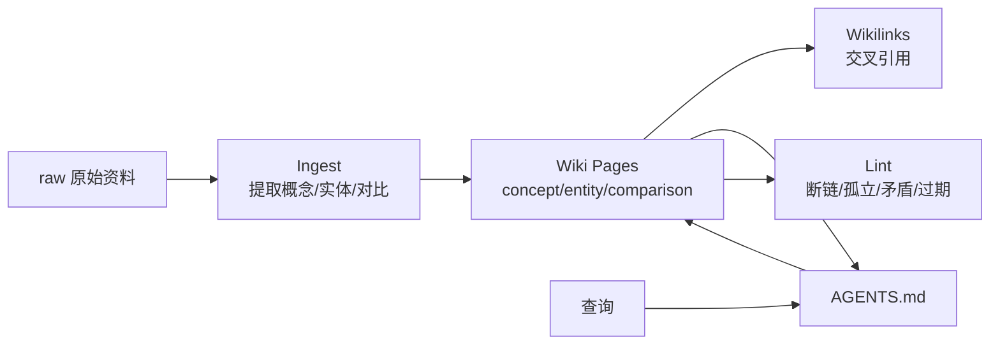

# LLM Wiki
## 知识点入口

- 本模块先看宏观流程，再看文章：[流程化知识点总览](knowledge/02_Agent与AI工程/0203_RAG与知识库/LLM%20Wiki/核心知识点/流程化知识点总览.md)。
- 新文章必须先归入流程节点，再判断是补充、冲突、不同层次还是降权。
- `文章/` 只保留原文锚点，长期知识必须沉淀到 `核心知识点/`。

## 技术定位

| 项 | 内容 |
|---|---|
| 技术名 | LLM Wiki |
| 一级类目 | Agent 与 AI 工程 |
| 二级类目 | RAG/知识库 |
| 技术本体 | 把原始资料预编译成互联 Markdown 页面，由 Agent 持续维护索引、交叉引用、矛盾和健康检查的知识库模式 |
| 全局架构位置 | 位于原始资料和 Agent 查询之间，承担知识编译、结构化沉淀、查询入口和健康检查 |
| 主要使用者 | 个人知识库维护者、AI 工程师、研究型 Agent |
| 主要产出 | concept/entity/comparison 页面、index、log、lint 报告、query 记录 |

## 官方锚点

- 原始模式：[Karpathy LLM Wiki gist](https://gist.github.com/karpathy/442a6bf555914893e9891c11519de94f)
- 本地旧 wiki：wiki/AGENTS.md（本地锚点缺失：`../../../../wiki/AGENTS.md`）
- 本地对比：RAG vs LLM Wiki（本地锚点缺失：`../../../../wiki/comparisons/rag-vs-llm-wiki.md`）

## 架构图

## 核心模块

| 模块 | 职责 | 重点问题 |
|---|---|---|
| raw | 保存不可变原始资料 | 来源可追溯、图片本地化 |
| wiki pages | 结构化概念、实体、对比 | 拆分粒度、互链、frontmatter |
| index | 查询入口 | 规模增长后过大 |
| log | 操作账本 | 可追踪变更 |
| lint | 健康检查 | 断链、孤立页、标签漂移、过期和矛盾 |

## 横向对标

| 对标技术 | 对标点 | LLM Wiki 优势 | LLM Wiki 劣势 | 使用判断 |
|---|---|---|---|---|
| RAG | 都服务知识问答 | 知识密度高、可读、可审查 | 维护成本高，覆盖慢 | 个人长期知识沉淀 |
| Obsidian | 都是 Markdown 网络 | LLM Wiki 有 Agent 编译和 lint 流程 | Obsidian 更适合人工写作 | 人机协作知识库 |
| 当前 knowledge | 都是个人知识系统 | knowledge 强化认知校准和文章价值判断 | LLM Wiki 更强调互链和健康检查 | 新 knowledge 吸收 lint/index/log 思想 |
| 普通文章摘要 | 都保留阅读结果 | LLM Wiki 会增量更新概念页 | 不保留文章整体脉络 | 多来源综合 |

## 已沉淀核心知识点

| 主题 | 文件 | 问题指纹 | 解决什么问题 | 认知增量 |
|---|---|---|---|---|
| LLM Wiki 预编译知识库模式 | [LLMWiki预编译知识库模式](核心知识点/LLMWiki预编译知识库模式.md) | LLM Wiki + Ingest/Query/Lint + 预编译 Markdown 网络 + 个人知识库沉淀 + 与 RAG/knowledge 边界 | 判断旧 wiki 中哪些机制应吸收到新 knowledge | LLM Wiki 的优势是互链和健康检查，knowledge 的优势是认知校准和阅读投入判断，两者应合并而不是二选一 |
| Git 预编译知识库与 Lint 闭环 | [Git预编译知识库与Lint闭环](核心知识点/Git预编译知识库与Lint闭环.md) | LLM Wiki + Git/Markdown/CI/Lint/成熟度/引用追踪 + 预编译知识库治理 + 改进 knowledge 初始化闭环 | 把 LLM Wiki 思想落到版本化、审查、质量门禁和上下文注入 | 当前 knowledge 应吸收 lint、三级索引、成熟度和引用追踪，而不是照搬全量 wikilink |

## 后续追查

- 关键词：LLM Wiki、Ingest、Query、Lint、wikilinks、knowledge lifecycle、RAG vs LLM Wiki、Git knowledge base、reference tracking。
- 待读资料：Karpathy 原始 gist、knowledge lint 实现、当前 knowledge 断链与重复问题指纹检查。
- 待补实验：给 knowledge 做轻量 lint：断链、孤立技术 index、重复问题指纹、原图缺失、未更新画像证据、成熟度字段。
