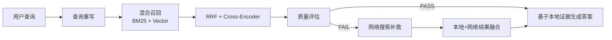

# Agentic RAG 查询重写、多路召回与质量评估

## 原文锚点

- 本地文件：[Agentic RAG 开发实践（查询重写、多路召回、路由决策、质量评估、多步重查）](../文章/Agentic RAG 开发实践（查询重写、多路召回、路由决策、质量评估、多步重查）.md)
- 原文链接：https://mp.weixin.qq.com/s?__biz=MzI1MDQ0Nzc1Mg==&mid=2247484734&idx=1&sn=e765024d62a6210ac2416796edc5af78
- 关键段落：项目目标、关键技术选型、查询流程、查询重写、多路召回、质量评估、互联网搜索补救。
- 关键图：无可用技术图，原文用文本流程描述。

## 图片处理

| 图片 | 类型 | 是否保留 | 理由 | 处理方式 |
|---|---|---|---|---|
| Agentic RAG 查询流程 | 流程图 | 重建 | 查询链路是本文核心 | 基于原文描述用 Mermaid 重建 |

## 一句话结论

这篇文章值得精读，它把 RAG 的核心注意力从“建向量库”推进到“查询重写、混合召回、质量评估和失败补救”的查询链路治理。

## 用户相关性判断

| 项 | 内容 |
|---|---|
| 用户当前认知层级 | RAG / 知识库 L2 draft |
| 认知成熟度 | draft |
| 阅读投入建议 | 精读 |
| 阅读投入理由 | 流程有工程启发，但项目示例较小，质量评估依赖 LLM 自评，不能直接判实践 |
| 对用户的新信息 | Agentic RAG 的价值不在“加 Agent 名字”，而在对检索链路做可控的多阶段决策 |
| 问题指纹 | RAG + 查询重写/混合召回/RRF/Cross-Encoder/质量评估/补救搜索 + 检索质量治理 + 成本延迟边界 |
| 排重判断 | 新建 |
| 置信度 | 高 |

## 认知校准点

| 校准点 | 文章观点/信息 | 与用户认知或价值观的关系 | 处理建议 |
|---|---|---|---|
| Agentic RAG 不等于复杂化 | 引入查询重写、路由、质量评估和补救搜索 | 补充：Agent 应该服务可控流程，不是增加炫技节点 | 关注链路节点的收益和代价 |
| 查询链路比索引本身同样重要 | 文章强调查询前、查询中、查询后 | 补缺：第一批已补文档解析，本篇补查询治理 | 写入 RAG index |
| 质量评估是门禁也是风险 | 使用 LLM 给检索结果评分并决定是否联网搜索 | 待验证：LLM 自评可能不稳定 | 后续补可量化评估 |
| 网络搜索补救有边界 | FAIL 后触发互联网搜索 | 补充：开放搜索可能引入权威性和时效风险 | 需要引用、来源和可信度治理 |

## 冲突点

| 冲突类型 | 具体表现 | 影响 | 处理 |
|---|---|---|---|
| 实践判定偏宽 | 有项目代码片段，但没有完整仓库、测试集、指标结果 | 不能直接判实践 | 降为精读 |
| 证据不足 | 质量评估 80% 阈值没有实验依据 | 阈值不能直接复用 | 标为待验证 |
| 关键词误导 | ADK、DeepSeek、SerpAPI 容易抢主线 | 可能误读成框架教程 | 主问题仍是 RAG 查询链路治理 |

## 待吸收点

| 分级 | 内容 | 为什么值得吸收 | 后续动作 |
|---|---|---|---|
| 理解 | 查询重写用于把口语化、模糊问题转为更可检索的问题 | 提升召回质量 | 和本地知识库搜索结合 |
| 理解 | 关键词召回 + 向量召回 + RRF + Cross-Encoder 是常见混合召回链路 | 横向补足 RAG 检索模块 | 后续补 RAGFlow/检索评估 |
| 记住 | 质量评估应决定是否提前终止或扩大搜索，而不是固定走完整流程 | 降低成本和延迟 | 写入 RAG index |
| 记住 | Agentic RAG 的代价是延迟、成本、评估不稳定和更多故障点 | 防止盲目复杂化 | 后续做成本表 |
| 实践 | 给 knowledge 做本地查询重写 + 混合召回 + 引用检查最小实验 | 贴合用户知识库目标 | 待实验 |

## 已知可跳过

| 内容 | 跳过理由 |
|---|---|
| RAG 的存储和查询基础定义 | 已在 RAG index 中覆盖 |
| BGE-M3、FAISS、BM25 的名词堆叠 | 没有实验结果时只作为组件列表 |
| 法律咨询示例业务背景 | 与用户知识库目标关系弱 |

## 实践门槛

| 门槛 | 判断 | 证据 |
|---|---|---|
| 可运行 | 部分 | 有代码片段和项目结构 |
| 可验证 | 否 | 无测试集、召回率、引用正确率、延迟成本 |
| 可排障 | 部分 | 有流程节点，但缺失败分类和日志指标 |
| 可迁移 | 是 | 可迁移到知识库查询链路 |
| 结论 | 降为精读 | 工程思路好，但验证不足 |

## 归类判断

| 项 | 内容 |
|---|---|
| 技术本体 | RAG 是检索增强生成架构模式 |
| 文章主问题 | 如何用 Agent 思路治理 RAG 查询链路 |
| 使用场景 | 法律条文知识库问答 |
| 关键词干扰 | ADK、DeepSeek、SerpAPI、法律咨询 |
| 最终归类 | Agent 与 AI 工程 / RAG 与知识库 / RAG |
| 归类理由 | 主问题是 RAG 查询流程，而不是单个 Agent 框架或模型能力 |

## 纵向理解

| 维度 | 判断 |
|---|---|
| 全局架构 | 文档解析、索引、查询重写、召回、重排、质量评估、上下文组装、答案生成 |
| 本文位置 | 主要讲查询侧链路治理 |
| 核心机制 | 查询重写、混合召回、RRF、Cross-Encoder、质量门禁、补救搜索 |
| 使用链路 | 用户问题 -> 查询重写 -> 本地混合召回 -> 质量评估 -> PASS 生成 / FAIL 搜索补救 |
| 前置条件 | 有结构化知识库、可评估数据集、引用追踪和成本预算 |
| 边界 | 不解决文档解析质量问题，也不保证答案一定可信 |

## Mermaid 重建

## 横向对标

| 对标技术 | 实现方式 | 优势 | 劣势 | 适合场景 |
|---|---|---|---|---|
| 简单 RAG | 查询直接向量召回后生成 | 链路短、成本低 | 对模糊问题和低质量召回不稳 | 小知识库、问题明确 |
| Agentic RAG | 多阶段重写、召回、评估、补救 | 更可控，鲁棒性更好 | 延迟、成本和失败点增加 | 高价值问答、问题复杂 |
| LLM Wiki/手工知识库 | 人工整理结构化知识 | 认知校准和长期结构强 | 覆盖速度慢 | 用户当前 knowledge 沉淀 |
| 纯搜索引擎 | 关键词或全文检索 | 可解释、可控 | 语义泛化弱 | 精确查找、追原文 |

## 后续追查

- 关键词：query rewriting、hybrid search、RRF、Cross-Encoder、RAG evaluation、citation precision。
- 相关技术：RAGFlow、LlamaIndex、LangChain、Haystack、BM25、BGE-M3。
- 需要补读的文章：RAGFlow 切分策略、RAG 评估指标、LLM Wiki 与 RAG 的长期知识治理差异。
