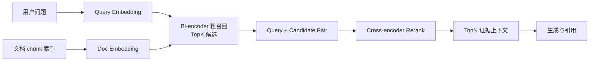

# RAG 切分策略与重排边界

## 原文锚点

- 本地文件：[RAG 分块策略：从原理到实战优化，喂饭级教程不允许你踩坑](../文章/RAG 分块策略：从原理到实战优化，喂饭级教程不允许你踩坑.md)
- 本地文件：[RAG核心技术全解析：Embedding选型、面试高频问题与Rerank重排序原理](../文章/RAG核心技术全解析：Embedding选型、面试高频问题与Rerank重排序原理.md)
- 原文链接：`https://mp.weixin.qq.com/s?__biz=MzU1OTgxMTg2Nw==&mid=2247513881&idx=1&sn=06875ba9c27ff35e269d1aa27f7f3112`
- 原文链接：`https://mp.weixin.qq.com/s?__biz=Mzk0ODU3NTE3Ng==&mid=2247483909&idx=1&sn=f1a4deeb83b7984de89ab6383564da03`
- 关键段落：固定大小、语义、递归、文档结构、智能体、句子、段落等切分策略；Bi-encoder 与 Cross-encoder；向量召回后为什么需要 Rerank。
- 关键图：本地 Markdown 未保留可用技术图；第二篇主要是表格和代码片段。

## 图片处理

| 图片 | 类型 | 是否保留 | 理由 | 处理方式 |
|---|---|---|---|---|
| 分块策略图 | 说明图 | 原图缺失 | 文章来源标记原图缺失，本地 Markdown 未保留图片 | 不重建；用策略表和纵向链路表达 |
| Bi-encoder / Cross-encoder 对比 | 对比图 | 重建 | 两阶段检索是本文核心机制 | 用下方 Mermaid 重建 |

## 一句话结论

这组文章值得精读但不能照抄参数：切分决定“候选证据边界”，Rerank 决定“候选证据排序”，二者都必须用本地问题集和引用正确率验证。

## 用户相关性判断

| 项 | 内容 |
|---|---|
| 用户当前认知层级 | RAG / 知识库 L2 draft |
| 认知成熟度 | draft |
| 阅读投入建议 | 精读 |
| 阅读投入理由 | 能补齐已有 RAG 文档解析、召回、评估之间的关键接口，但文章里的模型排行、分数和推荐参数缺少本地验证 |
| 对用户的新信息 | 切分策略不是预处理小细节，而是影响召回率、上下文完整性和引用粒度的第一层索引设计；Rerank 是粗召回后的精排门禁 |
| 问题指纹 | RAG + chunking/rerank + 证据边界/粗召回/精排序 + 提升召回质量与上下文质量 + 参数需本地评估 |
| 排重判断 | 新建主题型笔记；与已有文档解析、Agentic RAG、RAG 评估互补 |
| 置信度 | 中 |

## 认知校准点

| 校准点 | 文章观点/信息 | 与用户认知或价值观的关系 | 处理建议 |
|---|---|---|---|
| 切分参数不是默认答案 | 原文给出 512 tokens、10%-15% overlap、2500/25 等建议 | 用户重视可验证准则；这些值缺少任务、语料和指标前提 | 只当起始假设，不写成稳定结论 |
| “语义分块更好”要降权 | 原文说语义分块成本高且不一定足够优秀 | 纠偏：复杂方法不必然更适合本地 knowledge | 先按标题/段落/递归分块做 baseline，再比较语义分块 |
| Rerank 不是替代向量召回 | 原文区分 Bi-encoder 粗排和 Cross-encoder 精排 | 补齐 RAG 纵向链路中的精排层 | 记住“先广后精”：TopK 召回后再 TopN 精排 |
| 模型排行高度时效化 | 原文列出 Qwen3、BGE、OpenAI、Cohere 等模型与分数 | 本轮不联网，无法确认最新榜单和价格 | 模型名只作为后续补证锚点，不作为当前选型结论 |

## 冲突点

| 冲突类型 | 具体表现 | 影响 | 处理 |
|---|---|---|---|
| 原目录冲突 | Rerank 文章在 `01_LLM与大模型`，主问题实际是 RAG 检索链路 | 可能误归为模型能力文章 | 重路由到 RAG 与知识库 / RAG |
| 证据不足 | 性能分数、提升比例、模型榜单没有本地数据集和复现条件 | 容易误用为选型依据 | 标为后续补证 |
| 实践资讯混杂 | 有代码示例和面试题，但缺完整环境、数据集、验收指标 | 不能直接判实践 | 降为精读 |
| 图片缺失 | 文章来源标记分块文章有图缺失 | 影响直观看链路 | 用 Mermaid 重建两阶段检索 |

## 待吸收点

| 分级 | 内容 | 为什么值得吸收 | 后续动作 |
|---|---|---|---|
| 理解 | 固定、递归、段落、句子、文档结构、语义、智能体切分分别对应不同文档结构和成本 | 让切分策略从“按长度”升级为“按证据边界” | 在 RAG index 中补切分策略位置 |
| 理解 | Bi-encoder 适合大规模粗召回，Cross-encoder 适合小规模精排 | 解释为什么向量召回后还需要 Rerank | 与 RAGFlow 召回策略联动 |
| 记住 | chunk 太小会割裂证据，chunk 太大会引入噪声和延迟 | 会反复影响知识库问答质量 | 作为本地 knowledge 初始化的切分准则 |
| 记住 | Rerank 的收益来自候选集质量，粗召回漏掉的证据无法靠精排找回 | 防止把 Rerank 当万能补救 | 评估时同时看 Recall@K 和最终引用正确率 |
| 实践 | 用同一批 knowledge 问题比较固定长度、标题层级、递归分块、Rerank 前后效果 | 直接服务当前 knowledge 初始化流程 | 后续构造小样本集 |

## 已知可跳过

| 内容 | 跳过理由 |
|---|---|
| RAG 基础四阶段定义 | 已在 RAG index 覆盖 |
| 面试题清单 | 对长期知识沉淀价值低，容易稀释机制 |
| 模型榜单和价格 | 本轮不联网，时效性强，需要后续补证 |
| 示例代码逐行解释 | 缺本地环境和数据集，实践阶段再看 |

## 实践门槛

| 门槛 | 判断 | 证据 |
|---|---|---|
| 可运行 | 部分 | Rerank 文章有代码片段，但没有本地依赖和数据集 |
| 可验证 | 否 | 没有给本地问题集、gold evidence、Recall@K、MRR、引用正确率 |
| 可排障 | 部分 | 能区分粗召回、精排、上下文组装，但缺日志信号 |
| 可迁移 | 是 | 可迁移到当前 Markdown knowledge 检索实验 |
| 结论 | 降为精读 | 先沉淀机制，后续单独做最小实验 |

## 归类判断

| 项 | 内容 |
|---|---|
| 技术本体 | RAG 是外部知识检索增强生成架构 |
| 文章主问题 | 如何通过切分策略和 Rerank 提升检索证据质量 |
| 使用场景 | 技术文档问答、企业知识库、个人 knowledge 检索 |
| 关键词干扰 | Embedding、模型排行、面试、Qwen3、Cohere |
| 最终归类 | Agent 与 AI 工程 / RAG 与知识库 / RAG |
| 归类理由 | 主问题是 RAG 检索链路质量，而不是模型能力评测 |

## 技术定位

| 项 | 内容 |
|---|---|
| 技术类型 | 架构机制 / 检索工程方法 |
| 所属领域 | Agent 与 AI 工程 |
| 二级类目 | RAG 与知识库 |
| 全局架构位置 | 文档解析之后、索引和召回之前是切分；粗召回之后、上下文组装之前是 Rerank |
| 涉及模块 | 文档解析、Chunk、Embedding、向量召回、BM25、Hybrid Search、Rerank、上下文组装、评估 |
| 解决问题 | 控制证据边界、提高召回覆盖、提升最终上下文相关性 |
| 原文局限 | 模型和数值缺少本地复现；切分参数没有绑定具体语料和指标 |
| 我的结论 | 以后关注；先把切分和 Rerank 作为本地 knowledge 初始化的验证变量 |

## 纵向理解

| 维度 | 判断 |
|---|---|
| 全局架构 | Source -> Parse -> Chunk -> Embed/Index -> Retrieve -> Rerank -> Context -> Generate -> Evaluate |
| 本文位置 | 切分和重排两个链路节点，不覆盖文档解析、引用生成和生命周期 |
| 核心机制 | 切分控制候选块粒度；Rerank 用 Query-Document 联合编码重排候选 |
| 使用链路 | 先用结构化切分生成 chunk，再粗召回 TopK，再精排 TopN，再生成带引用答案 |
| 前置条件 | 有代表性语料、稳定 chunk ID、评估问题集、gold evidence 和日志 |
| 边界 | 不解决源文档解析错误、知识过期、答案忠实性和权限问题 |

## 横向对标

| 对标技术 | 实现方式 | 优势 | 劣势 | 适合场景 |
|---|---|---|---|---|
| 固定 token 切分 | 按长度和 overlap 切 | 简单、稳定、便宜 | 容易切断标题、表格、代码和条款 | baseline、结构弱文本 |
| 文档结构切分 | 利用标题、段落、页码、表格 | 保留语义边界和引用位置 | 依赖解析质量 | Markdown、规范、报告 |
| 语义切分 | 基于句向量相似度切 | 能处理主题跳跃 | 成本高，阈值难调 | 长文本主题混杂 |
| 向量召回 | Bi-encoder 预索引 | 快，覆盖大规模候选 | 相关性粗，细节容易错 | 第一阶段召回 |
| Rerank | Cross-encoder 精排 | 相关性更细 | 成本和延迟高 | 高价值问答、候选较少 |

## 后续追查

- 关键词：chunking evaluation、recursive chunking、semantic chunking、parent document retrieval、sentence window、Bi-encoder、Cross-encoder、Rerank、Recall@K、citation precision。
- 相关技术：RAGFlow 切分、RAGFlow 召回、RAG 评估、LLM Wiki lint。
- 需要补读的文章：RAGFlow PDF/DOCX/PPT 切分、RAGFlow 参数配置、RAG 生产级评估实践。

