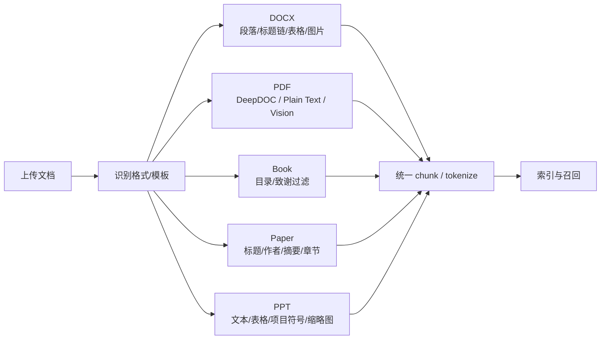

# RAGFlow 多格式切分与参数门槛

## 原文锚点

- 本地文件：[【解密源码】 RAGFlow 切分最佳实践-General 模式语义切块（docx 篇）](../文章/【解密源码】 RAGFlow 切分最佳实践-General 模式语义切块（docx 篇）.md)
- 本地文件：[【解密源码】 RAGFlow 切分最佳实践-General 模式语义切块（pdf 篇）](../文章/【解密源码】 RAGFlow 切分最佳实践-General 模式语义切块（pdf 篇）.md)
- 本地文件：[【解密源码】 RAGFlow 切分最佳实践- book 篇](../文章/【解密源码】 RAGFlow 切分最佳实践- book 篇.md)
- 本地文件：[【解密源码】 RAGFlow 切分最佳实践- paper 篇](../文章/【解密源码】 RAGFlow 切分最佳实践- paper 篇.md)
- 本地文件：[【解密源码】 RAGFlow 切分最佳实践- ppt 篇](../文章/【解密源码】 RAGFlow 切分最佳实践- ppt 篇.md)
- 本地文件：[保姆级教程：RAGFlow知识库参数全解析，让工程人AI助理更靠谱](../文章/保姆级教程：RAGFlow知识库参数全解析，让工程人AI助理更靠谱.md)
- 原文链接：以上文章的微信公众号 URL 均保留在各本地文件 frontmatter 中。
- 关键段落：Docx 标题链和表格处理、PDF DeepDOC/Plain Text/Vision 三路解析、book 非正文过滤、paper 标题/作者/摘要/章节切分、ppt 页面缩略图、参数模板和 RAPTOR/知识图谱开关。
- 关键图：参数文章有图片下载失败；源码系列主要是代码片段和流程描述。

## 图片处理

| 图片 | 类型 | 是否保留 | 理由 | 处理方式 |
|---|---|---|---|---|
| 参数配置截图 | 配图/界面图 | 原图缺失 | 本地 Markdown 标记图片下载失败，且截图不是机制核心 | 不进入知识点 |
| PDF/Docx/PPT 解析流程 | 流程图 | 重建 | 多格式解析差异是本文核心机制 | Mermaid 重建 |

## 一句话结论

RAGFlow 切分的价值不在“模板多”，而在按文档类型恢复标题链、表格、图片、坐标、页码和非正文过滤；参数推荐必须先小样本预览和评估，不能直接套用。

## 用户相关性判断

| 项 | 内容 |
|---|---|
| 用户当前认知层级 | RAGFlow / RAG L2 draft |
| 认知成熟度 | draft |
| 阅读投入建议 | 精读 |
| 阅读投入理由 | 直接补齐 RAGFlow 已有 Markdown 切分之外的 DOCX/PDF/book/paper/PPT 解析边界；参数文章有实践启发但证据不足 |
| 对用户的新信息 | RAGFlow 的解析质量来自“文档类型感知 + 结构保真 + 多模态兜底”，不是单一 chunk_size 参数 |
| 问题指纹 | RAGFlow + 多格式解析/模板参数 + 标题链/表格/图片/坐标/非正文过滤 + 让 chunk 保留可引用结构 |
| 排重判断 | 合并 6 篇源码/参数文章为一个主题，不逐篇机械扩写 |
| 置信度 | 中 |

## 认知校准点

| 校准点 | 文章观点/信息 | 与用户认知或价值观的关系 | 处理建议 |
|---|---|---|---|
| 模板优先于参数微调 | 参数文章强调先选模板再调 chunk_size/overlap | 补充：RAGFlow 使用前要先判断文档类型 | 写入 RAGFlow index |
| PDF 不是一种输入 | PDF 可能是原生文本、扫描件、图文混排、复杂表格 | 纠偏：不能用同一种解析策略处理所有 PDF | 按 DeepDOC / Plain Text / Vision 分支判断 |
| 表格和图片要保留位置与视觉锚点 | PDF/DOCX 解析会保留表格 HTML、图片、positions | 与用户重原文锚点和图片处理一致 | 当前 knowledge 图片处理规则可吸收 |
| 推荐参数不能直接照抄 | 文章给工程行业 chunk_size、overlap、RAPTOR 配置 | 缺少本地数据集和复现 | 只沉淀门槛，不沉淀默认值 |

## 冲突点

| 冲突类型 | 具体表现 | 影响 | 处理 |
|---|---|---|---|
| 原目录冲突 | PPT 文章在 `01_LLM与大模型`，主问题是 RAGFlow 文档解析 | 可能误归为模型文章 | 重路由到 RAGFlow |
| 证据不足 | 参数推荐值、效果提升和资源消耗多为经验表述 | 不能作为稳定配置 | 标为待验证 |
| 版本风险 | PDF 文章提到新版本支持 MinerU、Docling、TCADP，但本轮未联网核验 | 可能与当前版本不一致 | 官网/GitHub 后续补证 |
| 图片缺失 | 参数文章 UI 图下载失败 | 配置细节不可直接复现 | 只保留机制和参数含义 |
| 实践判定偏宽 | 源码片段多，但没有本地 RAGFlow 版本和测试集 | 不能判实践 | 降为精读 |

## 待吸收点

| 分级 | 内容 | 为什么值得吸收 | 后续动作 |
|---|---|---|---|
| 理解 | DOCX 解析要保留段落样式、标题链、表格标题、图注和图片绑定 | 技术文档常以 Word/Markdown 混合存在 | 对 current knowledge 的表格和图处理有启发 |
| 理解 | PDF DeepDOC 通过图像化、OCR、布局识别、表格结构识别和坐标重建恢复结构 | PDF 是 RAG 输入质量最大风险点 | 后续做 PDF 解析实验 |
| 理解 | Book/Paper/PPT 模板分别面向长书籍过滤、论文元信息/章节、幻灯片页级视觉 | 说明“文档类型”就是切分策略的一部分 | 更新 RAGFlow 已覆盖问题 |
| 记住 | 结构保真比 chunk_size 更基础，chunk_size 只能在解析正确后调 | 防止把问题误判为模型差 | 写入 RAGFlow 排重准则 |
| 记住 | 分块预览和小样本验证是调参前置门槛 | 直接减少知识库初始化返工 | 写入后续追查 |
| 实践 | 用同一批 Markdown/PDF/DOCX/PPT 样本对比 RAGFlow 模板、固定切分和标题切分 | 可验证是否改善 knowledge 初始化 | 后续实验，不在本轮改脚本 |

## 已知可跳过

| 内容 | 跳过理由 |
|---|---|
| RAGFlow 是 RAG 平台 | 已在 RAGFlow index 覆盖 |
| 源码逐行解释 | 当前沉淀关注机制和边界，不做源码手册 |
| 工程行业示例配置的完整抄表 | 场景太窄且缺本地验证 |
| UI 操作截图 | 图片缺失且不是核心机制 |

## 实践门槛

| 门槛 | 判断 | 证据 |
|---|---|---|
| 可运行 | 否 | 没有本地 RAGFlow 版本、仓库、配置和样本文档 |
| 可验证 | 部分 | 有分块预览、Recall@K、引用正确率等可设计指标，但原文未给统一评估 |
| 可排障 | 部分 | 能定位到解析器、模板、参数、OCR、表格和视觉模型层 |
| 可迁移 | 是 | 可迁移到当前 knowledge 初始化与文档解析 |
| 结论 | 降为精读 | 机制强，实践需另建样本和环境 |

## 归类判断

| 项 | 内容 |
|---|---|
| 技术本体 | RAGFlow 是面向文档解析、切分、索引、召回和问答的 RAG 平台 |
| 文章主问题 | RAGFlow 如何按不同文档类型生成可检索 chunk，以及参数如何影响质量 |
| 使用场景 | 企业知识库、工程文档、规范、论文、PPT、PDF 问答 |
| 关键词干扰 | DeepDOC、MinerU、Docling、RAPTOR、工程行业、知识图谱 |
| 最终归类 | Agent 与 AI 工程 / RAG 与知识库 / RAGFlow |
| 归类理由 | 主问题是 RAGFlow 文档解析和知识库参数，不是单个 PDF 工具或行业方案 |

## 技术定位

| 项 | 内容 |
|---|---|
| 技术类型 | RAG 平台 / 文档解析与切分机制 |
| 所属领域 | Agent 与 AI 工程 |
| 二级类目 | RAG 与知识库 |
| 全局架构位置 | 原始文档进入 RAGFlow 后的解析、切分、表格/图片处理和索引前处理层 |
| 涉及模块 | DOCX Parser、PDF Parser、DeepDOC、Vision Parser、Table Transformer、Tokenizer、模板、RAPTOR、知识图谱 |
| 解决问题 | 不同格式文档如何被转成保留结构的可检索 chunk |
| 原文局限 | 缺少版本锁定、统一 benchmark、生产失败样例和本地复现 |
| 我的结论 | 以后关注；作为 RAGFlow 文档解析能力地图和后续实验清单 |

## 纵向理解

| 维度 | 判断 |
|---|---|
| 全局架构 | 文档上传 -> 模板/解析器选择 -> 结构抽取 -> 图片/表格/位置保留 -> chunk/tokenize -> 索引 -> 召回/重排 |
| 本文位置 | 主要讲解析和切分，不完整覆盖召回、重排和答案评估 |
| 核心机制 | 标题链、表格类型识别、坐标重建、非正文过滤、视觉兜底、模板参数 |
| 使用链路 | 先按文档类型选模板，再分块预览，再用小问题集验证召回和引用 |
| 前置条件 | 样本文档、解析器版本、OCR/视觉模型可用、评估问题集 |
| 边界 | 不能保证答案忠实；解析正确也要看召回、重排、上下文和生成 |

## 横向对标

| 对标技术 | 实现方式 | 优势 | 劣势 | 适合场景 |
|---|---|---|---|---|
| 固定文本切分 | 纯文本长度和分隔符 | 简单、便宜 | 丢标题、表格、图片和页码 | 低结构文本 |
| RAGFlow 多格式解析 | 按文档类型恢复结构 | 结构保真和引用能力更强 | 复杂、版本风险、成本高 | PDF/DOCX/PPT/论文/规范 |
| MinerU/Docling | 专注文档解析输出 | 解析质量可能更强 | 还需接入 RAGFlow 后处理 | PDF 解析专项 |
| LLM Wiki/knowledge | 人工/Agent 预编译 | 认知校准强 | 不适合海量原文自动覆盖 | 高价值知识沉淀 |

## 后续追查

- 关键词：RAGFlow DocxParser、PdfParser、DeepDOC、Plain Text、VisionParser、Table Transformer、RAPTOR、chunk_token_num、document parser evaluation。
- 相关技术：RAG 文档解析、RAG 切分策略、RAGFlow 召回策略、RAG 评估。
- 需要补读的文章：RAGFlow 当前官方文档和源码版本、RAGFlow 评估机制、MinerU/Docling 接入验证。

