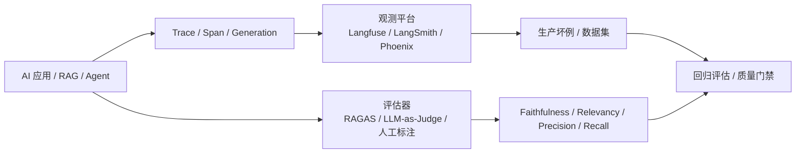

# AI 应用评估
## 知识点入口

- 本模块先看宏观流程，再看文章：[知识地图](020401_知识地图.md)。
- 新文章必须先归入流程节点，再判断是补充、冲突、不同层次还是降权。
- `文章/` 只保留原文锚点，长期知识必须沉淀到 `020401_核心知识点/` 下的主题文件。

## 技术定位

| 项 | 内容 |
|---|---|
| 技术名 | AI 应用评估 |
| 一级类目 | Agent 与 AI 工程 |
| 二级类目 | 评估与观测 |
| 技术本体 | 对 LLM/RAG/Agent 应用的调用链、质量、成本、延迟和回归风险进行观测与评估 |
| 全局架构位置 | 位于 AI 应用运行链路旁路，采集 Trace、Span、Generation、检索结果、评分和用户反馈 |
| 主要使用者 | AI 应用工程师、Agent 平台工程师、RAG 工程师、评测负责人 |
| 主要产出 | Trace、评估分数、数据集、回归报告、质量门禁、成本分析 |

## 官方锚点

- Langfuse 文档：[Langfuse Docs](https://langfuse.com/docs)
- Langfuse GitHub：[langfuse/langfuse](https://github.com/langfuse/langfuse)
- RAGAS 文档：[Ragas Documentation](https://docs.ragas.io/)
- RAGAS GitHub：[vibrantlabsai/ragas](https://github.com/vibrantlabsai/ragas)

## 架构图

## 核心模块

| 模块 | 职责 | 重点问题 |
|---|---|---|
| Trace | 记录一次业务调用全链路 | 输入、输出、耗时、成本、错误 |
| Span | 记录检索、重排、工具调用等子步骤 | 失败归因和瓶颈定位 |
| Generation | 记录 LLM 调用 | 模型、Prompt、Token、成本 |
| 评估指标 | 判断输出质量 | 忠实性、相关性、召回、上下文精度 |
| 数据集和 CI | 做回归比较 | 变更后是否退化，阈值如何设 |

## 横向对标

| 对标技术 | 对标点 | 优势 | 劣势 | 使用判断 |
|---|---|---|---|---|
| Langfuse | 观测、评估、Prompt 管理 | Trace 与生产数据闭环完整 | 平台建设和数据治理成本 | 需要线上观测与回归 |
| RAGAS | RAG 指标评估 | 指标聚焦 RAG 质量 | LLM-as-Judge 有噪声 | RAG 检索/生成质量 |
| LangSmith | LangChain 生态评估观测 | 生态集成强 | 绑定生态更多 | LangChain 应用 |
| 手工抽查 | 人工审核样本 | 最贴近业务判断 | 成本高，不可频繁回归 | 高风险样本和标注基准 |

## 已沉淀核心知识点

| 主题 | 文件 | 问题指纹 | 解决什么问题 | 认知增量 |
|---|---|---|---|---|
| Langfuse 与 RAGAS 监控评估闭环 | [Langfuse与RAGAS监控评估闭环](020401_核心知识点/Langfuse与RAGAS监控评估闭环.md) | AI 应用 + Trace/Span/Generation + RAGAS 指标 + 观测与评估闭环 + 可回归质量门禁 | 把 AI 应用质量从主观体验变成可观测、可评分、可回归 | 观测回答“发生了什么”，评估回答“答得好不好”，两者要串进 CI |

## 后续追查

- 关键词：Langfuse、RAGAS、Trace、Span、Generation、Faithfulness、Context Recall、LLM-as-Judge、CI eval。
- 待读资料：Langfuse Evaluation、RAGAS metrics、LangSmith eval、Phoenix tracing、生产坏例数据集构造。
- 待补实验：给文章抽取流程记录 Trace，构造 20 条样本，评估分类准确率、冲突点命中率、链接正确率和人工复核意见。

<!-- AUTO-DISTILL-02-START -->

## 本轮文章处理收口

- 已归档来源：`6` 篇，全部位于 `文章/` 且使用 `done-` 前缀。
- 长期入口：[AI应用评估指标与闭环.md](020401_核心知识点/AI应用评估指标与闭环.md)。
- 新文章进入时先对照知识地图、AGENTS 排重准则和已有主题页；只有新增机制、边界、反例、版本差异或实践证据时才新建主题页。

<!-- AUTO-DISTILL-02-END -->
