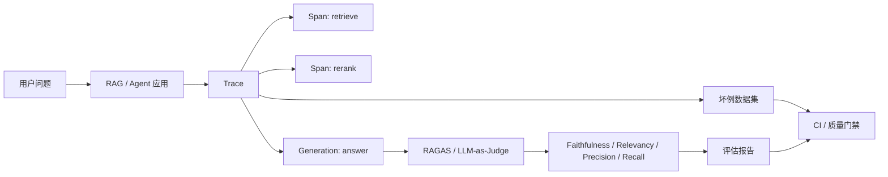

# Langfuse 与 RAGAS 监控评估闭环

## 原文锚点

- 本地文件：[AI 应用的监控与评估：LangFuse + RAGAS](../文章/AI 应用的监控与评估：LangFuse + RAGAS.md)
- 原文链接：https://mp.weixin.qq.com/s?__biz=MzE5ODA1NTAwNQ==&mid=2247485506&idx=1&sn=5608468c170be73e681a130be55716db&chksm=97c33673279e8fbbc0dca8552b5bd74921d5cf4f372defad918d2ec2db77538ad48edcab4ff7&mpshare=1&scene=24&srcid=0514Qe8M2U7LyMteHIMvpYXr&sharer_shareinfo=73a16691eaea1b5c8ade56542e9ff3bc&sharer_shareinfo_first=73a16691eaea1b5c8ade56542e9ff3bc#rd
- 官方锚点：[Langfuse Docs](https://langfuse.com/docs)、[RAGAS GitHub](https://github.com/vibrantlabsai/ragas)
- 关键段落：普通日志不足、Trace/Span/Generation、RAGAS 指标、Faithfulness、评估流水线、踩坑与最佳实践。
- 关键图：无技术图，原文用调用链代码块表达。

## 图片处理

| 图片 | 类型 | 是否保留 | 理由 | 处理方式 |
|---|---|---|---|---|
| 无 | 无图 | 不适用 | 文章主要是调用链和代码片段 | Mermaid 重建闭环 |

## 一句话结论

这篇文章值得精读：它把 AI 应用质量拆成“观测发生了什么”和“评估答得好不好”，并把两者接入回归流程。

## 用户相关性判断

| 项 | 内容 |
|---|---|
| 用户当前认知层级 | Agent 评估与观测 L1-L2 draft；RAG L2 draft |
| 认知成熟度 | draft |
| 阅读投入建议 | 精读 |
| 阅读投入理由 | 直接服务当前文章抽取 Agent 的质量闭环；但原文 Demo 代码和模型命名需降权，重点吸收数据模型和评估流程 |
| 对用户的新信息 | Trace/Span/Generation 解决可观测，RAGAS 指标解决 RAG 质量，二者应进入 CI 做回归 |
| 问题指纹 | AI 应用 + Trace/Span/Generation + RAGAS 指标 + 观测与评估闭环 + 可回归质量门禁 |
| 排重判断 | 新建 |
| 置信度 | 高 |

## 认知校准点

| 校准点 | 文章观点/信息 | 与用户认知或价值观的关系 | 处理建议 |
|---|---|---|---|
| 普通日志不足以评估 AI 应用 | HTTP 200 和耗时不能解释检索错、重排错还是生成幻觉 | 补充观测边界 | 写入评估与观测 |
| 观测和评估不是一回事 | Langfuse 看调用链，RAGAS 看质量指标 | 纠偏：不要把 tracing 当 eval | 建立 AI 应用评估 index |
| LLM-as-Judge 要有容错和人工校准 | 裁判模型 JSON 会失败，指标有噪声 | 符合重证据偏好 | 后续加人工复核 |
| 评估要进入 CI | Prompt/模型改动后跑数据集，下降则阻断 | 补工程闭环 | 可迁移到当前流程 |

## 冲突点

| 冲突类型 | 具体表现 | 影响 | 处理 |
|---|---|---|---|
| 实践判定偏宽 | 有代码片段和报告样例，但依赖示例项目和模型环境 | 不能直接判实践 | 降为精读 |
| 证据不足 | 示例数据集只有少量案例，指标过高不代表生产可用 | 容易高估效果 | 只保留流程 |
| 工具名时效 | RAGAS GitHub 组织已变化，LangFuse 常写作 Langfuse | 官方锚点需校准 | 使用当前官方链接 |

## 待吸收点

| 分级 | 内容 | 为什么值得吸收 | 后续动作 |
|---|---|---|---|
| 理解 | Trace 是一次完整业务调用，Span 是子步骤，Generation 是 LLM 调用 | 建立 AI 应用可观测模型 | 写入 index |
| 理解 | RAGAS 的 Faithfulness、Answer Relevancy、Context Precision、Context Recall 分别定位不同失败 | 补 RAG 评估工具化 | 与 RAG 评估关联 |
| 记住 | 观测回答“哪一步出了问题”，评估回答“结果是否合格” | 防止概念混淆 | 作为准则 |
| 记住 | 失败样本和线上 Trace 要回流成评估数据集 | 避免同类错误反复 | 服务知识库初始化 |
| 实践 | 给文章抽取流程增加 trace_id、原文、分类、冲突点、链接检查、人工复核字段 | 可直接落地 | 后续实验 |

## 已知可跳过

| 内容 | 跳过理由 |
|---|---|
| AI 应用上线后会有质量问题 | 已知基础 |
| 80 行 Tracer 逐行代码 | 机制可懂即可，不进入长期知识 |
| 社群和系列文章推广 | 低价值背景 |

## 实践门槛

| 门槛 | 判断 | 证据 |
|---|---|---|
| 可运行 | 部分 | 有 Demo 代码思路 |
| 可验证 | 部分 | 有指标和报告样例，但样本太少 |
| 可排障 | 部分 | Trace 模型清楚，缺真实生产错误分类 |
| 可迁移 | 是 | 可迁移到当前知识抽取流程 |
| 结论 | 降为精读 | 实践需本地化数据集和 trace 字段 |

## 归类判断

| 项 | 内容 |
|---|---|
| 技术本体 | AI 应用评估与观测是 Agent/RAG 工程质量控制方法 |
| 文章主问题 | 如何用 Langfuse 类 Trace 和 RAGAS 指标建立 AI 应用监控评估闭环 |
| 使用场景 | RAG 应用、Agent 应用、Prompt/模型变更回归 |
| 关键词干扰 | RAG、Next.js、Vercel AI SDK、代码 Demo |
| 最终归类 | Agent 与 AI 工程 / 评估与观测 / AI 应用评估 |
| 归类理由 | 主问题是观测和评估闭环，不是 RAG 检索算法或前端应用开发 |

## 纵向理解

| 维度 | 判断 |
|---|---|
| 全局架构 | AI 应用 -> Trace/Span/Generation -> 评估指标 -> 数据集 -> CI 质量门禁 |
| 本文位置 | 讲观测和评估的最小闭环，不讲生产权限和数据治理 |
| 核心机制 | 嵌套调用树、Token/成本归因、LLM-as-Judge、RAGAS 指标、评估报告 |
| 使用链路 | 采集 Trace -> 从生产坏例构造数据集 -> 跑 RAGAS/自定义评估 -> 生成报告 -> CI 阈值门禁 |
| 前置条件 | 有代表性样本、标准答案/相关文档、稳定裁判模型、人工复核 |
| 边界 | 不替代人工审核，也不保证指标等于业务价值 |

## Mermaid 重建

## 横向对标

| 对标技术 | 实现方式 | 优势 | 劣势 | 适合场景 |
|---|---|---|---|---|
| Langfuse | Trace、评估、Prompt 管理、数据集 | 开源，覆盖观测到评估 | 需要平台和数据治理 | 生产 AI 应用 |
| RAGAS | RAG 指标和测试集 | RAG 质量维度清晰 | 裁判模型噪声 | RAG 回归 |
| 手工抽查 | 人工评审样本 | 贴近业务 | 不可规模化 | 高风险样本 |
| 普通日志/APM | HTTP、耗时、错误 | 工程成熟 | 不理解 LLM 语义质量 | 底层服务稳定性 |

## 后续追查

- 关键词：Langfuse Trace、Generation、RAGAS、Faithfulness、Context Precision、Context Recall、LLM-as-Judge、eval dataset。
- 相关技术：RAG 评估、Agent 评估、LLM Wiki、MCP 工具调用评估。
- 需要补读的文章：Langfuse Evaluation 官方文档、RAGAS metrics、LangSmith/Phoenix 对比、评估数据集构造方法。

