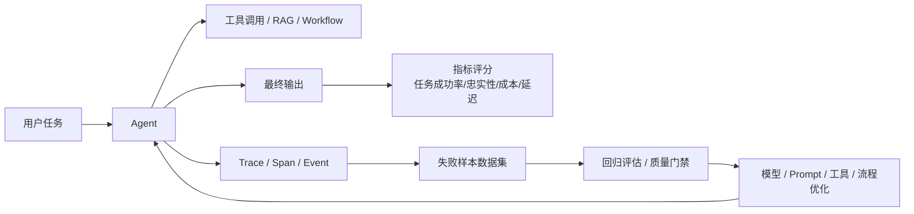

# Agent 评估
## 知识点入口

- 本模块先看宏观流程，再看文章：[流程化知识点总览](knowledge/02_Agent与AI工程/0204_评估与观测/Agent评估/核心知识点/流程化知识点总览.md)。
- 新文章必须先归入流程节点，再判断是补充、冲突、不同层次还是降权。
- `文章/` 只保留原文锚点，长期知识必须沉淀到 `核心知识点/`。

## 技术定位

| 项 | 内容 |
|---|---|
| 技术名 | Agent 评估 |
| 一级类目 | Agent 与 AI 工程 |
| 二级类目 | 评估与观测 |
| 技术本体 | 用指标、日志、Trace、数据集和人工反馈判断 Agent 的任务质量、工具调用质量和迭代收益 |
| 全局架构位置 | 位于 Agent 运行链路旁路，收集输入、推理、工具调用、输出和反馈，反哺优化与质量门禁 |
| 主要使用者 | AI 应用工程师、Agent 平台工程师、业务负责人、评测负责人 |
| 主要产出 | 评估数据集、Trace、Score、失败样本、质量报告、CI 门禁 |

## 官方锚点

- 官网：无单一官网，属于工程评估方法和平台能力。
- 常见工具：Langfuse、LangSmith、Phoenix、OpenTelemetry。
- 本地相关：[RAG 评估体系](../../0203_RAG与知识库/RAG/核心知识点/RAG评估体系.md)
- 相邻技术：[AI 应用评估](../AI应用评估/AGENTS.md)

## 架构图

## 核心模块

| 模块 | 职责 | 重点问题 |
|---|---|---|
| 指标体系 | 定义什么叫好 | 成功率、准确率、引用率、工具调用正确率、成本、延迟 |
| Trace/Span | 记录运行过程 | 定位失败发生在检索、推理、工具、输出还是权限 |
| 数据集 | 固化典型问题和失败样本 | 覆盖正常、边界、负例和业务关键场景 |
| 评估器 | 自动或人工打分 | LLM-as-judge 偏差、人工标注一致性 |
| 类型化评估 | 按 Coding、Research、Conversation、Computer Use 等类型选择验收对象 | 状态验证、过程验证、工具选择、引用质量 |
| 质量门禁 | 阻止退化版本上线 | 阈值、对比报告、回归失败处理 |

## 横向对标

| 对标技术 | 对标点 | 优势 | 劣势 | 使用判断 |
|---|---|---|---|---|
| RAG 评估 | 都评估 AI 应用质量 | RAG 指标更聚焦召回和忠实性 | 不覆盖复杂工具链 | RAG 问答单独评估 |
| LLM 模型评测 | 都看模型效果 | 基准可横向比较 | 不代表业务 Agent 成功 | 模型选型用它，Agent 上线不能只看它 |
| 软件测试 | 都做回归和门禁 | 可自动化、可复现 | 自然语言任务 oracle 难 | 与 Agent eval 结合 |
| 可观测性 APM | 都看 trace、latency、error | 工程成熟 | 不直接判断语义质量 | Agent 需要语义 score |

## 已沉淀核心知识点

| 主题 | 文件 | 问题指纹 | 解决什么问题 | 认知增量 |
|---|---|---|---|---|
| Agent 评估体系与 Trace 闭环 | [Agent评估体系与Trace闭环](核心知识点/Agent评估体系与Trace闭环.md) | Agent + 评估与观测 + 指标/Trace/Dataset/CI 门禁 + 优化是否真的变好 + 失败样本闭环 | 避免只靠换模型和堆 prompt 判断 Agent 优化效果 | Agent 评估要从指标和 Trace 定位失败，而不是只看最终回答 |
| Agent 类型化评估与 pass 指标 | [Agent类型化评估与pass指标](核心知识点/Agent类型化评估与pass指标.md) | Agent 评估 + Agent 类型 + code/model/human graders + capability/regression + pass@k/pass^k + 评估设计边界 | 判断不同类型 Agent 应如何设计评分器和稳定性指标 | Agent 评估不能统一打分，要按任务类型选择结果、过程和工具调用证据 |

## 后续追查

- 关键词：Agent evaluation、Trace、Span、Dataset、LLM-as-judge、code-based graders、model-based graders、human graders、capability eval、regression eval、pass@k、pass^k。
- 待读资料：Anthropic/OpenAI/LangSmith/Langfuse 的 Agent eval 实践、工具调用评估、长任务 Agent 评估、生产坏例数据集构造。
- 待补实验：为本地文章抽取 Agent 构造 20 条固定任务，记录分类准确率、冲突点命中率、链接正确率、工具选择正确率和人工复核意见；分别计算首次成功率和多次稳定性。
