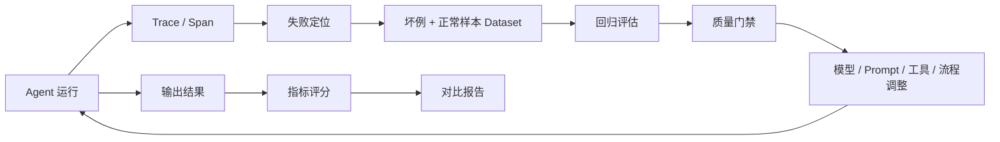

# Agent 评估体系与 Trace 闭环

## 原文锚点

- 本地文件：[【观察】AI Agent评估体系：让Agent优化不再迷路](../文章/【观察】AI Agent评估体系：让Agent优化不再迷路.md)
- 原文链接：https://mp.weixin.qq.com/s?__biz=MzkwNTMxNzY4NQ==&mid=2247485924&idx=1&sn=0a562ecdd7ecc33a20b6d05913e293af&chksm=c1682eafe3d2c4675aeb9b49929b91007debca82abe4bc88b522d664cb08abb34b201930d22a&mpshare=1&scene=24&srcid=0423dutRPcSGr4mmo4uQo1ff&sharer_shareinfo=a5869e412c04e342b990bd3fa1b48903&sharer_shareinfo_first=a5869e412c04e342b990bd3fa1b48903#rd
- 关键段落：Agent 类型拆分、QA 指标、执行型 Agent 指标、Trace/Span/Generation/Event/Score、Dataset 和 CI/CD 门禁。
- 关键图：无技术图。

## 图片处理

| 图片 | 类型 | 是否保留 | 理由 | 处理方式 |
|---|---|---|---|---|
| 无 | 无图 | 不适用 | 原文主要是指标和流程 | Mermaid 重建闭环 |

## 一句话结论

这篇文章值得精读：它把 Agent 优化从“换模型、改 prompt”校准为“指标定义、Trace 定位、失败样本数据集、回归评估、质量门禁”的闭环。

## 用户相关性判断

| 项 | 内容 |
|---|---|
| 用户当前认知层级 | Agent 评估与观测 L1-L2 draft |
| 认知成熟度 | draft |
| 阅读投入建议 | 精读 |
| 阅读投入理由 | 当前知识库初始化流程本身就需要 Agent 评估；原文提供方向，但经验阈值和工具建议需降权 |
| 对用户的新信息 | Agent 评估要按 QA 型和执行型拆分指标，并用 Trace/Span 定位失败节点 |
| 问题指纹 | Agent + 评估与观测 + 指标/Trace/Dataset/CI 门禁 + 优化是否真的变好 + 失败样本闭环 |
| 排重判断 | 新建 |
| 置信度 | 高 |

## 认知校准点

| 校准点 | 文章观点/信息 | 与用户认知或价值观的关系 | 处理建议 |
|---|---|---|---|
| Agent 优化不能只看主观体验 | 换模型、堆 prompt 后必须回答变好多少 | 纠偏：需要基线和回归 | 写入评估与观测 index |
| QA 型和执行型指标不同 | QA 看准确率、引用率、拒答；执行型看成功率、工具调用和步骤 | 补充分类边界 | 后续处理文章抽取 Agent 要用专门指标 |
| Trace 是定位工具，不只是日志 | Trace/Span/Generation/Event/Score 帮助定位失败发生在哪一步 | 补工程链路 | 作为待吸收点 |
| 经验阈值要降权 | 原文给的优秀/及格阈值没有业务基线 | 符合反标题党和证据偏好 | 不直接沉淀为准则 |

## 冲突点

| 冲突类型 | 具体表现 | 影响 | 处理 |
|---|---|---|---|
| 证据不足 | 指标阈值缺行业、任务、数据集和样本量 | 不能直接采信 | 只保留指标维度 |
| 工具偏向 | 以 LangSmith/Langfuse 风格描述为主 | 可能误以为工具就是体系 | 抽象成方法 |
| 实践门槛不足 | 没有完整 eval repo、数据集和 CI 配置 | 不能直接实践 | 降为精读 |

## 待吸收点

| 分级 | 内容 | 为什么值得吸收 | 后续动作 |
|---|---|---|---|
| 理解 | Agent 评估对象要先分 QA 型和执行型 | 不同任务指标完全不同 | 写入二级 index |
| 理解 | Trace/Span/Generation/Event/Score 是观测抽象 | 能定位失败环节 | 后续对文章抽取流程落地 |
| 记住 | 失败样本要进入 Dataset，成为后续回归集 | 避免同类错误反复出现 | 与用户“积累”偏好一致 |
| 记住 | 优化必须通过对比报告和质量门禁确认 | 防止改 prompt 后无证据上线 | 作为 Agent 准则 |
| 实践 | 为文章抽取流程建立灰度样本集、人工复核标签、冲突命中率和链接正确率 | 直接服务当前知识库初始化 | 后续落地 |

## 已知可跳过

| 内容 | 跳过理由 |
|---|---|
| Agent 可以接 RAG、Workflow、MCP、Skill | 已知基础 |
| AI 发展背景和泛泛趋势判断 | 不形成工程准则 |
| 未给基线的优秀/及格阈值 | 需要本地数据校准 |

## 实践门槛

| 门槛 | 判断 | 证据 |
|---|---|---|
| 可运行 | 否 | 无最小项目或配置 |
| 可验证 | 部分 | 有指标和流程，但无数据集 |
| 可排障 | 部分 | Trace 抽象清楚，缺真实日志字段 |
| 可迁移 | 是 | 可迁移到当前文章抽取 Agent |
| 结论 | 降为精读 | 方法可吸收，实践需本地化 |

## 归类判断

| 项 | 内容 |
|---|---|
| 技术本体 | Agent 评估是 Agent 工程化质量控制方法 |
| 文章主问题 | 如何用指标和 Trace 判断 Agent 优化是否有效 |
| 使用场景 | RAG QA、工具调用 Agent、工作流 Agent、业务助手 |
| 关键词干扰 | RAG、Workflow、MCP、Skill、Memory、Prompt |
| 最终归类 | Agent 与 AI 工程 / 评估与观测 / Agent 评估 |
| 归类理由 | 主问题是评估和观测，不是 RAG、MCP 或提示词技巧 |

## 纵向理解

| 维度 | 判断 |
|---|---|
| 全局架构 | Agent 执行 -> Trace 采集 -> 指标评分 -> 失败样本入库 -> 回归评估 -> 质量门禁 -> 迭代 |
| 本文位置 | 只讲评估与观测方法，不讲具体 Agent 框架实现 |
| 核心机制 | 指标体系、Trace/Span、Dataset、人工标注、CI/CD gate |
| 使用链路 | 先定义任务类型 -> 接入观测 -> 建指标 -> 收集坏例 -> 标注数据集 -> 回归对比 |
| 前置条件 | 有任务样本、标准答案或人工准则、trace 采集和版本对比 |
| 边界 | 不解决模型能力不足、工具权限设计和业务口径定义 |

## Mermaid 重建

## 横向对标

| 对标技术 | 实现方式 | 优势 | 劣势 | 适合场景 |
|---|---|---|---|---|
| Agent 评估 | 任务成功率、工具调用、Trace、Dataset | 覆盖多步链路 | 标注和归因成本高 | 工具型/流程型 Agent |
| RAG 评估 | 召回、忠实性、引用、延迟 | 指标更聚焦 | 不覆盖工具执行 | 知识问答 |
| LLM 模型评测 | 基准集比较模型能力 | 便于模型选型 | 不代表业务流程成功 | 模型筛选 |
| 传统软件测试 | 单元/集成/回归测试 | 稳定可自动化 | 语义质量难判断 | 工具和流程硬约束 |

## 后续追查

- 关键词：Agent evaluation、Trace、Span、Dataset、Quality Gate、LLM-as-judge、Langfuse、LangSmith。
- 相关技术：RAG 评估、MCP 工具调用评估、Claude Code workflow、LLM Wiki。
- 需要补读的文章：Anthropic Agent eval、LangSmith eval、Langfuse eval、工具调用错误分类。

