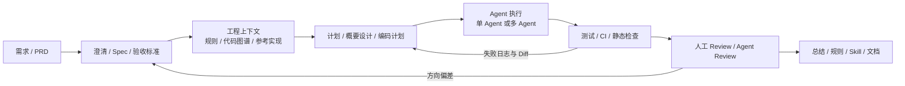

# AI Coding 工程闭环与流畅度模型

## 原文锚点

- 本地文件：
  - [2026 年，AI Coding 该怎么做？四个共识和个人实战工作流分享.md](<../文章/2026 年，AI Coding 该怎么做？四个共识和个人实战工作流分享.md>)
  - [AI Coding 流畅度模型：人机协作中的开发者角色转型与未来演进.md](<../文章/AI Coding 流畅度模型：人机协作中的开发者角色转型与未来演进.md>)
  - [Context Is All You Need：快手后端AI Coding的实践与思考.md](<../../../0208_Context Engineering/文章/Context Is All You Need：快手后端AI Coding的实践与思考.md>)
  - [AI编程实践：理清楚AI IDE从需求到交付的最小闭环流程.md](<../文章/AI编程实践：理清楚AI IDE从需求到交付的最小闭环流程.md>)
  - [AI Coding 与 Harness 实践精髓：让AI高效干活、持续交付.md](<../../../0209_Harness Engineering/文章/AI Coding 与 Harness 实践精髓：让AI高效干活、持续交付.md>)
- 原文链接：见各本地文件 frontmatter；本轮不联网校验。
- 关键段落：
  - `2026 年，AI Coding 该怎么做？`：Plan/Act/Review/Summary、AGENTS.md/CLAUDE.md、Skills、Memory、研发流程不变。
  - `AI Coding 流畅度模型`：从工具使用到协作能力，开发者转向目标拆解、系统设计和验证。
  - `Context Is All You Need`：后端 AI Coding 从 Context 到 Control，需要代码图谱、概要设计、编码计划和多 Agent 可控执行。
  - `AI IDE 最小闭环`：需求、设计、开发、CI、失败分析、修复、合并部署的闭环。
  - `AI Coding 与 Harness`：主子 Agent、进度持久化、质量门禁和错误沉淀。
- 关键图：多篇原文提到流程图、调用链图或看板图，但 Markdown 未保留图片链接，属于原图缺失。

## 图片处理

| 图片 | 类型 | 是否保留 | 理由 | 处理方式 |
|---|---|---|---|---|
| 后端改动流程示意、详细调用链路图 | 流程图 / 架构图 | 原图缺失 | 用于解释后端改动为什么会跨 Controller、Service、DAO、VO、DB 多层扩散 | 标记原图缺失；按正文重建简化流程 |
| Multi-Agent 执行流程示意 | 流程图 | 原图缺失 | 用于说明 Context 解决“看见”，Control 解决“稳定执行” | 标记原图缺失；按正文重建简化流程 |
| AI IDE 从需求到交付流程图 | 流程图 | 原图缺失 | 用于表达需求、计划、编码、CI、修复、合并闭环 | 标记原图缺失；按正文重建简化流程 |
| AI Coding Fluency 表格/看板图 | 对比图 | 原图缺失 | 用于区分 Awareness、Assisted、Structured、Agent-Centric、Agent-First | 不重画成熟度表，只吸收分层判断 |

## 一句话结论

这组文章值得精读，但不应被理解为“AI 编程工具更强了”；真正的增量是把 AI Coding 从提示词技巧校准为一条可设计、可验证、可复盘的工程流程。

## 用户相关性判断

| 项 | 内容 |
|---|---|
| 用户当前认知层级 | AI 编程工具 L2，正在补齐 Claude Code、Cursor、OpenCode 等工具进入工程流程的边界 |
| 认知成熟度 | draft |
| 阅读投入建议 | 精读 |
| 阅读投入理由 | 文章能补齐“需求到交付”的流程边界、后端 AI Coding 的 Context/Control 机制、以及 Harness 的长期任务治理；但效率数字和成熟度表缺少可复现实验证据 |
| 对用户的新信息 | AI Coding 的关键不是一次性生成代码，而是 Plan、Context、Control、Verify、Review、Memory 的闭环 |
| 问题指纹 | AI Coding 工作流 + 需求到交付 + 计划/上下文/验证/复盘 + 防跑偏和返工 + 把工具使用升级为工程能力 |
| 排重判断 | 新建。与 Claude Code 动态搜索、Cursor 动态上下文不同，本主题沉淀的是跨工具的研发流程闭环 |
| 置信度 | 中 |

## 认知校准点

| 校准点 | 文章观点/信息 | 与用户认知或价值观的关系 | 处理建议 |
|---|---|---|---|
| 研发流程没有被 AI 替代 | 多篇文章都把 Plan、Act、Review、Summary 或需求、开发、CI、部署作为主线 | 补充“工具进入工程流程”的边界，避免被“全自动写代码”叙事带偏 | 记住：AI Coding 的稳定性来自流程约束，不来自一次提示词 |
| 后端 AI Coding 的核心缺口是工程事实 | 快手文章指出 PRD 不包含调用链、隐式依赖、数据来源和扩散范围 | 对用户重视架构位置和上下游非常相关 | 后端任务前置代码图谱、参考实现、概要设计和影响面分析 |
| Context 只解决“看见”，Control 才解决“可控” | 代码图谱提升系统视角，但单 Agent 仍会因上下文膨胀和阶段干扰失控 | 校准“只补上下文就能稳定交付”的误区 | 将任务拆成概要设计、编码计划、多 Agent 执行和验证 |
| 流畅度不是工具采用率 | AI Coding Fluency 强调团队协作能力、质量治理和上下文管理 | 符合用户“长期沉淀、反泛泛总结”的偏好 | 把成熟度模型当诊断框架，不当组织排名 |
| 复盘不是可选总结 | Summary/Compound/Memory 负责把踩坑、模式、关键决策写回本地规则或文档 | 与用户要求“积累/沉淀”的工作方式一致 | 每次跑通后更新规则、Skill 或项目文档，而不是只保留聊天记录 |
| 效率数字需要降权 | 采纳率、提升倍数、成功率等多为经验数字，缺少统一环境和基线 | 符合反标题党和重证据价值观 | 只沉淀机制，不把数字写成通用结论 |

## 冲突点

| 冲突类型 | 具体表现 | 影响 | 处理 |
|---|---|---|---|
| 原目录冲突 | `Context Is All You Need` 原在工程与架构，`AI IDE 最小闭环` 原在机器学习 | 会把 AI 编程工具流程误放到后端架构或机器学习 | 按主问题重路由到 Agent 与 AI 工程 / AI 编程工具 |
| 图片缺失 | 多篇文章出现“流程示意”“调用链路图”“下图”等描述但无图片文件 | 缺少可视化证据，影响机制理解 | 标记原图缺失；基于正文重建简化 Mermaid |
| 证据不足 | 采纳率、效率提升、成功率等缺少可复现环境和对照组 | 可能把局部经验误写成普遍结论 | 降权，只保留流程和机制 |
| 实践资讯混杂 | 部分文章既讲方法论又讲工具推荐、社区方案和个人实践 | 容易逐篇堆工具名 | 合并为一个“工程闭环”主题，不逐篇扩写 |
| 关键词误导 | 标题出现模型、AI IDE、Harness、Memory 等相邻主题 | 可能误归到模型能力、上下文工程或工作流编排 | 本轮只沉淀“AI 编程工具如何进入研发流程” |

## 待吸收点

| 分级 | 内容 | 为什么值得吸收 | 后续动作 |
|---|---|---|---|
| 理解 | AI Coding 的主线是需求澄清、计划设计、代码探索、实现、验证、评审、复盘 | 这是判断工具是否进入工程流程的基本框架 | 写入二级类目排重准则和后续路由判断 |
| 理解 | 后端任务需要把 PRD 转成概要设计，再转成编码计划 | PRD 不包含后端调用链、数据来源和隐式依赖 | 后续遇到后端 AI Coding 文章优先看是否有概要设计和影响面分析 |
| 理解 | Context 工程化可以是代码图谱、规则文档、领域知识、参考实现，不等同于长提示词 | 能避免“把资料全塞进上下文”的错误做法 | 与 Claude Code 和 Cursor 的动态上下文机制对比 |
| 记住 | “计划者”和“执行者”分离能降低跑偏风险 | Prometheus/Feature Dev/Plan 模式都在做类似边界 | 后续工具对标时看是否支持先计划、后执行、可回滚 |
| 记住 | 验证闭环必须有输入、输出、失败日志和修复路径 | 没有 CI/测试/静态检查，AI 生成很难进入交付 | 每个实践型笔记都要求写明验收信号 |
| 实践 | 在本地仓库跑一次 Plan/Act/Review/Summary，并把总结写回规则或 Skill | 能验证流程是否真的降低返工 | 后续选择小范围代码任务做实验 |

## 已知可跳过

| 内容 | 跳过理由 |
|---|---|
| “AI 会取代开发者”式泛化 | 文章有效部分反而说明开发者转向目标、边界和验证，不是退出流程 |
| 工具名清单 | 不改变判断框架，容易把知识库变成工具收藏夹 |
| 未给基线的采纳率和效率数字 | 无法迁移到用户项目，不能作为长期结论 |
| AI IDE 入门操作 | 用户更需要工程边界和流程治理，不需要重复基础使用教程 |

## 实践门槛

| 门槛 | 判断 | 证据 |
|---|---|---|
| 可运行 | 否 | 文章给出流程和示例，但本轮未在本地仓库跑完整闭环 |
| 可验证 | 部分 | 可以用测试、CI、diff、review 作为验收，但文章未提供统一指标 |
| 可排障 | 部分 | 有 CI 失败分析、日志、diff、上下文缺失等失败模式，但缺少真实本地证据 |
| 可迁移 | 是 | 可迁移到代码改造、数据开发、Agent 工程任务 |
| 结论 | 降为精读 | 当前先沉淀流程准则，后续本地实验通过后再升级为实践 |

## 归类判断

| 项 | 内容 |
|---|---|
| 技术本体 | AI Coding 工作流 |
| 文章主问题 | AI 编程工具如何从代码生成进入真实软件研发流程 |
| 使用场景 | 需求澄清、后端改造、存量项目增量开发、CI 反馈、长程任务 |
| 关键词干扰 | Harness、Memory、AI IDE、后端架构、模型能力、Spec 等词会抢分类 |
| 最终归类 | Agent 与 AI 工程 / AI 编程工具 / AI Coding 工作流 |
| 归类理由 | 主问题是 AI 编程工具的工程化协作流程，不是模型本身、后端架构本体或通用项目管理 |

## 技术定位

| 项 | 内容 |
|---|---|
| 技术类型 | 架构模式 / 工作流方法 |
| 所属领域 | Agent 与 AI 工程 |
| 二级类目 | AI 编程工具 |
| 全局架构位置 | 开发流程控制层，位于需求与代码交付之间 |
| 涉及模块 | 需求、计划、上下文、执行、验证、评审、复盘 |
| 解决问题 | 降低 AI 编程跑偏、返工、上下文污染和不可验证交付 |
| 原文局限 | 多数文章缺少可复现实验和失败样本，效率数字需要降权 |
| 我的结论 | 以后关注，并优先作为 AI 编程工具文章的排重和评估框架 |

## 纵向理解

| 维度 | 判断 |
|---|---|
| 全局架构 | AI Coding 工作流由需求澄清、上下文建模、计划设计、执行编排、验证反馈、复盘沉淀组成 |
| 本文位置 | 本主题不讨论某个工具完整能力，只沉淀跨工具的研发闭环 |
| 核心机制 | 计划先行、工程上下文显性化、执行与规划分离、验证反馈、知识复利 |
| 使用链路 | 用户需求 -> 澄清 -> 计划 -> 代码探索 -> 实现 -> 测试/CI -> Review -> 总结写回规则 |
| 前置条件 | 项目有可运行测试、清晰目录、可读规则、可追查日志和人工评审时间 |
| 边界 | 需求极模糊、无测试、无业务锚点、无权限边界时，AI Coding 只能做辅助探索 |

## 横向对标

| 对标技术 | 实现方式 | 优势 | 劣势 | 适合场景 |
|---|---|---|---|---|
| Vibe Coding | 一句话或少量提示直接生成 | 快速、轻量 | 跑偏和技术债风险高 | 原型、探索、低风险小工具 |
| Spec-Driven Development | 规格、计划、任务、实现 | 可追踪、适合团队协作 | 可能过重，维护成本高 | 复杂需求、长期维护项目 |
| Feature Dev / Plan 模式 | 先计划后执行 | 防止过早编码 | 计划质量依赖上下文和人工确认 | 存量项目功能开发 |
| Harness / 多 Agent | 主 Agent 调度，子 Agent 执行 | 隔离上下文、适合长任务 | 编排和评估成本高 | 多模块、长时间、可并行任务 |
| 传统人工开发流程 | 人主导设计、编码、测试 | 可控性强 | 重复劳动多 | 高风险核心系统仍需人工主导 |

## 后续追查

- 关键词：AI Coding Fluency、Feature Dev、Spec-Driven Development、Harness、Context to Control、Plan/Act/Review/Summary。
- 相关技术：Claude Code、Cursor、OpenCode、OpenSpec、Spec Kit、CI、代码图谱。
- 需要补读的文章：
  - 后续补证 Claude Code Feature Dev 官方说明。
  - 后续补证 Cursor Plan 官方说明。
  - 后续补证 OpenSpec / Spec Kit 官方文档。
  - 本地选择一个真实代码任务，记录计划、diff、测试、失败和复盘证据。
