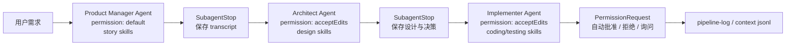

# Claude Code Hooks 权限与 Skill 治理

## 原文锚点

- 本地文件：
  - [Claude Code 2.0.41-47完全拆解：Hook系统、权限自动化与Skills加载的生产级改进.md](<../文章/Claude Code 2.0.41-47完全拆解：Hook系统、权限自动化与Skills加载的生产级改进.md>)
  - [Claude Code Hooks 完全指南：从配置到生效的实战经验.md](<../文章/Claude Code Hooks 完全指南：从配置到生效的实战经验.md>)
  - [量化基本面研究团队的CLAUDE.md、Skills和Hooks实战配置指南.md](../文章/量化基本面研究团队的CLAUDE.md、Skills和Hooks实战配置指南.md)
- 原文链接：见各本地文件 frontmatter；本轮不联网校验。
- 关键段落：
  - `2.0.41-47 完全拆解`：permissionMode、Skills 自动加载、SubagentStart/Stop、tool_use_id、PermissionRequest、生产级多代理 Pipeline。
  - `Hooks 完全指南`：工作区信任、配置优先级、绝对路径、Debug 日志、Stop 触发边界、PreToolUse 拦截。
  - `量化团队配置指南`：CLAUDE.md、Rules、Skills、Hooks 的团队级分工与数据安全习惯。
- 关键图：原文主要是配置片段，没有必要保留配图。

## 图片处理

| 图片 | 类型 | 是否保留 | 理由 | 处理方式 |
|---|---|---|---|---|
| Hooks 配置片段 | 说明图 / 代码块 | 删除 | 代码块已经保留足够机制信息，不需要图片 | 不进入知识点 |
| 多代理 Pipeline | 流程图 | 重建 | 文章用 PM、架构师、实施者和 hooks 配置描述链路，可重建控制面 | Mermaid 重建 |

## 一句话结论

这组文章值得实践，但实践对象不是“任务完成后播放提示音”，而是把 Claude Code 的 Hooks、permissionMode、Skill 自动加载和审计日志组合成可控、可追踪、可逐步授权的多 Agent 工作流。

## 用户相关性判断

| 项 | 内容 |
|---|---|
| 用户当前认知层级 | Claude Code L3，正在补权限、Hooks、Skill 治理和团队配置边界 |
| 认知成熟度 | draft |
| 阅读投入建议 | 实践 |
| 阅读投入理由 | 文章提供可运行配置、可验证日志、失败排查信号和可迁移的团队治理结构；但版本细节和字段需要后续补证 |
| 对用户的新信息 | Hook 不是“自动执行命令”这么简单，而是 Agent 生命周期、权限审批、上下文流转和审计的控制面 |
| 问题指纹 | Claude Code + Hooks/permissionMode/skills frontmatter + 生命周期事件和权限自动化 + 多 Agent 上下文流转与审计 + 最小权限边界 |
| 排重判断 | 新建。与上下文压缩主题不同，本主题沉淀权限、生命周期钩子和 Skill 治理 |
| 置信度 | 中 |

## 认知校准点

| 校准点 | 文章观点/信息 | 与用户认知或价值观的关系 | 处理建议 |
|---|---|---|---|
| Hook 是高权限执行点 | Hooks 可以执行系统命令，不可信工作区会跳过 Hook | 强化用户对权限边界和审计的关注 | Hook 必须纳入安全模型，而不是只看自动化便利 |
| permissionMode 应该逐步放权 | default、plan、acceptEdits、bypassPermissions 适合不同风险等级 | 符合“信任是赚来的，不是假设的” | 新 Agent 从 default/plan 开始，验证稳定后再升级 |
| `bypassPermissions` 只能在安全环境使用 | 文章明确警告生产和敏感仓库不应使用 | 这是高风险边界 | 在知识库中保留为强约束 |
| Skill 自动加载解决专业性，但也会引入重叠风险 | skills frontmatter 可让 subagent 自动加载所需 Skill | 补足 Skill 与 Agent 的组合关系 | Skill 应互补、边界清楚，不要把所有内容塞进一个 Skill |
| 工作区信任是 Hook 生效前置条件 | 即使全局信任，工作区也可能未接受 Hooks | 这是重要失败场景 | 排障时先查信任状态、配置优先级、绝对路径和日志 |
| 团队级配置要区分规则、技能和 Hook | CLAUDE.md 写稳定规范，Skills 写能力流程，Hooks 做确定性自动化 | 校准“全写进 CLAUDE.md”的倾向 | 建议按职责拆分，而不是堆长规则文件 |

## 冲突点

| 冲突类型 | 具体表现 | 影响 | 处理 |
|---|---|---|---|
| 原目录冲突 | 文章在 LLM 与大模型目录下 | 容易误归为模型版本更新或提示词技巧 | 重路由到 AI 编程工具 / Claude Code |
| 版本时效 | 文章涉及 2.0.41-47、2.0.45 等版本字段 | 字段可能变化 | 标为后续补证，不写成永久 API |
| 证据不足 | 多代理 Pipeline 是文章示例，未在本轮本地运行 | 不能认定为已验证生产方案 | 成熟度 draft，后续实验 |
| 权限风险 | 自动批准测试、编辑、删除等操作有误伤风险 | 可能导致高权限工具越权 | 写明最小权限和环境隔离 |
| 实践资讯混杂 | 提醒音教程中混有实用故障排查 | 若只看标题会被降为低价值技巧 | 抽取工作区信任、配置优先级、Debug 日志等失败场景 |

## 待吸收点

| 分级 | 内容 | 为什么值得吸收 | 后续动作 |
|---|---|---|---|
| 理解 | Hooks 是 Agent 生命周期控制面，包括启动、停止、工具前后、权限请求、压缩等事件 | 能把 Claude Code 从交互式工具提升为可治理流程 | 后续对照官方文档补证事件列表 |
| 理解 | permissionMode 是按 Agent 角色分配权限，而不是全局放权 | 支撑多 Agent 工作流的最小权限设计 | 新建团队 Agent 时先写权限模式 |
| 理解 | SubagentStart/Stop 可做上下文注入和 transcript 持久化 | 能让多 Agent 链路有审计和上下文流转 | 后续实验保存 `.claude/context/*.jsonl` |
| 记住 | Hook 排障顺序：JSON 格式、命令绝对路径、工作区信任、重启、Debug 日志 | 能快速定位“配置了但不生效” | 写入 Claude Code 排障准则 |
| 记住 | CLAUDE.md、Skills、Hooks 分别承载规则、能力、确定性自动化 | 避免规则文件膨胀和职责混乱 | 更新技术 index 的核心模块 |
| 实践 | 做一个最小安全 Hook：禁止危险删除、自动运行低风险测试、记录审计日志 | 有可运行、可验证、可排障、可迁移条件 | 后续在非敏感测试仓库执行 |

## 已知可跳过

| 内容 | 跳过理由 |
|---|---|
| 任务完成播放声音本身 | 只是 Hook 入门例子，不是长期知识点 |
| 量化业务配置细节 | 对用户价值在配置分层，不在美股量化字段 |
| 版本号宣传 | 未补证前不作为稳定结论 |
| 大段配置代码 | 核心是模式和边界，不复制教程 |

## 实践门槛

| 门槛 | 判断 | 证据 |
|---|---|---|
| 可运行 | 是 | 文章给出 settings 配置、Hook 事件、权限模式和调试命令 |
| 可验证 | 是 | 可通过日志文件、Debug 日志、Hook 触发、权限批准/拒绝结果验证 |
| 可排障 | 是 | 提供工作区信任、配置优先级、绝对路径、Stop 触发边界等排障信号 |
| 可迁移 | 是 | 可迁移到数据工程、代码评审、测试、文档生成和团队规范治理 |
| 结论 | 实践 | 后续应在非敏感测试仓库做最小 Hook 和审计日志验证 |

## 归类判断

| 项 | 内容 |
|---|---|
| 技术本体 | Claude Code |
| 文章主问题 | 如何用 Hooks、权限模式和 Skills 把 Claude Code 变成可控工作流 |
| 使用场景 | 多 Agent 流程、权限审批、自动化测试、审计日志、团队规则治理 |
| 关键词干扰 | Team 数据安全、量化团队、版本更新、提示音等会误导分类 |
| 最终归类 | Agent 与 AI 工程 / AI 编程工具 / Claude Code |
| 归类理由 | 主问题是 Claude Code 工程化控制面，不是模型能力、金融业务或通用 shell 自动化 |

## 技术定位

| 项 | 内容 |
|---|---|
| 技术类型 | 产品机制 / 权限治理 / 工作流控制 |
| 所属领域 | Agent 与 AI 工程 |
| 二级类目 | AI 编程工具 |
| 全局架构位置 | Claude Code 扩展与安全控制层 |
| 涉及模块 | Hooks、permissionMode、skills frontmatter、SubagentStart/Stop、PermissionRequest、CLAUDE.md、Rules |
| 解决问题 | 让 Agent 工作流可授权、可审计、可自动化、可复用 |
| 原文局限 | 版本字段、官方行为和商业版数据政策需要后续补证 |
| 我的结论 | 现在可实践，但必须从最小权限、测试仓库和审计日志开始 |

## 纵向理解

| 维度 | 判断 |
|---|---|
| 全局架构 | Claude Code 通过规则文件提供稳定约束，Skill 提供专业能力，Hook 在生命周期节点执行确定性控制，permissionMode 控制 Agent 权限 |
| 本文位置 | 本主题覆盖扩展治理，不覆盖上下文压缩或动态代码搜索 |
| 核心机制 | 生命周期事件、权限请求自动化、角色权限分层、Skill 自动加载、transcript 持久化、审计日志 |
| 使用链路 | 定义 Agent -> 声明 Skill -> 设置权限模式 -> 配置 Hook -> 执行任务 -> 保存审计与上下文 -> 根据结果逐步放权 |
| 前置条件 | 工作区信任、配置文件正确、命令可执行、路径绝对、低风险环境和测试仓库 |
| 边界 | 高风险仓库、生产凭证、删除操作、敏感数据不应自动放权 |

## 横向对标

| 对标技术 | 实现方式 | 优势 | 劣势 | 适合场景 |
|---|---|---|---|---|
| 手动审批 | 每次工具调用人工确认 | 安全、可控 | 慢，不适合批量任务 | 高风险修改、敏感仓库 |
| Hook 自动化 | 生命周期事件触发脚本 | 确定性、可审计 | 配置错误会静默不生效或误触发 | 格式化、测试、审计、通知 |
| CI/CD | 代码提交后自动构建测试 | 标准化、团队可见 | 反馈较晚，不在 Agent 交互内 | 合并前质量门禁 |
| Cursor Rules / Skills | IDE 内规则和动态能力 | 适合交互式开发 | 权限和审计边界需对标 | IDE 内 AI 编程规范 |
| OpenCode Skills / Hooks | 终端 Agent 生态扩展 | 开放、多模型编排空间大 | 官方边界和稳定性需补证 | 开放式 CLI 工作流 |

## 后续追查

- 关键词：Claude Code Hooks、permissionMode、PermissionRequest、SubagentStart、SubagentStop、skills frontmatter、workspace trust。
- 相关技术：Claude Code 上下文治理、OpenCode Hooks、Cursor Rules/Skills、CI、审计日志。
- 需要补读的文章：
  - 后续补证 Claude Code Hooks 官方文档和事件列表。
  - 后续补证 permissionMode 最新字段和安全语义。
  - 在测试仓库实践最小 Hook：禁止危险删除、自动运行测试、保存 pipeline 日志。
