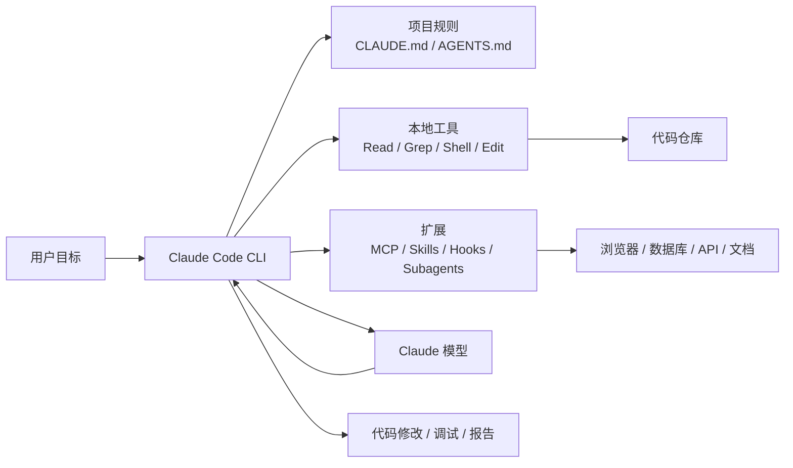

# Claude Code
## 知识点入口

- 本模块先看宏观流程，再看文章：[知识地图](020502_知识地图.md)。
- 新文章必须先归入流程节点，再判断是补充、冲突、不同层次还是降权。
- `文章/` 只保留原文锚点，长期知识必须沉淀到 `020502_核心知识点/` 下的主题文件。

## 技术定位

| 项 | 内容 |
|---|---|
| 技术名 | Claude Code |
| 一级类目 | Agent 与 AI 工程 |
| 二级类目 | AI 编程工具 |
| 技术本体 | 面向软件工程任务的命令行 Agent 工具，通过读写文件、执行命令、调用工具和维护项目规则来完成代码任务 |
| 全局架构位置 | 位于开发者工作流入口层，连接本地代码仓库、终端命令、项目规则、外部工具和模型推理能力 |
| 主要使用者 | 工程师、数据开发、平台工程师、技术写作者 |
| 主要产出 | 代码修改、调试结论、项目规则、会话上下文、自动化工作流 |

## 官方锚点

- 官方文档：[Claude Code Docs](https://code.claude.com/docs/en/overview)
- 产品入口：[Claude Code](https://www.anthropic.com/claude-code)
- 相关概念：`CLAUDE.md`、Hooks、MCP、Skills、Subagents、上下文压缩、权限模式

## 架构图

## 核心模块

| 模块 | 职责 | 重点问题 |
|---|---|---|
| 项目规则 | 为 Agent 提供项目内长期约束 | 规则是否单一来源、是否可执行、是否会过期 |
| 上下文管理 | 控制模型看到哪些文件、命令、历史和摘要 | 如何避免上下文污染、压缩丢失和无效长文档 |
| Agentic Search | 通过文件名搜索、全文搜索、读取文件动态获取代码上下文 | 适合快速变化的代码库，但依赖搜索策略和代码结构 |
| 工具调用 | 执行读写文件、命令、测试、浏览器、外部服务 | 权限边界、可回滚、失败重试、证据保留 |
| Hooks 与权限 | 在工具调用生命周期中做拦截、提醒、自动化和权限控制 | 自动化脚本是否可信，工作区信任和 bypass 权限是否被滥用 |
| Skill 与 Subagent | 把领域流程、工具用法和子任务隔离成可复用单元 | 是否减少上下文污染，还是制造规则分散和版本漂移 |
| 扩展机制 | 通过 MCP、Skill、Hook、Subagent 扩展能力 | 扩展越多，越需要治理和评估 |

## 横向对标

| 对标技术 | 对标点 | 优势 | 劣势 | 使用判断 |
|---|---|---|---|---|
| Cursor | IDE 内 AI 编程 | IDE 体验连续、代码定位直观 | 规则和自动化流程容易被 IDE 形态约束 | 偏交互式开发时选 Cursor |
| Codex CLI | 终端代码 Agent | 更贴近本地命令、仓库和自动化流程 | 需要清晰项目规则和验证习惯 | 偏任务执行、批量改造、脚本化时选 CLI Agent |
| Aider | Git 驱动代码协作 | 变更和提交模型清晰 | 对复杂工具链和多步骤验证依赖额外约束 | 偏代码补丁和提交管理时可对标 |
| 传统 RAG 代码检索 | 代码索引与相似度召回 | 对静态文档和稳定知识库有效 | 代码变更快时索引易过期，召回不等于可改代码 | 对代码仓库优先考虑动态搜索，对文档库再考虑 RAG |

## 已沉淀核心知识点

| 主题 | 文件 | 问题指纹 | 解决什么问题 | 认知增量 |
|---|---|---|---|---|
| Claude Code 为什么不用传统 RAG | [为什么Claude Code不用RAG](<020502_核心知识点/为什么Claude Code不用RAG.md>) | Claude Code + 代码上下文获取 + 动态搜索 + 避免索引过期 + 代码库变化边界 | 代码 Agent 中动态搜索和传统 RAG 的边界 | 把“不用 RAG”校准为“代码库更适合动态搜索”，不是“RAG 无价值” |
| Claude Code 上下文压缩与会话治理 | [Claude Code上下文压缩与会话治理](<020502_核心知识点/Claude Code上下文压缩与会话治理.md>) | Claude Code + 长会话 + 工具输出/compact/clear/rewind/subagent + 防上下文污染 + 会话治理边界 | 长会话为什么会退化，以及如何控制上下文进入方式 | 把“上下文越长越强”校准为“越长越需要边界和证据管理” |
| Claude Code Hooks 权限与 Skill 治理 | [Claude Code Hooks权限与Skill治理](<020502_核心知识点/Claude Code Hooks权限与Skill治理.md>) | Claude Code + Hooks/权限/Skill + 生命周期控制 + 防误执行和团队复用 + 高权限边界 | Hooks、权限和 Skill 在工程流程中的治理位置 | 把“自动化提效”校准为“生命周期控制面，需要权限、路径和日志约束” |

## 后续追查

- Claude Code 上下文压缩机制与项目规则如何协同。
- `Grep/Glob/Read` 这类传统工具为什么在代码库检索中仍然有效。
- Skill、MCP、Hook、Subagent 各自解决什么边界问题。
- 后续补证官方 Hooks、权限模式、Skills、Subagents 文档和版本行为。
- 在本地测试仓库验证 Hook 触发顺序、权限拦截、Skill 自动加载和上下文压缩后的信息保留。

<!-- AUTO-DISTILL-02-START -->

## 本轮文章处理收口

- 已归档来源：`228` 篇，全部位于 `文章/` 且使用 `done-` 前缀。
- 长期入口：[ClaudeCode工程使用与治理边界.md](020502_核心知识点/ClaudeCode工程使用与治理边界.md)。
- 新文章进入时先对照知识地图、AGENTS 排重准则和已有主题页；只有新增机制、边界、反例、版本差异或实践证据时才新建主题页。

<!-- AUTO-DISTILL-02-END -->
