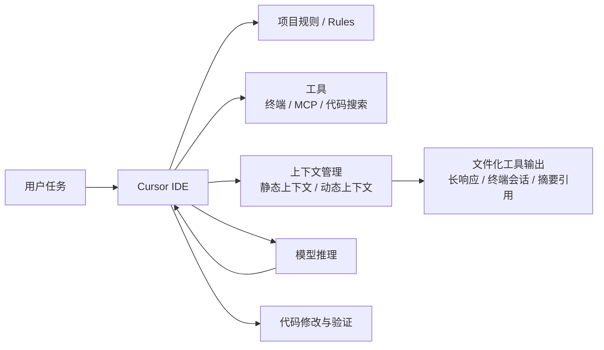

# Cursor
## 知识点入口

- 本模块先看宏观流程，再看文章：[知识地图](020503_知识地图.md)。
- 新文章必须先归入流程节点，再判断是补充、冲突、不同层次还是降权。
- `文章/` 只保留原文锚点，长期知识必须沉淀到 `020503_核心知识点/` 下的主题文件。

## 技术定位

| 项 | 内容 |
|---|---|
| 技术名 | Cursor |
| 一级类目 | Agent 与 AI 工程 |
| 二级类目 | AI 编程工具 |
| 技术本体 | 面向软件开发的 AI IDE，将模型、代码上下文、编辑器、终端、工具和项目规则整合到开发环境中 |
| 全局架构位置 | 位于开发者 IDE 层，连接代码仓库、终端、MCP 工具、Agent 上下文和模型推理 |
| 主要使用者 | 工程师、前端工程师、后端工程师、AI 编程使用者 |
| 主要产出 | 代码修改、上下文管理策略、工具调用结果、开发任务执行记录 |

## 官方锚点

- 官网：https://cursor.com/
- 文档：https://docs.cursor.com/
- 关键概念：Agent、MCP、Rules、上下文管理、动态上下文发现

## 架构图

## 核心模块

| 模块 | 职责 | 重点问题 |
|---|---|---|
| IDE 集成 | 把 AI Agent 嵌入编辑器工作流 | 与终端 CLI 工具的边界 |
| 上下文管理 | 决定哪些代码、工具结果、会话信息进入模型上下文 | 静态上下文过多会污染，动态上下文可能漏信息 |
| MCP 工具接入 | 连接外部工具和服务 | 工具数量、权限、加载成本 |
| 规则系统 | 约束代码风格、项目习惯和任务边界 | 规则过长、过时或冲突 |
| Plan 模式 | 在 IDE 内把任务拆成计划、上下文和执行步骤 | 是否真的形成验收闭环，还是只生成看似完整的计划 |
| Skills / Subagents | 把特定流程和子任务拆成可复用能力 | 是否适合 IDE 内交互式开发，还是应交给终端 Agent 编排 |

## 横向对标

| 对标技术 | 对标点 | Cursor 优势 | Cursor 劣势 | 使用判断 |
|---|---|---|---|---|
| Claude Code | AI 编程 Agent | IDE 交互连续、上下文与编辑器结合紧 | CLI 自动化和项目外工具链不如终端形态直接 | 日常 IDE 编码选 Cursor，长任务自动化可对标 Claude Code |
| Codex CLI | 终端 Agent | Cursor 更适合编辑器内增量开发 | CLI 更适合脚本化、自动化和仓库级任务 | 看任务是否需要 IDE 交互 |
| 传统 IDE 插件 | 补全和局部问答 | Agent 能执行多步任务 | 需要更强上下文治理 | 简单补全不必上 Agent，复杂改造需要 Agent |

## 已沉淀核心知识点

| 主题 | 文件 | 问题指纹 | 解决什么问题 | 认知增量 |
|---|---|---|---|---|
| 动态上下文发现 | [动态上下文发现](020503_核心知识点/动态上下文发现.md) | Cursor + 上下文工程 + 工具输出文件化/按需读取 + 降低上下文污染 + 不等同于无限上下文 | Cursor 如何通过动态上下文降低 token 和污染 | 把“上下文越多越好”校准为“按需发现更稳定” |
| Cursor Rules 与 Plan 工作流边界 | [Cursor Rules与Plan工作流边界](<020503_核心知识点/Cursor Rules与Plan工作流边界.md>) | Cursor + Rules/Plan/Skills/Subagents + IDE 内需求到实现 + 规范约束与对标 + 长任务边界 | Cursor 如何把规则、计划和 Agent 能力放进 IDE 工作流 | 把“Cursor 只是补全 IDE”校准为“IDE Agent 工作台，但长任务和规范治理仍需外部约束” |

## 后续追查

- Cursor 动态上下文与 Claude Code 动态搜索的差异。
- 长工具输出文件化是否会带来证据丢失和追查成本。
- MCP 工具按需加载的权限和性能边界。
- Cursor Rules 与 AGENTS.md、CLAUDE.md 之间的迁移和冲突策略。
- Cursor Plan、OpenSpec、Claude Code、OpenCode 在同一功能开发任务中的边界对比。

<!-- AUTO-DISTILL-02-START -->

## 本轮文章处理收口

- 已归档来源：`46` 篇，全部位于 `文章/` 且使用 `done-` 前缀。
- 长期入口：[Cursor工程使用与上下文边界.md](020503_核心知识点/Cursor工程使用与上下文边界.md)。
- 新文章进入时先对照知识地图、AGENTS 排重准则和已有主题页；只有新增机制、边界、反例、版本差异或实践证据时才新建主题页。

<!-- AUTO-DISTILL-02-END -->
