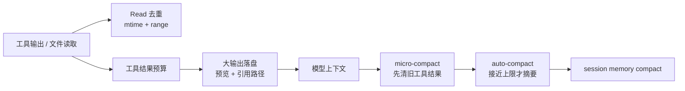

# Claude Code 上下文压缩与会话治理

## 原文锚点

- 本地文件：
  - [Claude Code 怎么压上下文？3 个机制，直接抄作业.md](../文章/Claude Code 怎么压上下文？3 个机制，直接抄作业.md)
  - [Claude Code的上下文管理，我踩过的几个坑.md](../文章/Claude Code的上下文管理，我踩过的几个坑.md)
- 原文链接：见各本地文件 frontmatter；本轮不联网校验。
- 关键段落：
  - `Claude Code 怎么压上下文？`：文件读取去重、工具结果落盘、单条消息预算、micro-compact、auto-compact、session-memory compact。
  - `Claude Code 的上下文管理，我踩过的几个坑`：Context Rot、主动 compact、rewind、clear、subagent、continue 的使用边界。
- 关键图：第二篇提到配图和上下文窗口示意，但 Markdown 没有图片路径，属于原图缺失。

## 图片处理

| 图片 | 类型 | 是否保留 | 理由 | 处理方式 |
|---|---|---|---|---|
| 上下文窗口结构示意 | 说明图 | 原图缺失 | 用于解释 system prompt、CLAUDE.md、tool calls、文件内容共同占用上下文 | 标记原图缺失；用文字和 Mermaid 重建机制 |
| clear/compact 使用示意 | 流程图 | 原图缺失 | 用于区分清空上下文、主动压缩和继续会话 | 标记原图缺失 |
| 工具结果落盘机制 | 流程图 | 重建 | 原文描述足够明确，能帮助理解“预览 + 引用” | Mermaid 重建 |

## 一句话结论

这组文章值得精读：Claude Code 的上下文治理不是“靠超长窗口硬塞”，而是先去重、落盘、清噪音，再在必要时摘要；会话操作上也应优先判断上下文是否仍有价值，而不是习惯性 `/clear`。

## 用户相关性判断

| 项 | 内容 |
|---|---|
| 用户当前认知层级 | Claude Code L3，已知道动态搜索和项目规则，正在补上下文压缩与长任务边界 |
| 认知成熟度 | draft |
| 阅读投入建议 | 精读 |
| 阅读投入理由 | 文章能补齐工具输出、会话压缩、上下文腐烂和 subagent 隔离的机制边界；但源码路径和常量需要后续官方/源码补证 |
| 对用户的新信息 | 上下文压缩应分层处理：文件去重、工具结果落盘、消息预算、micro-compact、auto-compact、session memory compact |
| 问题指纹 | Claude Code + 上下文治理 + 工具结果落盘/Read 去重/micro-compact + 降低上下文污染和缓存浪费 + 区分 compact/rewind/clear/subagent |
| 排重判断 | 新建。与“为什么 Claude Code 不用 RAG”同属上下文主题，但一个讲代码检索路线，一个讲会话和工具结果治理 |
| 置信度 | 中 |

## 认知校准点

| 校准点 | 文章观点/信息 | 与用户认知或价值观的关系 | 处理建议 |
|---|---|---|---|
| 长上下文不是越长越好 | 无关信息越多会形成 Context Rot | 校准“1M 上下文可以随便塞”的误区 | 把上下文视为预算，而不是无限空间 |
| 摘要不是第一选择 | 原文将落盘、去重、清旧工具结果放在 auto-compact 之前 | 补充用户做长日志、长 SQL、长 diff 时的上下文处理准则 | 优先保留引用和关键行，再摘要 |
| 大工具输出不该直接截断 | Claude Code 把大输出写入会话目录，只给预览和路径 | 与用户重证据 ID 和可追查锚点一致 | 后续整理大输出时保留文件路径、关键行和结论 |
| `/clear` 不是默认清理方式 | clear 会让 Agent 重新读代码和规则，浪费上下文和时间 | 校准“干净上下文一定更好”的直觉 | 只有任务无关时 clear；同一需求优先 continue 或 compact |
| Rewind 比在错误分支上继续纠正更干净 | 错误方案的工具调用会污染后续判断 | 补充长任务失败时的返工策略 | 方案方向错误时回退到分歧点重来 |
| Subagent 是上下文隔离机制 | 大量中间输出留在子 Agent，只把结论带回主会话 | 区分 Skill 和 Subagent 的边界 | 中间证据多、主会话只需结论时用 Subagent |

## 冲突点

| 冲突类型 | 具体表现 | 影响 | 处理 |
|---|---|---|---|
| 原目录冲突 | 两篇原文均在 LLM 与大模型或 raws/claude-code 下 | 容易误归到模型上下文能力或源码八卦 | 重路由到 Agent 与 AI 工程 / AI 编程工具 / Claude Code |
| 图片缺失 | 原文提到“如上图”“配图”但无图片路径 | 上下文窗口结构缺少可视化证据 | 标记原图缺失，重建机制图 |
| 证据不足 | 源码路径、常量、实现细节来自文章解读，未本轮补证 | 不能直接当官方实现事实 | 标记为后续补证 |
| 关键词误导 | 出现 1M context、cache、compact 等模型/推理词 | 可能误写入 LLM 与大模型 / 推理与上下文 | 本体是 Claude Code 的工程上下文治理 |
| 实践边界 | compact、rewind、subagent 的实际效果依赖任务阶段和工具版本 | 可能被写成固定操作口诀 | 以“判断上下文是否仍有用”为准则 |

## 待吸收点

| 分级 | 内容 | 为什么值得吸收 | 后续动作 |
|---|---|---|---|
| 理解 | 上下文治理分 I/O 层、消息层、会话层 | 能把“压上下文”拆成多个可设计机制 | 后续和 Cursor 动态上下文文件化对比 |
| 理解 | 工具结果落盘 + 预览 + 引用路径比粗暴截断更可靠 | 保留证据可追查，降低上下文污染 | 写入处理长输出的工作准则 |
| 理解 | micro-compact 先清旧工具结果，auto-compact 接近上限才摘要 | 能解释为什么摘要不应作为默认策略 | 后续补证实现细节 |
| 记住 | I/O 缓存省时间，Read 去重省上下文 | 会影响代码 Agent 检索与重复读取判断 | 与“动态搜索不用 RAG”主题互补 |
| 记住 | 任务相关上下文保留，任务无关上下文清理 | 这是 compact/clear/continue 的总准则 | 后续长任务中显式判断会话是否继续 |
| 实践 | 面对长日志、长 diff、长查询输出时，只保留摘要、关键行和本地锚点 | 与用户已有上下文膨胀痛点高度相关 | 在后续 Change/代码验证任务中执行 |

## 已知可跳过

| 内容 | 跳过理由 |
|---|---|
| “上下文窗口很大”基础解释 | 用户已关注上下文工程，不需要重复入门 |
| 源码文件路径本身 | 未补证前不作为稳定知识，只作为后续追查锚点 |
| 单纯命令技巧 | `/clear`、`/compact` 不是口诀，关键是使用边界 |

## 实践门槛

| 门槛 | 判断 | 证据 |
|---|---|---|
| 可运行 | 部分 | 可以通过本地长输出、重复 Read、compact/clear 操作观察，但本轮未执行实验 |
| 可验证 | 部分 | 可用 token 变化、上下文保留、任务恢复质量验证；文章未给统一验收 |
| 可排障 | 是 | 提供 Context Rot、错误分支污染、clear 后重读成本、subagent 中间输出污染等失败模式 |
| 可迁移 | 是 | 可迁移到代码任务、SQL 查询、日志分析、文章整理 |
| 结论 | 降为精读 | 机制可吸收；实践结论需后续本地实验验证 |

## 归类判断

| 项 | 内容 |
|---|---|
| 技术本体 | Claude Code |
| 文章主问题 | Claude Code 如何治理会话和工具输出上下文 |
| 使用场景 | 长任务、重复读文件、大工具输出、上下文接近上限、错误分支回退 |
| 关键词干扰 | RAG、1M context、compact、cache 等词容易误导到模型能力或上下文工程二级类目 |
| 最终归类 | Agent 与 AI 工程 / AI 编程工具 / Claude Code |
| 归类理由 | 主问题是 AI 编程工具的上下文装载、压缩和会话管理机制 |

## 技术定位

| 项 | 内容 |
|---|---|
| 技术类型 | 产品机制 / 上下文治理机制 |
| 所属领域 | Agent 与 AI 工程 |
| 二级类目 | AI 编程工具 |
| 全局架构位置 | Claude Code 会话管理与工具结果处理层 |
| 涉及模块 | Read 去重、工具结果存储、消息预算、compact、session memory、subagent |
| 解决问题 | 降低上下文污染、重复读取、工具输出爆炸、摘要失真和错误分支干扰 |
| 原文局限 | 源码路径与常量需要后续官方或源码补证 |
| 我的结论 | 以后关注；可作为处理长输出和长任务的工程准则 |

## 纵向理解

| 维度 | 判断 |
|---|---|
| 全局架构 | Claude Code 接收工具输出后，先做读取去重和结果预算，再通过 compact 管理历史会话 |
| 本文位置 | 只覆盖上下文治理，不覆盖权限、Hooks、Skill、MCP 等扩展能力 |
| 核心机制 | 文件读取去重、工具结果落盘、消息聚合预算、micro-compact、auto-compact、rewind、clear、continue、subagent 隔离 |
| 使用链路 | 工具输出 -> 判断是否重复/过大 -> 写入磁盘或保留预览 -> 历史工具结果清理 -> 必要时摘要 -> 会话继续 |
| 前置条件 | 需要稳定的本地文件锚点、任务阶段边界、能回退的会话操作和可追查输出 |
| 边界 | 如果任务已偏离或上下文被错误方案污染，继续 compact 不如 rewind；完全无关新任务才 clear |

## 横向对标

| 对标技术 | 实现方式 | 优势 | 劣势 | 适合场景 |
|---|---|---|---|---|
| Cursor 动态上下文发现 | 长输出文件化、终端会话文件化、按需读取 | 与 IDE 和工具输出结合紧 | 具体实现需后续补证 | IDE 内长输出和多工具会话 |
| 传统摘要压缩 | 把历史对话总结成短文本 | 简单、节省上下文 | 有损，可能丢证据 | 阶段性任务收口 |
| 直接清空会话 | 丢弃全部历史 | 干净 | 需要重新读仓库和规则 | 完全无关新任务 |
| Subagent 隔离 | 子任务独立上下文，主会话只收结论 | 减少主上下文污染 | 子任务结论质量依赖提示和汇报格式 | Review、日志分析、代码探索 |
| 传统 RAG | 外部索引召回 | 适合稳定文档 | 对实时工具输出和会话状态不直接适用 | 知识库检索 |

## 后续追查

- 关键词：Claude Code compact、micro-compact、tool result storage、Read 去重、Context Rot、rewind、subagent。
- 相关技术：Cursor 动态上下文、Claude Code Hooks、Claude Code Skill、动态搜索、RAG。
- 需要补读的文章：
  - 后续补证 Claude Code 官方上下文管理说明。
  - 后续用本地长日志/长 diff 实验验证“落盘 + 预览 + 引用”的效果。
  - 对比 Cursor 动态上下文发现和 Claude Code 工具结果治理的实现边界。
