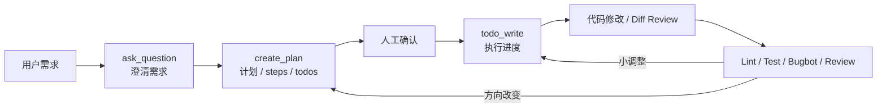

# Cursor Rules 与 Plan 工作流边界

## 原文锚点

- 本地文件：
  - [Cursor 官方出品：AI 编程 Agent 最佳实践指南.md](../文章/Cursor 官方出品：AI 编程 Agent 最佳实践指南.md)
  - [AI 编程工具 Cursor Plan 模式保姆级教程.md](../文章/AI 编程工具 Cursor Plan 模式保姆级教程.md)
  - [Cursor Rules 设计思路：构建企业级 AI 编程规范.md](../文章/Cursor Rules 设计思路：构建企业级 AI 编程规范.md)
  - [Cursor 2.4 发布：Subagents、Skills,还可以直接用 Banana 画图.md](../文章/Cursor 2.4 发布：Subagents、Skills,还可以直接用 Banana 画图.md)
  - [开发者最友好的规范工具？比Cursor Plan更细、比spec‑kit更轻，OpenSpec如何让AI编码更靠谱.md](../文章/开发者最友好的规范工具？比Cursor Plan更细、比spec‑kit更轻，OpenSpec如何让AI编码更靠谱.md)
- 原文链接：见各本地文件 frontmatter；本轮不联网校验。
- 关键段落：
  - `Cursor 官方出品`：Plan Mode、上下文少即是多、Rules 与 Skills、TDD、并行工作、Debug Mode、Review。
  - `Cursor Plan 模式`：ask_question、create_plan、todo_write、计划确认、遗漏调整、方向改变时重建 Plan。
  - `Cursor Rules 设计思路`：Always Apply、Specific Files、Apply Intelligently、Apply Manually，跨工具适配策略。
  - `Cursor 2.4`：Subagents、Skills、AI 代码归因、澄清问题。
  - `OpenSpec`：存量项目的 propose、review、plan、implement、archive 工作流。
- 关键图：Cursor Plan、OpenSpec 文章多处描述流程或截图，但 Markdown 未保留图片路径，属于原图缺失。

## 图片处理

| 图片 | 类型 | 是否保留 | 理由 | 处理方式 |
|---|---|---|---|---|
| Cursor Plan 工具流程图 | 流程图 | 原图缺失 | 用于说明 ask_question、create_plan、todo_write 的执行顺序 | 标记原图缺失；按正文重建 |
| OpenSpec 目录和提案截图 | 截图 / 说明图 | 删除 | 主要是工具界面截图，非核心机制 | 不进入知识点 |
| Cursor 2.4 功能配图 | 配图 | 删除 | 功能介绍性质强，缺少机制细节 | 不进入知识点 |

## 一句话结论

Cursor 的核心优势不是“在 IDE 里多了一个聊天框”，而是把计划、动态上下文、Rules、Skills、Subagents 和 Review 嵌入编辑器工作流；它适合交互式增量开发，但长任务和跨工具自动化需要与 Claude Code、OpenCode 或规范工具横向对标。

## 用户相关性判断

| 项 | 内容 |
|---|---|
| 用户当前认知层级 | Cursor L2，已有动态上下文发现笔记，正在补 Rules、Plan 和与 Claude Code/OpenCode 的边界 |
| 认知成熟度 | draft |
| 阅读投入建议 | 精读 |
| 阅读投入理由 | 文章能补 Cursor 在 IDE Agent 中的计划模式、规则加载层次和审查闭环；但版本功能、官方细节和 OpenSpec 对比需后续补证 |
| 对用户的新信息 | Cursor Rules 不是单一规则文件，而是按常驻、文件匹配、智能匹配、手动触发分层；Plan 不是一次性文档，而是可确认、可调整、可重建的任务控制面 |
| 问题指纹 | Cursor + IDE Agent + Rules/Plan/Skills/Subagents + 交互式增量开发 + 上下文少即是多和 Review 闭环 |
| 排重判断 | 新建。与既有“动态上下文发现”不同，本主题沉淀规则加载和计划执行边界 |
| 置信度 | 中 |

## 认知校准点

| 校准点 | 文章观点/信息 | 与用户认知或价值观的关系 | 处理建议 |
|---|---|---|---|
| Cursor Plan 是风险控制，不是文档装饰 | Plan 会先调研、提问、生成包含路径和步骤的计划，等待批准再执行 | 补充用户对 Cursor 工作流的系统位置理解 | 看 Plan 是否具体到文件、步骤、验收和重建边界 |
| Plan 偏离时重建比边聊边修更干净 | 文章建议写偏时回滚、改 Plan、重新执行 | 与 Claude Code rewind 的思想一致 | 方向性偏差不要在污染会话里继续补丁式纠正 |
| Rules 要分层加载 | Always Apply、Specific Files、Apply Intelligently、Manual 各有边界 | 校准“所有规范都塞进 Rules”的倾向 | 常驻规则少而硬，场景规则按需加载，工具类迁到 commands/skills |
| Cursor 的“少即是多”与动态上下文一致 | 不要手动 tag 所有文件，优先让 Agent 搜索；用 Past Chats/Branch 降低噪音 | 与既有动态上下文笔记互相验证 | 上下文治理重质量和可追查，不重堆料 |
| Subagents/Skills 正在向 Claude Code / OpenCode 靠拢 | Cursor 2.4 引入独立上下文子代理和 SKILL.md | 补横向对标入口 | 后续对比三类工具的 Skill 语义和权限边界 |
| OpenSpec 不是 Cursor 本体 | OpenSpec 比 Cursor Plan 更偏规范驱动和变更归档 | 防止把规范工具能力误写到 Cursor | 本主题仅作为横向对标，不归入 Cursor 本体 |

## 冲突点

| 冲突类型 | 具体表现 | 影响 | 处理 |
|---|---|---|---|
| 原目录冲突 | `Cursor 官方出品` 在 LLM 与大模型目录 | 容易误归为模型/提示词文章 | 重路由到 AI 编程工具 / Cursor |
| 图片缺失 | Cursor Plan、OpenSpec 文章描述图或截图但无图片路径 | 缺少流程可视化证据 | 标记原图缺失，重建核心流程图 |
| 实践资讯混杂 | Cursor 2.4 文章包含图像生成、Blame、澄清问题等产品发布信息 | 容易把资讯全部沉淀 | 只吸收 Subagents、Skills、归因和澄清问题对工程流程的影响 |
| 证据不足 | “官方最佳实践”来自转载，未本轮官网补证 | 不能当官方现状 | 标记后续补证 |
| 关键词误导 | OpenSpec、spec-kit、Kiro 与 Cursor Plan 对比混在一起 | 可能误归到工作流编排或开发工具与 CLI | 主体仍是 Cursor 对标，OpenSpec 作为横向对照 |

## 待吸收点

| 分级 | 内容 | 为什么值得吸收 | 后续动作 |
|---|---|---|---|
| 理解 | Cursor Plan 的工具链是澄清、创建计划、维护 todo、执行和验证 | 这是 IDE Agent 里的任务控制面 | 和 Claude Code Plan/Feature Dev、OpenCode Prometheus/Atlas 对比 |
| 理解 | Rules 四种应用类型决定上下文加载成本和干扰风险 | 规则治理是 Cursor 长期使用的核心 | 更新 Cursor index 的核心模块 |
| 理解 | Skills 适合动态能力，Rules 适合静态约束 | 能避免规则文件膨胀 | 后续看 Cursor 2.4 Skill 与 Claude Code Skill 兼容边界 |
| 记住 | 常驻规则应该少而可验证，工具类规范应迁到 commands/skills | 会反复影响项目规则设计 | 后续整理 Rules 文章时按加载层级排重 |
| 记住 | Agent Review、Bugbot、Diff 监控是 Cursor 交付闭环的一部分 | 防止把 Cursor 只当生成器 | 实际使用时先看 diff 和验证结果 |
| 实践 | 选择一个小需求写 Cursor Plan，对比是否比直接 Agent 模式少返工 | 可以本地验证 Plan 质量 | 后续补实践证据 |

## 已知可跳过

| 内容 | 跳过理由 |
|---|---|
| Plan 模式入门操作细节 | 用户更需要边界和对标，不需要保姆级操作 |
| 图像生成产品功能 | 与“AI 编程工具进入工程流程”关系较弱 |
| OpenSpec 安装细节 | 本轮不联网不安装，且不属于 Cursor 本体 |
| 未补证的官方/版本状态 | 需要后续官网补证 |

## 实践门槛

| 门槛 | 判断 | 证据 |
|---|---|---|
| 可运行 | 部分 | 文章给出 Plan、Rules、OpenSpec 命令和案例，但本轮未打开 Cursor 实测 |
| 可验证 | 部分 | 可用 Plan 步骤、todos、lint/test、diff review 验证；缺少本地结果 |
| 可排障 | 部分 | 有 Plan 遗漏、小调整、方向改变重建等失败处理，但缺少真实错误日志 |
| 可迁移 | 是 | 可迁移到前端、后端、数据开发和项目规则设计 |
| 结论 | 降为精读 | 先吸收工作流边界，后续用本地小需求实践再升级 |

## 归类判断

| 项 | 内容 |
|---|---|
| 技术本体 | Cursor |
| 文章主问题 | Cursor 如何通过 Rules、Plan、Skills、Subagents 和 Review 进入工程流程 |
| 使用场景 | IDE 内增量开发、存量项目小需求、代码规范治理、计划执行、Review |
| 关键词干扰 | OpenSpec、spec-kit、Kiro、Banana、图像生成、模型发布等词会误导归类 |
| 最终归类 | Agent 与 AI 工程 / AI 编程工具 / Cursor |
| 归类理由 | 主问题是 Cursor 作为 AI IDE 的工程工作流，而不是模型能力、图像生成或通用规范工具 |

## 技术定位

| 项 | 内容 |
|---|---|
| 技术类型 | 产品 / AI IDE / 工程工作流 |
| 所属领域 | Agent 与 AI 工程 |
| 二级类目 | AI 编程工具 |
| 全局架构位置 | IDE Agent 层，连接编辑器、代码仓库、规则、计划、终端、评审 |
| 涉及模块 | Plan、Rules、Skills、Subagents、上下文搜索、Diff Review、Bugbot、Cloud Agents |
| 解决问题 | 降低 IDE 内 AI 编码跑偏、规则不一致、上下文噪音和评审遗漏 |
| 原文局限 | 官方状态、版本细节和跨工具兼容性需后续补证 |
| 我的结论 | 以后关注；Cursor 适合交互式增量开发，长任务和终端编排需横向对标 Claude Code/OpenCode |

## 纵向理解

| 维度 | 判断 |
|---|---|
| 全局架构 | 用户在 IDE 提交需求，Cursor 通过上下文搜索、Rules、Plan、Skills/Subagents 和 Review 完成增量开发 |
| 本文位置 | 本主题覆盖规则和计划工作流，不覆盖动态上下文发现的详细机制 |
| 核心机制 | Plan 先行、规则分层加载、动态 Skill、子代理独立上下文、Diff/Agent Review |
| 使用链路 | 描述需求 -> 澄清 -> 创建 Plan -> 人工批准 -> 执行 todos -> Review/Diff/Test -> 小改继续、大偏差重建 Plan |
| 前置条件 | 项目规则清晰、代码结构可搜索、需求可拆分、开发者愿意审查 Plan 和 diff |
| 边界 | 大规模无人值守、多仓库脚本化、强权限自动化任务不一定是 Cursor 最优场景 |

## 横向对标

| 对标技术 | 实现方式 | 优势 | 劣势 | 适合场景 |
|---|---|---|---|---|
| Claude Code | 终端 Agent，项目规则、Hooks、Skill、权限模式 | 自动化和权限治理更强 | IDE 内交互不如 Cursor | 长任务、仓库级任务、流程自动化 |
| OpenCode | 终端 Agent，可叠加 oh-my-opencode 编排 | 开放、多模型、多 Agent 编排空间大 | 配置和治理成本高 | 终端批量任务、编排型任务 |
| Cursor Plan | IDE 内计划、执行和 Review | 贴近编辑器上下文，适合小步增量 | 长程无人值守和跨工具自动化有限 | 存量项目交互式修改 |
| OpenSpec | propose/review/plan/implement/archive | 规范与变更追踪强 | 不是 IDE Agent 本体 | 触及多个规范的存量项目变更 |
| Spec Kit | specify/plan/tasks/implement | 适合从零到一 | 对存量项目可能偏重 | 新项目或明确规格开发 |

## 后续追查

- 关键词：Cursor Plan、Cursor Rules、Apply Intelligently、Always Apply、Cursor Skills、Subagents、Bugbot、OpenSpec。
- 相关技术：Claude Code Feature Dev、OpenCode Prometheus/Atlas、OpenSpec、Spec Kit、AGENTS.md。
- 需要补读的文章：
  - 后续补证 Cursor 官方 Plan、Rules、Skills、Subagents 文档。
  - 后续用一个本地小需求验证 Plan 模式和直接 Agent 模式的返工差异。
  - 对比 Cursor Rules 与 AGENTS.md / CLAUDE.md 的跨工具迁移方式。
